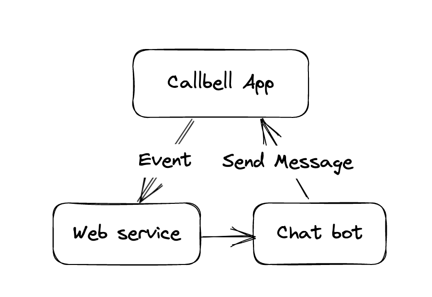
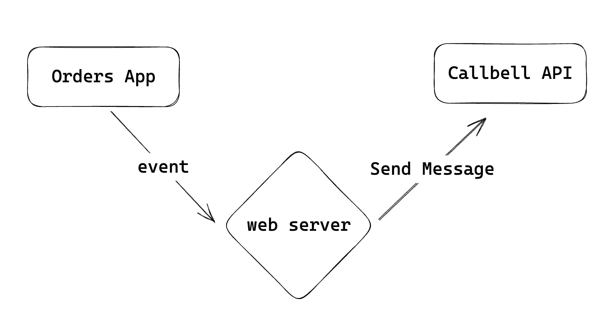

# How-to and Examples

This guide will show you how to use the Callbell API to send messages, get updates, and keep contact info up to date.

## Getting Started with Callbell

If you're new to Callbell, you can start with our [Getting Started with Callbell Guide](/getting_started).
We'll also look at some examples of using the Callbell API.

The examples fall into two categories: **Events Caused by Actions** and **Actions Driven by Events**.

## Events Caused by Actions

Events Caused by Actions are updates that happen because of an action. Like when someone new joins your website, it triggers a new event. You can sign up for these events and get a notice when they happen.

Here you'll find examples of events that the Callbell API can trigger. Use these examples to understand how to use Callbell API to send messages and update contact info when a new event happens.

:::info
For the webhook endpoint, you can use a service like [RequestBin](https://requestbin.com/) or [Webhook.site](https://webhook.site/). These are temporary endpoints for testing your setup. For actual use, you'll need to create your own endpoint. You'll need a webserver to receive the events and send messages to your customers using your own endpoint. You can use any programming language to do this.
:::

### Message Events

You can use the Callbell API to send messages when a new event happens.
We'll use the [Messages API](/api/reference/messages_api/introduction) to send messages. Check out the [Webhooks](/api/reference/webhooks/introduction) section for more info on signing up for events.

First, we need to set up a webhook endpoint to get the events. We'll use [RequestBin](https://requestbin.com/) to create a temporary endpoint.

1. Go to [RequestBin](https://requestbin.com/) and click on **Create a RequestBin**.
2. Copy the URL of the new RequestBin you just created.
3. Set up your webhook endpoint on Callbell. See [Webhooks](/api/reference/webhooks/introduction) for more info.

#### 🤖 Send a message with a chatbot when a new message comes in

In this example, we'll look at how to use the Callbell API to send a message with a chatbot when a new event happens. Let's say we want to send a chatbot message when a new message comes in. We'll follow the steps from the previous example to set up a webhook endpoint and get the events.

After setting up the webhook endpoint, we can use the Callbell API to send a chatbot message when a new message comes in. Check out the [Messages API](/api/reference/messages_api/introduction) for more info on sending messages.

Here's a diagram of how the Callbell API sends a chatbot message when a new message comes in.

### Contact Updates

You can also use the Callbell API to keep contact info up to date.
We'll use the [Contacts API](/api/reference/contacts_api/introduction) to make and update contacts.

#### 📝 Add a contact to a CRM when a new contact is made

In this example, we'll look at how to use the Callbell API to add a contact when a new user joins.

Let's say we want to add a contact to a CRM when a new contact is made in Callbell. We'll follow the steps from the previous example to set up a webhook endpoint and get the events.

After setting up the webhook endpoint, we can use the Callbell API to add a contact to a CRM when a new contact is made in Callbell. Check out the [Contacts API](/api/reference/contacts_api/introduction) for more info on making contacts.

:::info
You can use the same steps to update a contact when a user changes their profile.
:::

Here's a diagram of how the Callbell API adds a contact to a CRM when a new contact is made in Callbell.

## Actions Driven by Events

Actions Driven by Events are things that happen because of an update. Like when a new message comes in, you can send a message to the customer. You can use the Callbell API to send messages and keep contact info up to date when a new event happens.

### Send a message

Here, we'll look at how to use the Callbell API to send messages when a new event happens. As shown in the [Webhooks](/api/reference/webhooks/introduction) section, you can sign up for various events and get a notice when they happen.

You'll need to set up a webhook endpoint to get the events, and then use the Callbell API to send messages to your customers.

:::info
For the webhook endpoint, you can use a service like [RequestBin](https://requestbin.com/) or [Webhook.site](https://webhook.site/). These are temporary endpoints for testing your setup. For actual use, you'll need to create your own endpoint.
You'll need a webserver to receive the events and send messages to your customers using your own endpoint. You can use any programming language to do this.
:::

#### 🛒 Send a message when a new order comes in

In this example, we'll look at how to use the Callbell API to send a message to a customer when a new event happens.
Let's say we want to send a message to a customer when a new order is made on our online store.

First, we need to set up a webhook endpoint to get the events. We'll use [RequestBin](https://requestbin.com/) to create a temporary endpoint.

1. Go to [RequestBin](https://requestbin.com/) and click on **Create a RequestBin**.
2. Copy the URL of the new RequestBin you just created.
3. Set up your webhook endpoint on Callbell. See [Webhooks](/api/reference/webhooks/introduction) for more info.

Now we've set up a webhook endpoint that'll get the events. We can now use the Callbell API to send a message to the customer.

Check out the [Messages API](/api/reference/messages_api/introduction) for more info on sending messages.

Here's a diagram of how the Callbell API sends a message to the customer when a new order comes in.

#### 📅 Send a message when a new appointment is set

In this example, we'll look at how to use the Callbell API to send a message to a customer when a new event happens.
Let's say we want to send a message to a customer when a new appointment is set.

We'll follow the steps from the previous example to set up a webhook endpoint and get the events.

Now we've set up a webhook endpoint that'll get the events. We can now use the Callbell API to send a message to the customer when a new appointment is set. Check out the [Messages API](/api/reference/messages_api/introduction) for more info on sending messages. Here's a diagram of how the Callbell API sends a message to the customer when a new appointment is set.

### Using Zapier

You can use Zapier to link Callbell with thousands of other apps. Zapier is a tool that helps you link apps together and automate tasks. You can use Zapier to link Callbell with other apps like Slack, Gmail, Google Sheets, and more.

There are already many integrations available on Zapier that you can use to link Callbell with other apps. You can also make your own integrations using Zapier.

Here are some examples of Zaps you can make with Zapier:

- Send a message when a new email comes in (Gmail)
- Send a message when a new appointment is set (Calendly)
- Send a message when a new order comes in (Shopify)
- Send a message when a new contact is made (HubSpot)
- Send a message when a new contact is made (Mailchimp)
- Send a message when a new contact is made (Salesforce)
- Send a message when a new contact is made (Zendesk)
- Send a message when a new contact is made (Intercom)
- Send a message when a new contact is made (Pipedrive)
- Send a message when a new form is filled out (Typeform)
- Add a contact when a new form is filled out (Typeform)
- Send a message when a new form is filled out (Google Forms)
- Add a contact when a new form is filled out (Google Forms)

And many more...

You can also make your own integrations using Zapier. Check out the [Zapier Developer Platform](https://zapier.com/developer) for more info.
