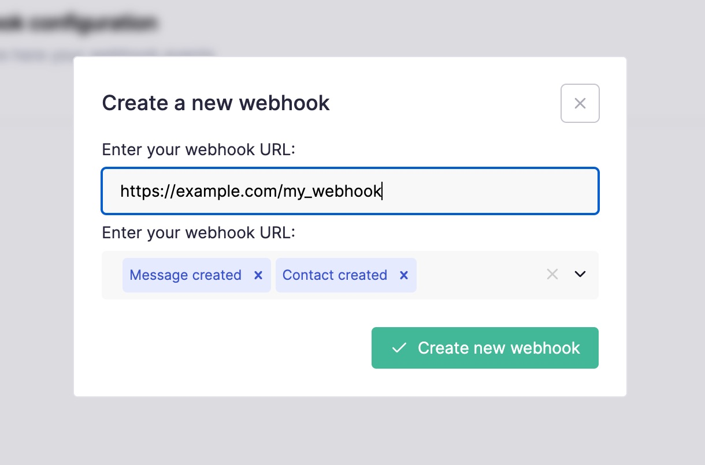

# Introduction

Callbell API provides **HTTP Webhooks** for the most common application events:

- **Message events**
- **Message notification status events**
- **Contact events**

## How to subscribe to events

On your Callbell dashboard navigate to the [**"API Settings"**](https://dash.callbell.eu/settings/api_settings/webhooks) section and click on the "Webhooks" tab:

In the URL field add your endpoint URL (e.g. `https://myapp.com/callbell_endpoint`) and select the events you want to get subscriptions for:

After clicking "Create new webhook" you should receive a success notification. You can always edit back the Webhook events in a later stage:

