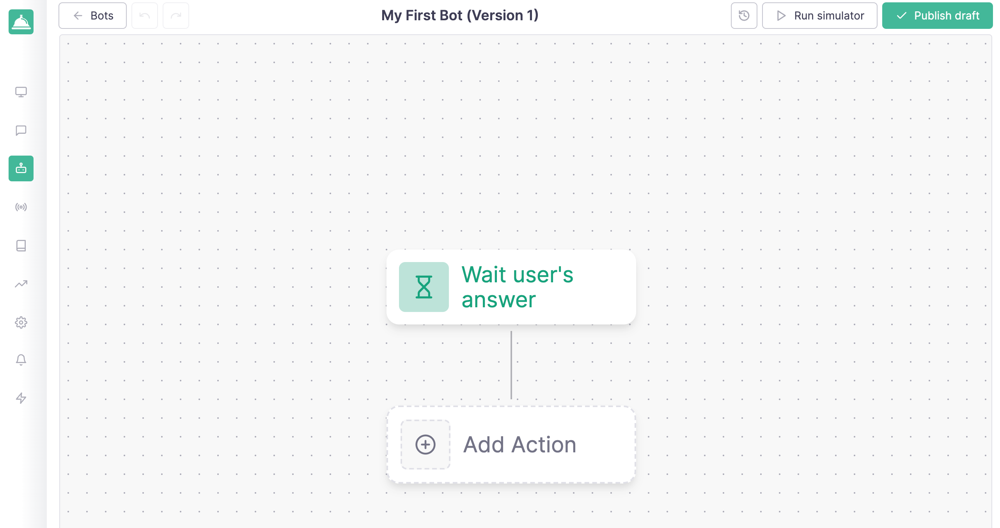
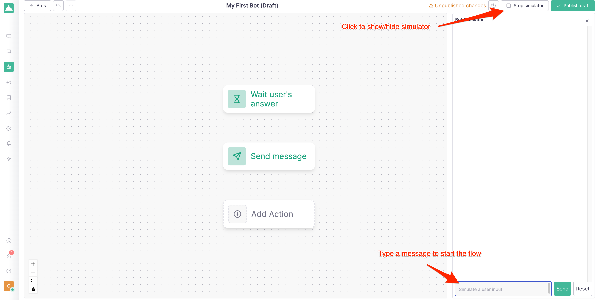
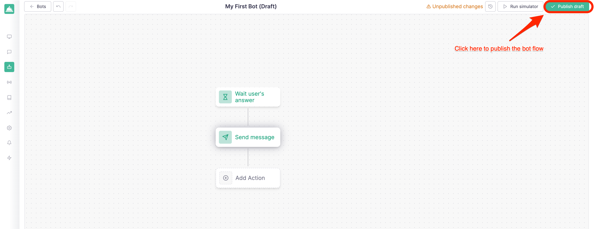

# Getting Started

This step by step guide will walk you through building your first chatbot with Callbell.

## Prerequisites

You will need to create an account on Callbell and have configured at least **1 channel** in order to be able to follow this guide.

- Sign up for [Callbell](https://dash.callbell.eu/users/sign_up)
- See more information about our [WhatsApp Business API integration](https://callbellsupport.zendesk.com/hc/en-us/articles/360007805898-How-to-integrate-WhatsApp-into-Callbell-through-the-WhatsApp-Business-APIs) for using the bot flow builder with WhatsApp.

## Creating your first chatbot

Navigate to the **Bot Builder** section in the left sidebar and click on the **Create new bot** button:

A modal will pop up asking you to choose a name for your bot and the channel you want to use it with:

After clicking on the **Create bot** button you'll be redirected to the bot builder page where you can start building your first chatbot:

## Adding a new action

In order for the bot to work you'll have to add at least one action. For example, let's reply to the user with a message when he/she sends a message to the bot.

Click on the **Add new action** button and select the **Send Message** action:

A panel will open so you can use to configure the action. In this case we'll just add a simple text message:

After clicking on the **Save** button you'll be redirected to the bot builder page where you can see the action you just created:

## Test your bot

In order to test your bot you'll have to click on the **Run Simulator** button on the top right corner of the page. This will open a panel where you can test your new flow:

Just click on the **Send** button and you'll see the bot replying with the message you just configured:

## Publish your bot

Once you're happy with your bot you can publish it by clicking on the **Publish Draft** button on the top right corner of the page:

After clicking on the **Publish draft** button and confirming, your bot flow will be published; at the same time you'll need to **enable your bot** in order to make it available to your customers. You can do this by navigating back to the "Bots" section in the right sidebar and clicking on the **Enable bot** button:

You can confirm that the bot is enabled by checking the status in the "Bots" section:

## Test your bot in production

Now that your bot is enabled you can test it in production by sending a message to the channel you configured it with. In this case we'll send a message to the WhatsApp number we configured in the [Prerequisites](#prerequisites) section:

## What's next?

Now that you've created your first chatbot you can start exploring the other actions available in the bot builder.