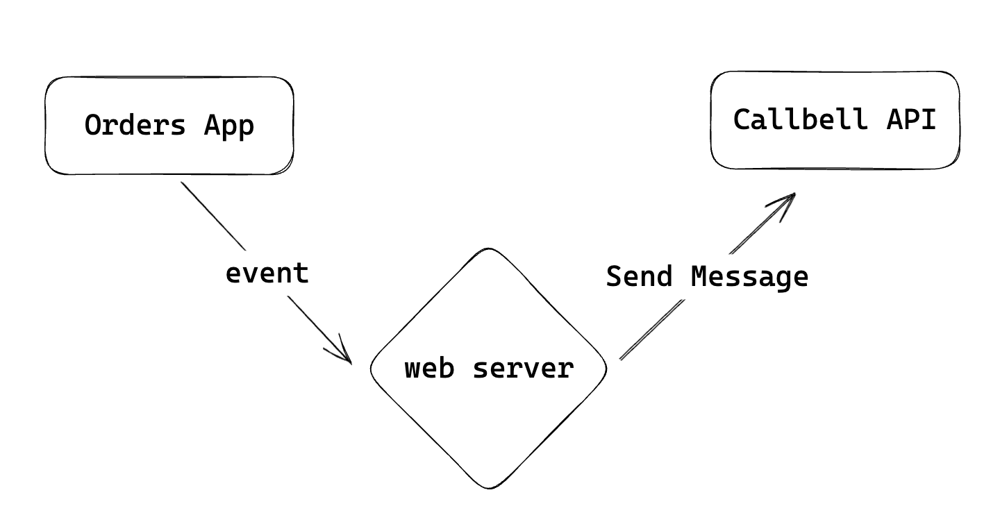

# Guides and Examples

Let's see how to use the Callbell API to send messages, receive events and synchronize contact information.

## Getting Started with Callbell

If you're new to Callbell, you can follow our [Getting Started with Callbell Guide](/getting_started).
Next we'll see some use-cases and examples of how to use the Callbell API.

The examples are divided into two categories: **Action-Triggered Events** and **Event-Driven Actions**.

## Action-Triggered Events

Action-Triggered Events are events that are triggered by an action. For example, when a new user signs up on your website, a new event is triggered. You can subscribe to these events and receive a notification when they occur.

This section contains a list of examples of events that can be triggered by the Callbell API. You can use these examples to learn how to use the Callbell API to send messages and synchronize contact information when a new event is triggered.

:::info
For the webhook endopoint you can use a service like [RequestBin](https://requestbin.com/) or [Webhook.site](https://webhook.site/). This is a temporary endpoint that you can use to test your integration. For production you will need to create your own endpoint. A webserver is required to receive the events and send messages to your customers using your own endpoint. You can use any programming language to do this.
:::

### Message Events

We can use the Callbell API to send messages when a new event is triggered.
We'll use the [Messages API](/api_reference/messages_api/introduction) to send messages. See the [Webhooks](/api_reference/webhooks/introduction) section for more information on how to subscribe to events.

First we need to create a webhook endpoint to receive the events. We'll use [RequestBin](https://requestbin.com/) to create a temporary endpoint.

1. Go to [RequestBin](https://requestbin.com/) and click on **Create a RequestBin**.
2. Copy the URL of the new RequestBin you just created.
3. Configure your webhook endpoint on Callbell. See [Webhooks](/api_reference/webhooks/introduction) for more information.

#### 🤖 Send a message with a chatbot when a new message is received

In this example we'll see how to use the Callbell API to send a message with a chatbot when a new event is triggered. Let's say that we want to send a message with a chatbot when a new message is received. We'll use the steps described in the previous example to create a webhook endpoint and receive the events.

After creating the webhook endpoint we can use the Callbell API to send a message with a chatbot when a new message is received. See the [Messages API](/api_reference/messages_api/introduction) for more information on how to send messages.

Below is a diagram of how the Callbell API is used to send a message with a chatbot when a new message is received.

### Contact Events

We can use the Callbell API to synchronize contact information too.
We'll use the [Contacts API](/api_reference/contacts_api/introduction) to create and update contacts.

#### 📝 Create a contact in a CRM when a new contact is created

In this example we'll see how to use the Callbell API to create a contact when a new user signs up.

Let's say that we want to create a contact in a CRM when a contact is created in Callbell. We'll use the steps described in the previous example to create a webhook endpoint and receive the events.

After creating the webhook endpoint we can use the Callbell API to create a contact in a CRM when a contact is created in Callbell. See the [Contacts API](/api_reference/contacts_api/introduction) for more information on how to create contacts.

:::info
The same steps can be used to update a contact when a user updates their profile.
:::

Below is a diagram of how the Callbell API is used to create a contact in a CRM when a contact is created in Callbell.

## Event-Driven Actions

Event-Driven Actions are actions that are triggered by an event. For example, when a new message is received, you can send a message to the customer. You can use the Callbell API to send messages and synchronize contact information when a new event is triggered.

### Send a message

Here we explore the use of Callbell API to send messages when a new event is triggered. As shown in the [Webhooks](/api_reference/webhooks/introduction) section, you can subscribe to several events and receive a notification when they occur.

You will need to create a webhook endpoint to receive the events and then use the Callbell API to send messages to your customers.

:::info
For the webhook endopoint you can use a service like [RequestBin](https://requestbin.com/) or [Webhook.site](https://webhook.site/). This is a temporary endpoint that you can use to test your integration. For production you will need to create your own endpoint.
A webserver is required to receive the events and send messages to your customers using your own endpoint. You can use any programming language to do this.
:::

#### 🛒 Send a message when a new order is placed

In this example we'll see how to use the Callbell API to send a message to a customer when a new event is triggered.
Let's say that we want to send a message to a customer when a new order is placed on our e-commerce store.

First we need to create a webhook endpoint to receive the events. We'll use [RequestBin](https://requestbin.com/) to create a temporary endpoint.

1. Go to [RequestBin](https://requestbin.com/) and click on **Create a RequestBin**.
2. Copy the URL of the new RequestBin you just created.
3. Configure your webhook endpoint on Callbell. See [Webhooks](/api_reference/webhooks/introduction) for more information.

Now we have created a webhook endpoint that will receive the events. We can now use the Callbell API to send a message to the customer.

See the [Messages API](/api_reference/messages/introduction) for more information on how to send messages.

In the following diagram we can see how the Callbell API is used to send a message to the customer when a new order is placed.

#### 📅 Send a message when a new appointment is scheduled

In this example we'll see how to use the Callbell API to send a message to a customer when a new event is triggered.
Let's say that we want to send a message to a customer when a new appointment is scheduled.

We'll use the steps described in the previous example to create a webhook endpoint and receive the events.

Now we have created a webhook endpoint that will receive the events. We can now use the Callbell API to send a message to the customer when a new appointment is scheduled. See the [Messages API](/api_reference/messages_api/introduction) for more information on how to send messages. In the following diagram we can see how the Callbell API is used to send a message to the customer when a new appointment is scheduled.

### Using Zapier

You can use Zapier to connect Callbell with thousands of other apps. Zapier is a tool that allows you to connect apps together and automate workflows. You can use Zapier to connect Callbell with other apps like Slack, Gmail, Google Sheets, and more.

There are already several integrations available on Zapier that you can use to connect Callbell with other apps. You can also create your own integrations using Zapier.

Some examples of Zaps that you can create using Zapier are:

- Send a message when a new email is received (Gmail)
- Send a message when a new appointment is scheduled (Calendly)
- Send a message when a new order is placed (Shopify)
- Send a message when a new contact is created (HubSpot)
- Send a message when a new contact is created (Mailchimp)
- Send a message when a new contact is created (Salesforce)
- Send a message when a new contact is created (Zendesk)
- Send a message when a new contact is created (Intercom)
- Send a message when a new contact is created (Pipedrive)
- Send a message when a new form is submitted (Typeform)
- Create a contact when a new form is submitted (Typeform)
- Send a message when a new form is submitted (Google Forms)
- Create a contact when a new form is submitted (Google Forms)

And many more...

You can also create your own integrations using Zapier. See the [Zapier Developer Platform](https://zapier.com/developer) for more information.
