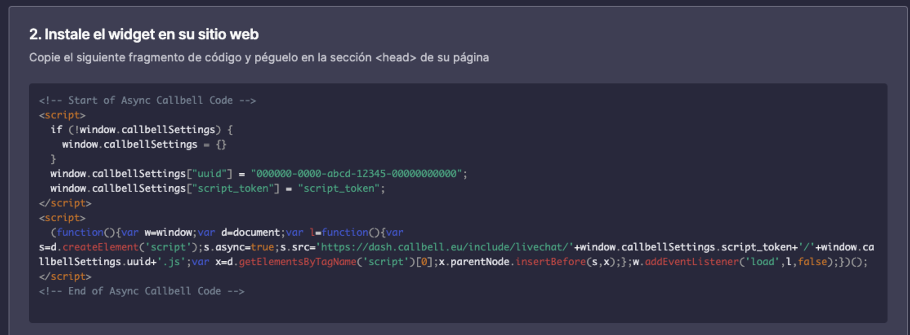
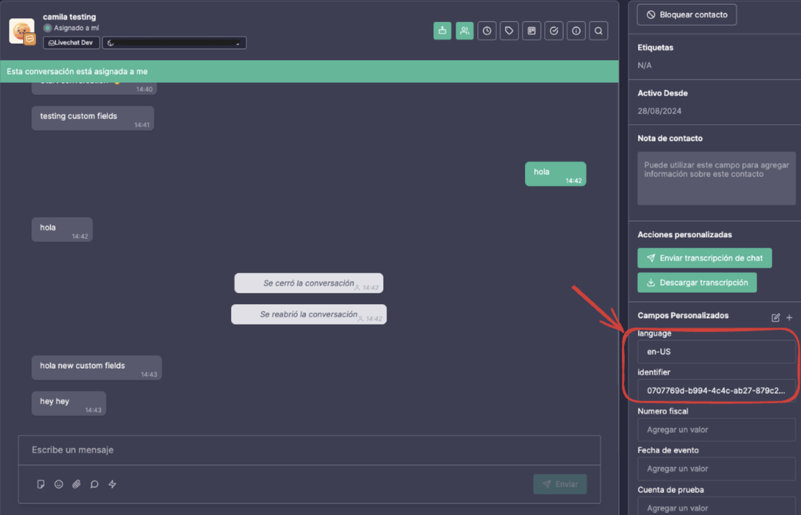

# How to create custom fields from webchat

In this quick guide you will learn how to create [custom fields](https://headwayapp.co/callbell-changelog/custom-fields-(for-contacts)-225586) in the Callbell app using information that is sent via our webchat.

## Step 1: Generate the webchat code snippet

After creating a webchat integration and customizing it according to your preferences, go to the second section of the widget configuration page. There you will see a code snippet that was generated to be copied and pasted into your website in order to make the webchat work.



## Step 2: Edit code snippet

In our case, what we want is to send information from our website to Callbell app whenever a user starts interacting with the chat. We can achieve that simply by making some small changes in the code snippet generated above. See the example below:

```html
<script>
  if (!window.callbellSettings) {
    window.callbellSettings = {}
  }
  window.callbellSettings["uuid"] = "000000-0000-abcd-1234-0000000000";
  window.callbellSettings["script_token"] = "script_token";
  window.callbellSettings["extra_params"] = {
    "identifier": '12345567',
    "course": "Computer Science",
    "semester": "4rd"
  }
</script>
<script>
  (function(){var ...);
</script>
```

In this example, the extra fields are hard coded, but they can be information that are sent from your backend.

:::info
Note that the field `identifier` is mandatory. It will be used as an id to the user interacting with the webchat, therefore it must be unique. If this field is not sent, the user will be able to interact with the chat and send and receive messages, but no custom fields will be created.
:::

:::info
You can send maximum 20 extra fields to create custom fields in the Callbell app.
:::

## Example

In the example below, we are generating random a UUID as an identifier and getting the browser language.
```html
<script>
  if (!window.callbellSettings) {
    window.callbellSettings = {}
  }
  window.callbellSettings["uuid"] = "000000-0000-abcd-1234-0000000000";
  window.callbellSettings["script_token"] = "script_token";
  window.callbellSettings["extra_params"] = {
    identifier: self.crypto.randomUUID(),
    language: navigator.language,
  }
</script>
<script>
  (function(){var ...);
</script>
````

And this is how it will be show the the Callbell app.
