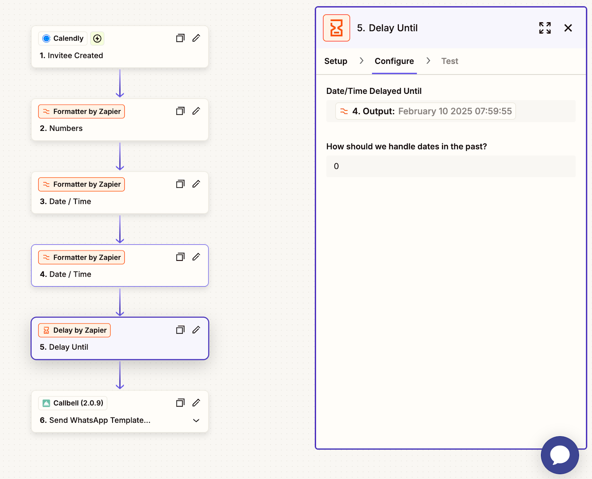

# Calendly Integration

## Automate Appointment WhatsApp Communication with Callbell

> In the following guides, you will learn how to integrate Calendly with Callbell using Zapier. This integration enables you to automate appointment-related WhatsApp communications, ensuring a seamless experience for both you and your customers.

With this setup, you can:

- Send automated appointment confirmations via WhatsApp through Callbell.
- Send automated appointment reminders via WhatsApp to reduce no-shows.
- Send automated follow-ups after the appointment via WhatsApp to maintain engagement and improve customer experience.

Each guide provides step-by-step instructions on setting up these workflows using Zapier, Calendly, and Callbell.

---

## Guide 1: Send Automated Appointment Confirmations

Send an automated appointment confirmation as a WhatsApp message through Callbell.

<iframe width="100%" height="500" src="https://www.youtube.com/embed/H6BbYsYniUQ?si=55NT_SFQAHJrCqqx" title="Automated Follow-Ups for Appointments on WhatsApp" frameborder="0" allow="accelerometer; autoplay; clipboard-write; encrypted-media; gyroscope; picture-in-picture; web-share" referrerpolicy="strict-origin-when-cross-origin" allowfullscreen></iframe>

### Step-by-Step Explanation

1. **Create your Calendly Booking Page**

   Design your Calendly booking page to collect essential information, such as:

   - **Name**
   - **Phone number** (mandatory)
   - **Email address** (optional)

   

2. **Prepare Message Templates in Callbell**

   Create the template message you want to send to new leads in Callbell. While designing the template:

   - Use custom variables (e.g., `{{variable 1}}`, `{{variable 2}}`) to personalize the message.
   - These variables will be dynamically filled in Zapier.
   - [Learn more about creating templates with variables in Callbell](https://callbellsupport.zendesk.com/hc/en-us/articles/360007759237-What-are-message-templates-and-what-are-they-for)

   > **Note:** In most cases, WhatsApp templates used for appointment confirmations or reminders are best approved under the “Utility” category (which costs less than “Marketing”).

   

3. **Create a Zap: Calendly as the Trigger**

   - Log into Zapier and create a new Zap.
   - Set the trigger to **Invitee Created**.
   - Connect your Calendly account.
   - Test the trigger to ensure Zapier correctly retrieves the booking submission data.

   

4. **Format the Phone Number**

   - Add Zapier’s **Formatter** action to ensure the phone number submitted via Calendly is properly formatted for Callbell.
   - Select the **Numbers** action in Formatter.
   - Choose **Format Phone Number** as the transformation type.
   - Map the phone number field from Calendly.
   - Select the output format **E164**.

   

5. **Send the Template Message with Custom Variables via Callbell**

   - Add a **Send Template Message** action in Zapier.
   - Connect your Callbell account.
   - Map the formatted phone number field from the previous step to the **“To”** field.
   - Copy and paste the template UUID you created in Step 2.
   - Copy and paste the channel UUID from your Callbell account.
   - Fill in your template variables under the **“Template values”** field.

   

### Final Notes

With this setup, every new Calendly appointment will trigger an automated WhatsApp confirmation message via Callbell—ensuring your customers receive an instant, clear confirmation. For additional assistance, refer to:

- [Callbell Help Center](https://callbellsupport.zendesk.com/hc/en-us)
- [Zapier Help Documentation](https://help.zapier.com/hc/en-us)

---

## Guide 2: Send Automated Appointment Reminders

Send an automated appointment reminder as a WhatsApp message through Callbell.

<iframe width="100%" height="500" src="https://www.youtube.com/embed/wkGdPDJ7H5w?si=WwM8HKyEVYh_NTbO" title="Automated Appointment Reminders on WhatsApp" frameborder="0" allow="accelerometer; autoplay; clipboard-write; encrypted-media; gyroscope; picture-in-picture; web-share" referrerpolicy="strict-origin-when-cross-origin" allowfullscreen></iframe>

### Step-by-Step Explanation

> The setup process is similar to the appointment confirmation workflow. First, follow all the steps outlined in **Guide 1**.

Then, add the following additional Zapier steps **before** the last step (“Send the Template Message with Custom Variables via Callbell”):

1. **Add a Formatter Action for Date/Time**

   - In Zapier, click **Add a Step** and select **Formatter**.
   - Choose **Date/Time** as the Event.
   - Under **Transform**, select **Format**.
   - In the **Input** field, select **Scheduled Event Start Time**.
   - Under **To Format**, choose the desired date/time format (e.g., `DD/MM/YYYY HH:mm`).
   - In **To Timezone**, select the appropriate timezone for the event.

   

2. **Add Another Formatter Action to Adjust the Reminder Time**

   - Click **Add a Step** and select **Formatter**.
   - Choose **Date/Time** as the Event.
   - Under **Transform**, select **Add/Subtract Time**.
   - In the **Input** field, select the output from the previous Formatter step.
   - In the **Expression** field, enter `-1 day` to send the reminder one day before the appointment.
   - Keep the output format the same as before.

   

3. **Add a Delay Action**

   - Click **Add a Step** and select **Delay**.
   - Choose **Delay Until** as the Event.
   - In the **Date/Time Delayed Until** field, select the output from the adjusted reminder time step.
   - Under **How should we handle dates in the past?**, choose **Always continue**.

   

### Final Notes

This setup ensures that every scheduled appointment in Calendly triggers an automated WhatsApp reminder via Callbell—sending a timely notification one day before the appointment. This helps reduce no-shows and improves attendance. For further help, refer to:

- [Callbell Help Center](https://callbellsupport.zendesk.com/hc/en-us)
- [Zapier Help Documentation](https://help.zapier.com/hc/en-us)

---

## Guide 3: Send Automated Follow-ups After Appointment

Send automated follow-up messages as a WhatsApp message via Callbell after an appointment.

<iframe width="100%" height="500" src="https://www.youtube.com/embed/8biiNuYRxaw?si=s8VRVNBE-DIqus-Q" title="Automate Appointment Communication on WhatsApp with Callbell" frameborder="0" allow="accelerometer; autoplay; clipboard-write; encrypted-media; gyroscope; picture-in-picture; web-share" referrerpolicy="strict-origin-when-cross-origin" allowfullscreen></iframe>

### Step-by-Step Explanation

The setup process is similar to the appointment confirmation workflow:

1. **Follow the steps outlined in Guide 1: Send Automated Appointment Confirmations**

2. **Add the following additional Zapier steps before the last step ‘Send the Template Message with Custom Variables via Callbell’ to complete this workflow.**

   1. **Add a Formatter Action**

      - In Zapier, click **Add a Step** and select Formatter.
      - Choose **Date/Time** as the Event.
      - Under Transform, select **Format**.
      - In the Input field, select **Scheduled Event End Time**.
      - Under To Format, choose the desired date/time format (e.g., `DD/MM/YYYY HH:mm`).
      - In To Timezone, select the appropriate timezone for the event.

      

   2. **Add another Formatter Action to Adjust the Follow-up Time**

      - In Zapier, click **Add a Step** and select Formatter.
      - Choose **Date/Time** as the Event.
      - Under Transform, select **Add/Subtract Time**.
      - In the Input field, select the Output of the formatted date from Step 3.
      - In the Expression field, enter **+15 minutes** to send the reminder 15 minutes after the appointment.
      - Keep the To Format the same as in Step 3 to maintain consistency.

      

   3. **Add a Delay Action**

      - In Zapier, click **Add a Step** and select Delay.
      - Choose **Delay Until** as the Event.
      - In the Date/Time Delayed Until field, select the Output from Step 4 above (the adjusted follow-up time).
      - Under **How should we handle dates in the past?**, select **Always continue** to ensure the workflow runs smoothly even if the delay condition is slightly missed.

      

### Final Notes

With this setup, every completed Calendly appointment will trigger an automated WhatsApp follow-up message via Callbell. This ensures continued engagement with your customers, whether for feedback collection, next steps, or future appointment scheduling. This workflow helps improve customer relationships and enhances overall service quality.

For additional help, check out:

- [Callbell Help Center](https://callbellsupport.zendesk.com/hc/en-us)
- [Zapier Help Documentation](https://help.zapier.com/hc/en-us)
