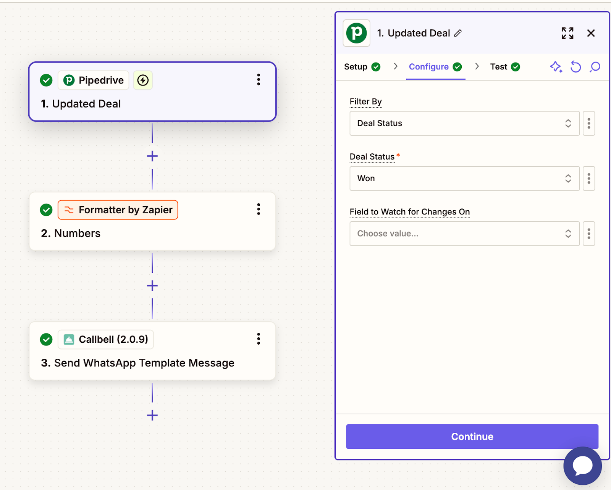

# Pipedrive Integration

## Automate CRM WhatsApp Communication with Callbell

Learn how to integrate Pipedrive with Callbell using Zapier to automate WhatsApp communications.

## Introduction

> In the following guide, you will learn how to integrate Pipedrive with Callbell using Zapier. This integration allows you to automate WhatsApp communications based on Pipedrive activities, ensuring a seamless sales and customer management process.

### With this setup, you can:

- Automatically create new contacts from Pipedrive in Callbell
- Automatically send out WhatsApp templates when a deal changes its status in Pipedrive
- Automatically send out WhatsApp templates when a deal is won

Each guide provides step-by-step instructions on setting up these workflows using Zapier, Pipedrive, and Callbell.

## Guide 1: Automatically Create New Contacts from Pipedrive in Callbell

In this guide, we will walk you through how to automatically create new contacts in Callbell whenever a new contact is added in Pipedrive. This integration ensures that your contacts from your CRM are automatically available in Callbell.

<iframe width="100%" height="500" src="https://www.youtube.com/embed/7pLef6Iu_U4?si=rv1bFs-88Qze6Vb5" title="Automatically Create New Contacts from Pipedrive in Callbell" frameborder="0" allow="accelerometer; autoplay; clipboard-write; encrypted-media; gyroscope; picture-in-picture; web-share" referrerpolicy="strict-origin-when-cross-origin" allowfullscreen></iframe>

### Step-by-Step Explanation

#### 1. Create a Zap: Pipedrive as the Trigger

- Log into Zapier and create a new Zap.
- Set the trigger to "New Person" (this will trigger the Zap whenever a new contact is added in Pipedrive).
- Connect your Pipedrive account.
- Test the trigger to ensure Zapier correctly retrieves the new contact data from Pipedrive.

#### 2. Create a Contact on Callbell

- Select Callbell as the action app.
- Set the action to "Create Contact" (this will create a new contact in Callbell when triggered).
- Connect your Callbell account.
- Map the fields from Pipedrive to Callbell:
  - **Name** → Map from Pipedrive's contact name.
  - **Phone Number** → Map from Pipedrive's contact phone number.
  - Map any additional relevant fields if needed.
- Test the action to ensure Zapier successfully creates a contact in Callbell.

### Final Notes

With this setup, every new contact added in Pipedrive will automatically be created in Callbell. This workflow saves time, reduces manual data entry, and ensures that your team can instantly engage with new contacts.

**For additional help, check out:**

- [Callbell Help Center](https://callbellsupport.zendesk.com/hc/en-us)
- [Zapier Help Documentation](https://help.zapier.com/hc/en-us)

## Guide 2: Automatically Send Out WhatsApp Templates When a Deal Changes Its Status in Pipedrive

In this guide, we will walk you through how to automatically send a WhatsApp message via Callbell whenever a deal changes its status in Pipedrive. This integration ensures that your customers receive timely updates based on deal progress, such as reminders, follow-ups, or status notifications.

<iframe width="100%" height="500" src="https://www.youtube.com/embed/uLFP-2HyCt0?si=bWH9qo1MxOT7bY8F" title="Automatically send out WhatsApp templates messages when a deal changes its status in Pipedrive" frameborder="0" allow="accelerometer; autoplay; clipboard-write; encrypted-media; gyroscope; picture-in-picture; web-share" referrerpolicy="strict-origin-when-cross-origin" allowfullscreen></iframe>

### Step-by-Step Explanation

#### 1. Prepare Message Templates in Callbell

- Create the template message you want to send out.
- Use custom variables (e.g., `{{variable 1}}, {{variable 2}}`) to personalize the message.
- Learn more about creating templates with variables in Callbell: [Message Templates Guide](https://callbellsupport.zendesk.com/hc/en-us/articles/360007759237-What-are-message-templates-and-what-are-they-for)

- **Note:** WhatsApp templates used for confirmations or reminders are best approved under the "Utility" category, which costs half compared to "Marketing."

#### 2. Create a Zap – Pipedrive as the Trigger

- Log into Zapier and create a new Zap.
- Set the trigger to "Updated Deal" (this will trigger the Zap whenever a deal moves to a new stage in Pipedrive).
- Connect your Pipedrive account.
- Test the trigger to ensure Zapier correctly retrieves the updated deal data from Pipedrive.

#### 3. Format the Phone Number

- Add Zapier’s "Formatter" action to ensure the phone number is properly formatted for Callbell.
- Select the "Numbers" action in Formatter.
- Choose "Format Phone Number" as the transformation type.
- Map the phone number field from Typeform.
- Select the output format **E164**.

#### 4. Send the Template Message with Custom Variables via Callbell

- Add a "Send Template Message" action in Zapier.
- Connect your Callbell account.
- Map the formatted phone number field from the previous step to the ‘To’ field.
- Copy and paste the **template UUID** you created in Step 1.
- Copy and paste the **channel UUID** from your Callbell account.
- Fill your template variables under the ‘Template values’ field.

### Final Notes

With this setup, every time a deal changes status in Pipedrive, an automated WhatsApp message will be sent via Callbell, ensuring your customers receive timely updates on their deal progress.

**For additional help, check out:**

- [Callbell Help Center](https://callbellsupport.zendesk.com/hc/en-us)
- [Zapier Help Documentation](https://help.zapier.com/hc/en-us)

## Guide 3: Automatically Send Out WhatsApp Templates When a Deal Is Won

In this guide, we will walk you through how to automatically send a WhatsApp message via Callbell whenever a deal is marked as "Won" in Pipedrive. This integration ensures that your customers receive timely updates, such as order confirmations, thank-you messages, or next steps, helping you maintain engagement and customer relationships.

<iframe width="100%" height="500" src="https://www.youtube.com/embed/_dDywjC2uu8?si=FypiyHT9q7eSM5Hg" title="Automatically send out WhatsApp templates when a deal is won" frameborder="0" allow="accelerometer; autoplay; clipboard-write; encrypted-media; gyroscope; picture-in-picture; web-share" referrerpolicy="strict-origin-when-cross-origin" allowfullscreen></iframe>

### Step-by-Step Explanation

The setup process follows a similar structure to **Guide 2: Automatically Send Out WhatsApp Templates When a Deal Changes Status in Pipedrive**. Refer to Guide 2 for detailed instructions.

#### Create a Zap – Pipedrive as the Trigger

- Log into Zapier and create a new Zap.
- Set the trigger to "Updated Deal" (this will trigger the Zap whenever a deal's status changes in Pipedrive).
- Connect your Pipedrive account.
- In the **Filter By** field, select **Deal Status**.
- In the **Deal Status** field, select **Won** (this ensures the automation runs only when a deal is marked as Won).
- Test the trigger to ensure Zapier correctly retrieves the updated deal data from Pipedrive.

### Final Notes

With this setup, every time a deal is marked as Won in Pipedrive, an automated WhatsApp message will be sent via Callbell, ensuring your customers receive timely updates and confirmations.

**For additional help, check out:**

- [Callbell Help Center](https://callbellsupport.zendesk.com/hc/en-us)
- [Zapier Help Documentation](https://help.zapier.com/hc/en-us)
