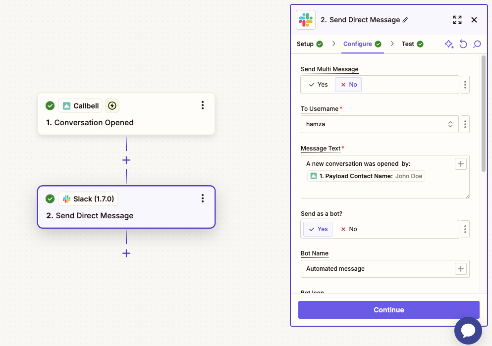

# Slack Integration

## Automate Internal Notifications from Callbell

In the following guides, you'll learn how to integrate Callbell with Slack using Zapier. This integration helps your team stay informed in real time by sending automated Slack messages based on specific events in Callbell.

With this setup, you can:

- Notify your team on Slack when a new contact is created in Callbell.
- Notify your team on Slack when a conversation is opened in Callbell.
- Notify your team on Slack when a conversation is closed in Callbell.

Each guide will walk you through step-by-step instructions to set up these workflows using Callbell, Zapier, and Slack.

---

## Guide 1: Notify Slack When a New Contact Is Created in Callbell

Automatically post a message in Slack whenever a new contact is created in Callbell.

### 1. Create a Zap: Callbell as the Trigger

1. Log into Zapier and click **Create Zap**.
2. Choose **Callbell** as the trigger app.
3. Select the trigger event **New Contact Created**.
4. Connect your Callbell account.
5. Test the trigger to confirm Zapier retrieves the new contact’s data (name, phone, etc.).

### 2. Add Slack as the Action

1. Click **+ Add Action**.
2. Select **Slack** as the action app.
3. Choose **Send Channel Message** or **Send Direct Message**, depending on your workflow.
4. Connect your Slack account and pick the destination (e.g., `#new-leads`, `#support`, or your own DM).
5. In the **Message Text**, insert dynamic fields from the Callbell step, such as `{{Contact Name}}` and `{{Phone Number}}`.

### 3. Customize Slack Message Settings

- (Optional) Add a custom icon or image for the message.
- Include a link back to the Zap or to the Callbell contact URL if available.
- Use Slack formatting: emojis, mentions (e.g., `<!here>` or `<@U123456>`), bold, links, etc.

### Final Notes

This workflow ensures your sales or support team sees every new contact immediately in Slack.

For additional help, check out:

- [Callbell Help Center](https://callbellsupport.zendesk.com/hc/en-us)
- [Zapier Help Documentation](https://help.zapier.com/hc/en-us)

---

## Guide 2: Notify Slack When a Conversation Is Opened in Callbell

Automatically post a message in Slack whenever a conversation is opened in Callbell.

### 1. Create a Zap: Callbell as the Trigger

1. Log into Zapier and click **Create Zap**.
2. Choose **Callbell** as the trigger app.
3. Select **Conversation Opened** as the trigger event.
4. Connect your Callbell account.
5. Test the trigger to ensure Zapier retrieves the correct conversation data.

### 2. Add Slack as the Action

1. Click **+ Add Action**.
2. Select **Slack** as the action app.
3. Choose **Send Channel Message** or **Send Direct Message**.
4. Connect your Slack account and choose the channel (e.g., `#activity-feed`, `#support-messages`, or a DM).
5. In **Message Text**, insert dynamic fields like `{{Contact Name}}`, `{{Conversation ID}}`, or the first message snippet.

### 3. Customize Slack Message Settings

- (Optional) Add an icon/image or link back to the Zap or the Callbell conversation.
- Tag users or use `<!here>` to alert your team.
- Format with bold, italics, and links for clarity.

### Final Notes

Keep your team updated in real time whenever a new conversation begins. Ideal for monitoring inbound requests and improving first response times.

For additional help, check out:

- [Callbell Help Center](https://callbellsupport.zendesk.com/hc/en-us)
- [Zapier Help Documentation](https://help.zapier.com/hc/en-us)

---

## Guide 3: Notify Slack When a Conversation Is Closed in Callbell

Automatically post a message in Slack whenever a conversation is closed in Callbell.

### 1. Create a Zap: Callbell as the Trigger

1. Log into Zapier and click **Create Zap**.
2. Choose **Callbell** as the trigger app.
3. Select **Conversation Closed** as the trigger event.
4. Connect your Callbell account.
5. Test the trigger to confirm Zapier retrieves the closing data.

### 2. Add Slack as the Action

1. Click **+ Add Action**.
2. Select **Slack** as the action app.
3. Choose **Send Channel Message** or **Send Direct Message**.
4. Connect your Slack account and choose the channel (e.g., `#closed-conversations`, `#support-logs`, or a DM).
5. In **Message Text**, insert fields such as `{{Contact Name}}`, `{{Closed At}}`, and a summary of the conversation outcome.

### 3. Customize Slack Message Settings

- (Optional) Include an icon or link to the Zap or the Callbell conversation URL.
- Use mentions (`<!here>`), emojis, or formatting to highlight key details.

### Final Notes

This workflow alerts your team whenever a conversation wraps up, enabling managers to review outcomes and follow up as needed.

For additional help, check out:

- [Callbell Help Center](https://callbellsupport.zendesk.com/hc/en-us)
- [Zapier Help Documentation](https://help.zapier.com/hc/en-us)
