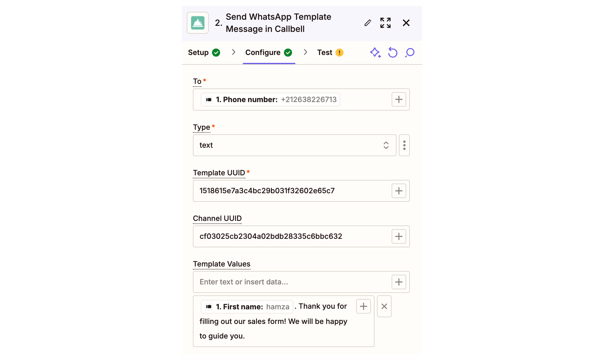

# Typeform Integration - Automate Lead Communication with Callbell

Simplify lead communication by integrating Typeform and Callbell through Zapier. This guide will help you set up an automated workflow to collect lead data from Typeform, format it, and send a personalized WhatsApp template message via Callbell using custom variables.

Link: https://zapier.com/apps/callbell/integrations/typeform

<iframe width="100%" height="500" src="https://www.youtube.com/embed/dJYwrNcfSPI?si=esDxnGo5KQfuLgE7" title="Typeform Integration - Automate Lead Communication with Callbell" frameborder="0" allow="accelerometer; autoplay; clipboard-write; encrypted-media; gyroscope; picture-in-picture; web-share" referrerpolicy="strict-origin-when-cross-origin" allowfullscreen></iframe>

## Introduction

This article explains how to automate lead qualification and communication using Typeform, Callbell, and Zapier. By the end, you'll have a fully automated workflow that sends a personalized WhatsApp template message to leads as soon as they submit their information via Typeform.

## Step-by-Step Explanation

### 1. Create the Desired Typeform

Design your Typeform to collect essential information, such as:

    - Name
    - Phone number (mandatory)
    - E-mail address (optional)

### 2. Prepare Message Templates in Callbell

Create the template message you want to send to new leads in Callbell. While designing the template:

    - Use custom variables (e.g., `{{variable 1}}`, `{{variable 2}}`) to personalize the message.
    - These variables will be dynamically filled in Zapier using the lead data from Typeform.
    - Learn more about creating templates with variables in Callbell: [Callbell Help Article](https://callbellsupport.zendesk.com/hc/en-us/articles/360007759237-What-are-message-templates-and-what-are-they-for)

### 3. Create a Zap: Typeform as the Trigger

- Log into Zapier and create a new Zap.
- Set the trigger to **"New Entry in Typeform"**.
- Connect your Typeform account and select the form you designed in Step 1.
- Test the trigger to ensure Zapier correctly retrieves the form submission data.

### 4. Format the Phone Number

**Note:** If the phone number field in Typeform is of type **"phone number"**, there is no need to perform the number formatting step.

Add Zapier’s **"Formatter"** action to ensure the phone number submitted via Typeform is properly formatted for Callbell.

- Select the **"Numbers"** action in Formatter.
- Choose **"Format Phone Number"** as the transformation type.
- Map the phone number field from Typeform.
- Select the output format **E164**.

### 5. Send the Template Message with Custom Variables via Callbell

Add a **"Send Template Message"** action in Zapier.

- Connect your Callbell account.
- Map the formatted phone number field from the previous step to the **‘To’** field.
- Copy and paste the template UUID you created in Step 2.
- Copy and paste the channel UUID from your Callbell account.
- Fill your template variables under the **‘Template values’** field.

## Final Notes

With this setup, every new lead from Typeform will automatically receive a personalized WhatsApp message via Callbell, complete with dynamically filled custom variables. This workflow ensures timely and customized communication with your leads.

For additional help, check out:

- [Callbell Help Center](https://callbellsupport.zendesk.com/hc/en-us)
- [Zapier Help Documentation](https://help.zapier.com/hc/en-us)
