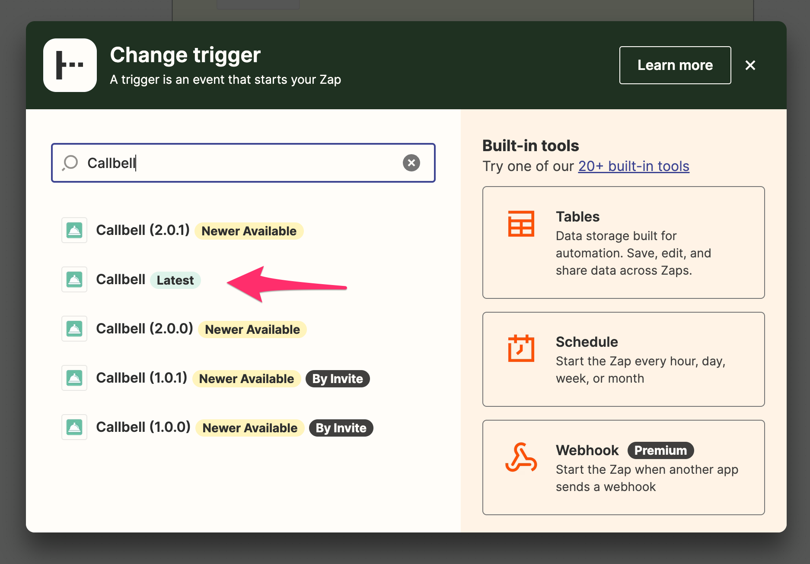

# Using Trigger in Zapier

Here we'll show you how to use Callbell in Zapier as a **Trigger**

## As a Trigger

Make you select the right Callbell(latest) app:

Our callbell integration allows you to use Callbell as a trigger. This means that you can send data from Callbell to other apps.

### Supported Triggers

- Contact Created
- Contact Updated
- Contact Deleted
- Message Created
- Message Status Updated
- Incoming Event (legacy trigger)

We reccomend you to use the first 5 triggers, as the last one will be deprecated at some point.

#### Contact Created

This trigger will be fired when a new contact is created in Callbell.

#### Contact Updated

This trigger will be fired when a contact is updated in Callbell.

#### Contact Deleted

This trigger will be fired when a contact is deleted in Callbell.

#### Message Created

This trigger will be fired when a new message is created in Callbell. The message can be either incoming or outgoing.

#### Message Status Updated

This trigger will be fired when a message status is updated in Callbell.

## Example with Contact Created Trigger

Let's say you have an external CRM and you want to send data from Callbell to your CRM. You can use Zapier to send the data from Callbell to your CRM.

Callbell is the **Trigger** and your CRM is the **Action**.

Set up your Zap:

### Step 1: Set up your Trigger

In this example, we'll use Callbell as the Trigger.

Select Callbell as the Trigger app, then select the "Contact Created" trigger.

### Step 2: Set up your Action

Select your CRM as the Action app.

Then click "Continue". You'll be asked to connect your CRM account to Zapier.

Once you've connected your CRM account, you'll have to set up the action.

Select the data you want to send to your CRM.

Then click "Continue".

Then click "Test & Continue".

Then click "Turn on Zap".

### Step 3: Test your Zap

Once you've turned on your Zap, you can test it by creating a new contact in Callbell.
