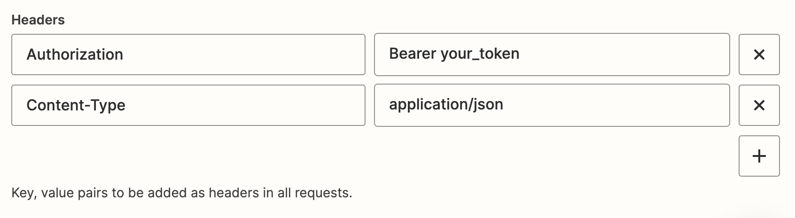

# Using Advanced Webhooks

Here we'll see how to use Callbell through Zapier by using Zapier's custom webhook as an action.
This is a more advanced way to use Callbell in Zapier, but it gives you more flexibility because you can use our public API to perform actions.

See <a href="https://docs.callbell.eu/api/reference/introduction'">API reference</a> for more info about the endponts and the payloads.

## Using Zapier's Custom Webhook

Make sure you select the right Callbell app (latest):

Then select "Webhooks by Zapier" as the action app:

The reccomened action is "Custom Request" here:

Regardless of the action you choose, you'll need to set up the webhook URL correctly.

### Webhook URL

The webhook URL is the URL that Zapier will use to send data to Callbell.

:::info

In [this](https://docs.callbell.eu/api/reference/contacts_api/post_contacts) section you can find the `url` to use for the webhook.

:::

### Webhook Payload

The webhook payload is the data that Zapier will send to Callbell.

The payload must be in JSON format.

### Authentication

You will need to authenticate your request to Callbell.

You can do this by adding the following headers to your request:

The `Content-Type` set to `application/json` is **required**.
