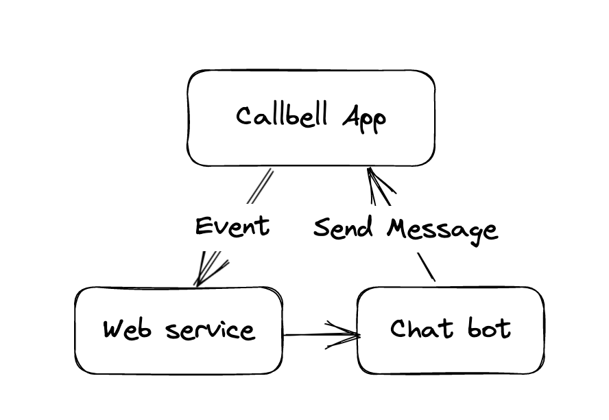
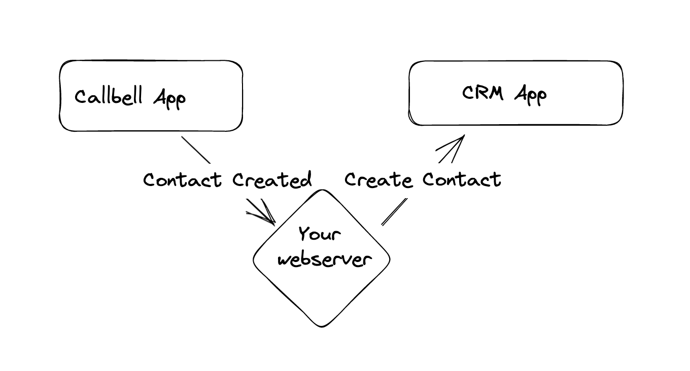
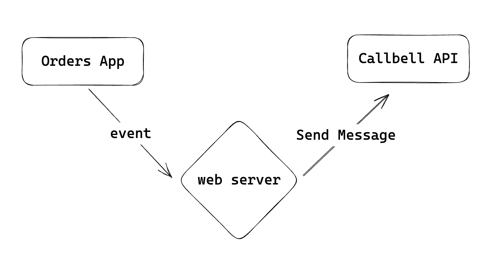

# Cómo y ejemplos

Esta guía le mostrará cómo utilizar la API de Callbell para enviar mensajes, obtener actualizaciones y mantener actualizada la información de contacto.

## Empezando con Callbell

Si eres nuevo en Callbell, puedes empezar con nuestra [Guía de iniciación a Callbell](/bot/getting_started).
También veremos algunos ejemplos de uso de la API de Callbell.

Los ejemplos se dividen en dos categorías: **Eventos Causados por Acciones** y **Acciones Impulsadas por Eventos**.

## Eventos causados por acciones

Los Eventos Causados por Acciones son actualizaciones que ocurren debido a una acción. Por ejemplo, cuando alguien nuevo se une a su sitio web, se desencadena un nuevo evento. Puede suscribirse a estos eventos y recibir un aviso cuando se produzcan.

Aquí encontrarás ejemplos de eventos que la API Callbell puede desencadenar. Utiliza estos ejemplos para entender cómo utilizar la API de Callbell para enviar mensajes y actualizar la información de contacto cuando se produce un nuevo evento.

:::info
Para el punto final webhook, puede utilizar un servicio como [RequestBin](https://requestbin.com/) o [Webhook.site](https://webhook.site/). Estos son endpoints temporales para probar tu configuración. Para el uso real, tendrás que crear tu propio punto final. Necesitarás un servidor web para recibir los eventos y enviar mensajes a tus clientes utilizando tu propio punto final. Puede utilizar cualquier lenguaje de programación para hacer esto.
:::

### Eventos de Mensaje

Puedes usar el API de Callbell para enviar mensajes cuando ocurra un nuevo evento.
Usaremos la [API de Mensajes](/api/reference/messages_api/introduction) para enviar mensajes. Echa un vistazo a la sección [Webhooks](/api/reference/webhooks/introduction) para más información sobre el registro de eventos.

En primer lugar, tenemos que configurar un punto final webhook para obtener los eventos. Usaremos [RequestBin](https://requestbin.com/) para crear un endpoint temporal.

1. Ve a [RequestBin](https://requestbin.com/) y haz clic en **Crear un RequestBin**.
2. Copia la URL del nuevo RequestBin que acabas de crear.
3. 3. Configura tu webhook endpoint en Callbell. Ver [Webhooks](/api/reference/webhooks/introduction) para más información.

#### 🤖 Envía un mensaje con un chatbot cuando llegue un nuevo mensaje

En este ejemplo, veremos cómo utilizar la API Callbell para enviar un mensaje con un chatbot cuando se produce un nuevo evento. Supongamos que queremos enviar un mensaje con un chatbot cuando llegue un nuevo mensaje. Seguiremos los pasos del ejemplo anterior para configurar un endpoint webhook y obtener los eventos.

Después de configurar el punto final webhook, podemos utilizar la API Callbell para enviar un mensaje chatbot cuando llegue un nuevo mensaje. Consulta [Messages API](/api/reference/messages_api/introduction) para obtener más información sobre el envío de mensajes.

Este es un diagrama de cómo la API de Callbell envía un mensaje de chatbot cuando llega un nuevo mensaje.

### Actualización de contactos

También puedes utilizar la API de Callbell para mantener actualizada la información de contacto.
Usaremos la [Contacts API](/api/reference/contacts_api/introduction) para crear y actualizar contactos.

#### 📝 Añadir un contacto a un CRM cuando se hace un nuevo contacto.

En este ejemplo, veremos cómo utilizar la API de Callbell para añadir un contacto cuando se incorpora un nuevo usuario.

Supongamos que queremos añadir un contacto a un CRM cuando se realiza un nuevo contacto en Callbell. Seguiremos los pasos del ejemplo anterior para configurar un endpoint webhook y obtener los eventos.

Después de configurar el webhook endpoint, podemos utilizar la API de Callbell para añadir un contacto a un CRM cuando se hace un nuevo contacto en Callbell. Echa un vistazo a [Contacts API](/api/reference/contacts_api/introduction) para más información sobre la creación de contactos.

:::info
Puede utilizar los mismos pasos para actualizar un contacto cuando un usuario cambia su perfil.
:::

Aquí tienes un diagrama de cómo la API de Callbell añade un contacto a un CRM cuando se crea un nuevo contacto en Callbell.

## Acciones Impulsadas por Eventos

Las Acciones Dirigidas por Eventos son cosas que suceden debido a una actualización. Como cuando llega un nuevo mensaje, puedes enviar un mensaje al cliente. Puede utilizar la API de Callbell para enviar mensajes y mantener la información de contacto actualizada cuando se produce un nuevo evento.

### Enviar un mensaje

Aquí veremos cómo utilizar el API de Callbell para enviar mensajes cuando se produce un nuevo evento. Como se muestra en la sección [Webhooks](/api/reference/webhooks/introduction), puedes apuntarte a varios eventos y recibir un aviso cuando se produzcan.

Tendrás que configurar un punto final webhook para obtener los eventos y, a continuación, utilizar la API Callbell para enviar mensajes a tus clientes.

:::info
Para el punto final webhook, puede utilizar un servicio como [RequestBin](https://requestbin.com/) o [Webhook.site](https://webhook.site/). Se trata de puntos finales temporales para probar la configuración. Para el uso real, tendrás que crear tu propio punto final.
Necesitarás un servidor web para recibir los eventos y enviar mensajes a tus clientes utilizando tu propio punto final. Puede utilizar cualquier lenguaje de programación para hacer esto.
:::

#### 🛒 Enviar un mensaje cuando llegue un nuevo pedido

En este ejemplo, veremos cómo utilizar la API Callbell para enviar un mensaje a un cliente cuando se produce un nuevo evento.
Supongamos que queremos enviar un mensaje a un cliente cuando se realiza un nuevo pedido en nuestra tienda online.

En primer lugar, tenemos que configurar un punto final webhook para obtener los eventos. Usaremos [RequestBin](https://requestbin.com/) para crear un endpoint temporal.

1. Ve a [RequestBin](https://requestbin.com/) y haz clic en **Crear un RequestBin**.
2. Copia la URL del nuevo RequestBin que acabas de crear.
3. 3. Configura tu webhook endpoint en Callbell. Ver [Webhooks](/api/reference/webhooks/introduction) para más información.

Ahora hemos configurado un webhook endpoint que recibirá los eventos. Ahora podemos utilizar la API de Callbell para enviar un mensaje al cliente.

Consulta [Messages API](/api/reference/messages_api/introduction) para más información sobre el envío de mensajes.

A continuación se muestra un diagrama de cómo la API Callbell envía un mensaje al cliente cuando entra un nuevo pedido.

#### 📅 Enviar un mensaje cuando se fija una nueva cita

En este ejemplo, veremos cómo utilizar la API Callbell para enviar un mensaje a un cliente cuando se produce un nuevo evento.
Digamos que queremos enviar un mensaje a un cliente cuando se establece una nueva cita.

Seguiremos los pasos del ejemplo anterior para configurar un endpoint webhook y obtener los eventos.

Ahora hemos configurado un webhook endpoint que obtendrá los eventos. Ahora podemos utilizar la API de Callbell para enviar un mensaje al cliente cuando se establece una nueva cita. Echa un vistazo a [Messages API](/api/reference/messages_api/introduction) para más información sobre el envío de mensajes. A continuación se muestra un diagrama de cómo la API de Callbell envía un mensaje al cliente cuando se establece una nueva cita.

### Usando Zapier

Puedes usar Zapier para enlazar Callbell con miles de otras aplicaciones. Zapier es una herramienta que te ayuda a enlazar aplicaciones y automatizar tareas. Puedes usar Zapier para enlazar Callbell con otras apps como Slack, Gmail, Google Sheets, y más.

Ya hay muchas integraciones disponibles en Zapier que puedes usar para enlazar Callbell con otras apps. También puedes hacer tus propias integraciones usando Zapier.

Aquí tienes algunos ejemplos de Zaps que puedes hacer con Zapier:

- Enviar un mensaje cuando llegue un nuevo email (Gmail)
- Enviar un mensaje cuando se establece una nueva cita (Calendly)
- Enviar un mensaje cuando llegue un nuevo pedido (Shopify)
- Enviar un mensaje cuando se establece un nuevo contacto (HubSpot)
- Enviar un mensaje cuando se establece un nuevo contacto (Mailchimp)
- Enviar un mensaje al establecer un nuevo contacto (Salesforce)
- Enviar un mensaje al establecer un nuevo contacto (Zendesk)
- Enviar un mensaje al establecer un nuevo contacto (Intercom)
- Enviar un mensaje al establecer un nuevo contacto (Pipedrive)
- Enviar un mensaje al rellenar un nuevo formulario (Typeform)
- Añadir un contacto al rellenar un nuevo formulario (Typeform)
- Enviar un mensaje al rellenar un nuevo formulario (Google Forms)
- Añadir un contacto al rellenar un nuevo formulario (Google Forms)

Y muchas más...

También puedes crear tus propias integraciones utilizando Zapier. Echa un vistazo a la [Zapier Developer Platform](https://zapier.com/developer) para más información.
