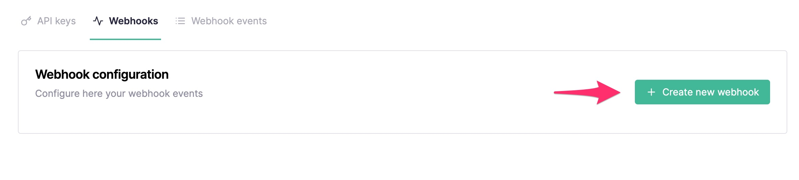
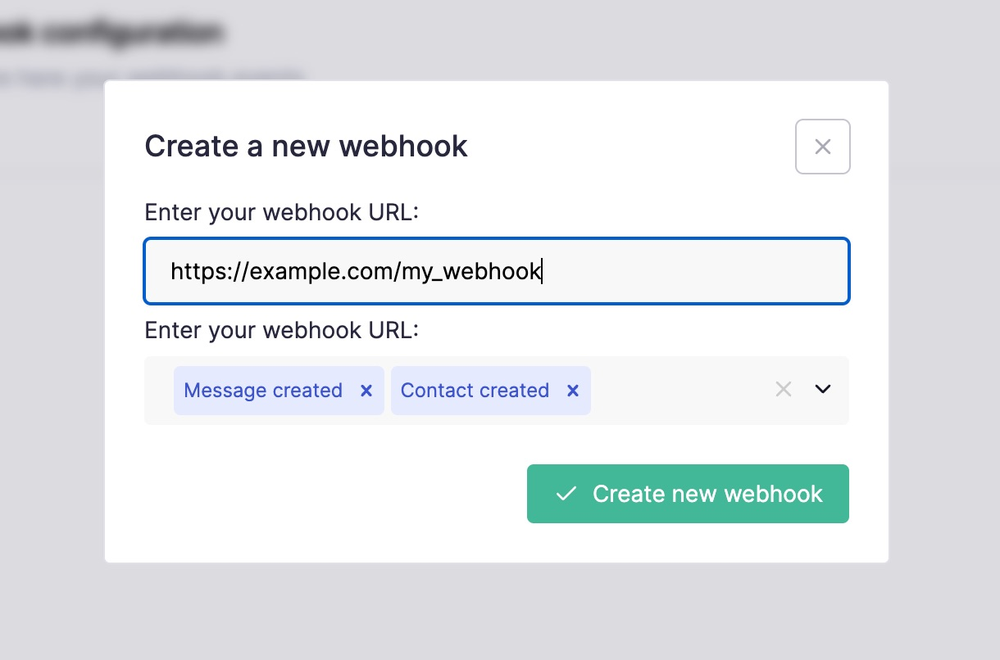

# Introducción

La API de Callbell proporciona **HTTP Webhooks** para los eventos de aplicación más comunes:

- **Eventos de mensajes**
- **Eventos de estado de notificación de mensajes**
- **Eventos de contactos**
- **Eventos de conversación**

## Cómo suscribirse a los eventos

:::info
Esto también se puede hacer programáticamente desde [WebhooksEndpoint](./../webhooks_api/introduction.md)
:::

En tu panel de control de Callbell, ve a la sección [**"Configuración de API"**](https://dash.callbell.eu/settings/api_settings/webhooks) y haz clic en la pestaña "Webhooks":

En el campo de URL, agrega la URL de tu punto de conexión (por ejemplo, `https://miaplicacion.com/callbell_endpoint`) y selecciona los eventos a los que quieres suscribirte:

:::info
Asegúrate también de **incluir** el protocolo (`http` o `https`) dentro de tu punto de conexión de webhook:

✅ **Correcto**: `https://www.miexample.com`

❌ **Incorrecto**: `www.ejemplo.com`
:::

Después de hacer clic en "Crear nuevo webhook", deberías recibir una notificación de éxito. Siempre puedes editar los eventos de webhook más tarde:

:::caution
Callbell no admite `localhost` como URL de webhook. Si necesitas depurar una aplicación local, utiliza un servicio para exponer tu entorno de desarrollo local como [Ngrok](https://ngrok.com).
:::