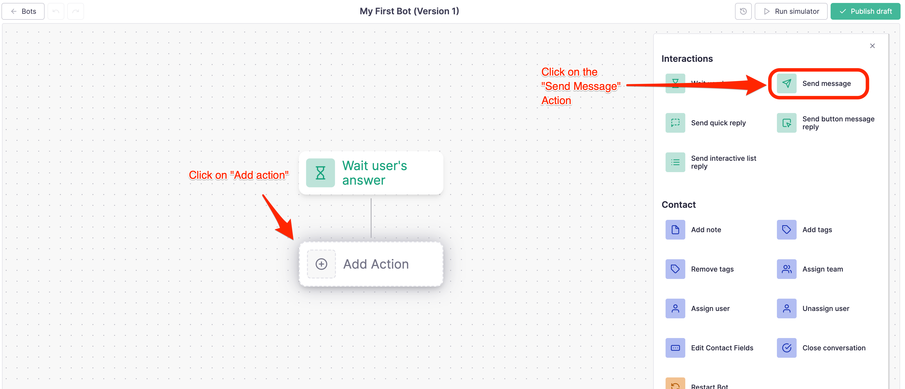
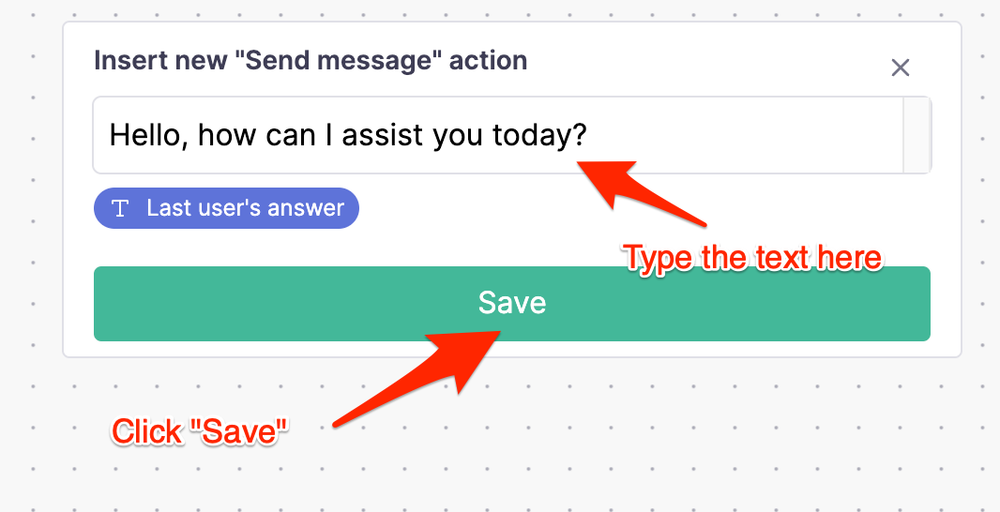
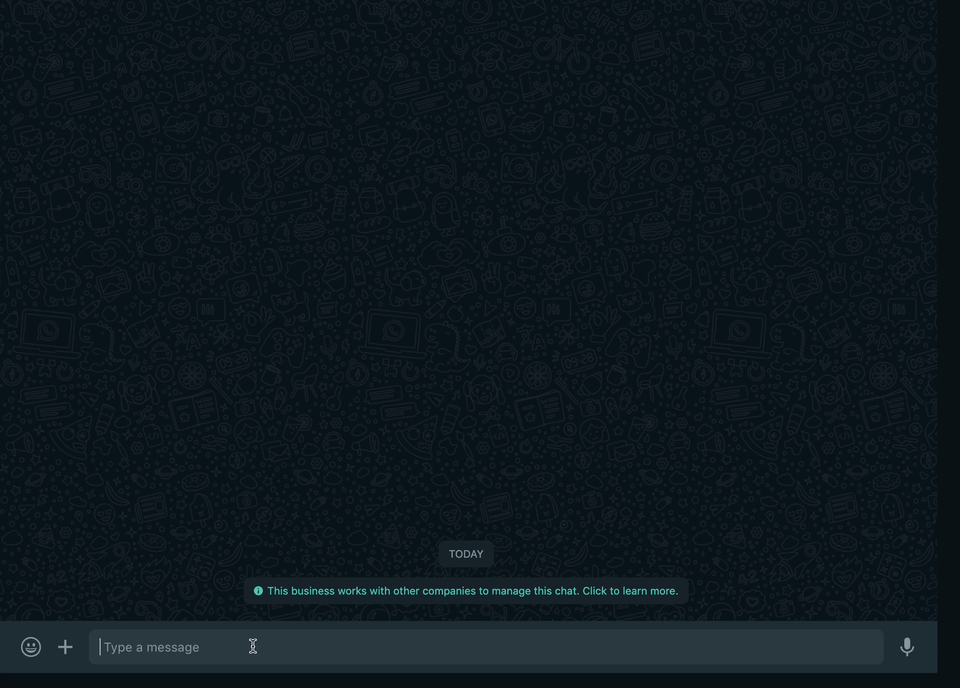

# Inicio

Esta guía paso a paso le guiará a través de la construcción de su primer chatbot con Callbell.

## Requisitos previos

Necesitarás crear una cuenta en Callbell y tener configurado al menos **1 canal** para poder seguir esta guía.

- Regístrate en [Callbell](https://dash.callbell.eu/users/sign_up)
- Consulta más información sobre nuestra [integración con WhatsApp Business API](https://callbellsupport.zendesk.com/hc/en-us/articles/360007805898-How-to-integrate-WhatsApp-into-Callbell-through-the-WhatsApp-Business-APIs) para utilizar el creador de flujos de bots con WhatsApp.

## Crear tu primer chatbot

Navega hasta la sección **Bot Builder** de la barra lateral izquierda y haz clic en el botón **Crear nuevo bot**:

crear_nuevo_bot](./assets/create_new_bot.png)

Aparecerá un modal pidiéndote que elijas un nombre para tu bot y el canal con el que quieres usarlo:

Tras hacer clic en el botón **Crear bot**, serás redirigido a la página de creación de bots, donde podrás empezar a crear tu primer chatbot:

bot_builder](./assets/bot_builder.png)

## Añadir una nueva acción

Para que el bot funcione tendrás que añadir al menos una acción. Por ejemplo, vamos a responder al usuario con un mensaje cuando envíe un mensaje al bot.

Haz clic en el botón **Añadir nueva acción** y selecciona la acción **Enviar mensaje**:

Se abrirá un panel que podrás utilizar para configurar la acción. En este caso vamos a añadir un simple mensaje de texto:

Después de hacer clic en el botón **Guardar** serás redirigido a la página del bot builder donde podrás ver la acción que acabas de crear:

bot_builder_action](./assets/bot_builder_action.png)

## Prueba tu bot

Para probar tu bot tendrás que hacer clic en el botón **Run Simulator** en la esquina superior derecha de la página. Esto abrirá un panel donde podrás probar tu nuevo flujo:

run_simulator](./assets/run_simulator.png)

Haz clic en el botón **Enviar** y verás cómo el bot responde con el mensaje que acabas de configurar:

run_simulator_reply](./assets/run_simulator_reply.png)

## Publica tu bot

Cuando estés satisfecho con tu bot, puedes publicarlo haciendo clic en el botón **Publicar borrador** situado en la esquina superior derecha de la página:

publicar_bot](./assets/publish_bot.png)

Tras hacer clic en el botón **Publicar borrador** y confirmar, tu flujo de bots se publicará; al mismo tiempo, tendrás que **habilitar tu bot** para que esté disponible para tus clientes. Para ello, vuelve a la sección "Bots" de la barra lateral izquierda y haz clic en el botón **Habilitar bot**:

Puedes confirmar que el bot está habilitado comprobando el estado en la sección "Bots":

## Prueba tu bot en producción

Ahora que tu bot está habilitado puedes probarlo en producción enviando un mensaje al canal con el que lo configuraste. En este caso enviaremos un mensaje al número de WhatsApp que configuramos en la sección [Prerequisites](#prerequisites):

## ¿Y ahora qué?

Ahora que has creado tu primer chatbot puedes empezar a explorar las otras acciones disponibles en el bot builder.