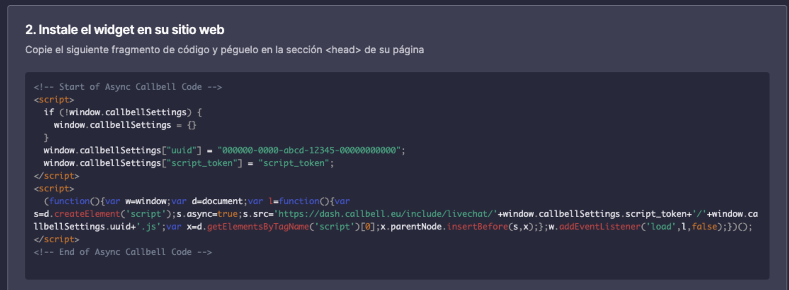
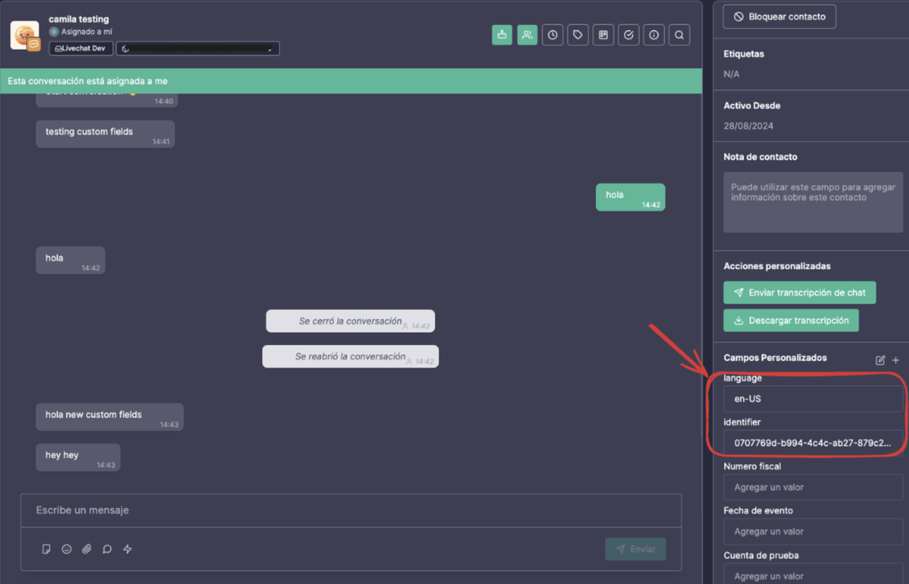

# Cómo crear campos personalizados desde el chat en vivo

En esta guía rápida aprenderás cómo crear [campos personalizados](https://headwayapp.co/callbell-changelog/custom-fields-(for-contacts)-225586) en la aplicación Callbell utilizando la información que se envía a través de nuestro chat en vivo.

## Paso 1: Generar el fragmento de código del chat en vivo

Después de crear una integración de chat en vivo y personalizarla según tus preferencias, ve a la segunda sección de la página de configuración del widget. Allí verás un fragmento de código que se generó para copiar y pegar en tu sitio web para que funcione el chat en vivo.



## Paso 2: Editar el fragmento de código

En nuestro caso, lo que queremos es enviar información desde nuestro sitio web a la aplicación Callbell cada vez que un usuario comience a interactuar con el chat. Podemos lograrlo simplemente realizando algunos cambios pequeños en el fragmento de código generado anteriormente. Mira el ejemplo a continuación:

```html
<script>
  if (!window.callbellSettings) {
    window.callbellSettings = {}
  }
  window.callbellSettings["uuid"] = "000000-0000-abcd-1234-0000000000";
  window.callbellSettings["script_token"] = "script_token";
  window.callbellSettings["extra_params"] = {
    "identifier": '12345567',
    "course": "Ciencia de la Computación",
    "semester": "4ro"
  }
</script>
<script>
  (function(){var ...);
</script>
```

En este ejemplo, los campos adicionales están codificados de manera estática, pero pueden ser información que se envía desde tu backend.

:::info
Ten en cuenta que el campo `identifier` es obligatorio. Se utilizará como identificación del usuario que interactúa con el chat en vivo, por lo tanto, debe ser único. Si este campo no se envía, el usuario podrá interactuar con el chat y enviar y recibir mensajes, pero no se crearán campos personalizados.
:::

:::info
Puedes enviar un máximo de 20 campos adicionales para crear campos personalizados en la aplicación Callbell.
:::

## Ejemplo

En el siguiente ejemplo, generamos un UUID aleatorio como identificador y obtenemos el idioma del navegador.
```html
<script>
  if (!window.callbellSettings) {
    window.callbellSettings = {}
  }
  window.callbellSettings["uuid"] = "000000-0000-abcd-1234-0000000000";
  window.callbellSettings["script_token"] = "script_token";
  window.callbellSettings["extra_params"] = {
    identifier: self.crypto.randomUUID(),
    language: navigator.language,
  }
</script>
<script>
  (function(){var ...);
</script>
````

Y así se mostrará en la aplicación Callbell.
