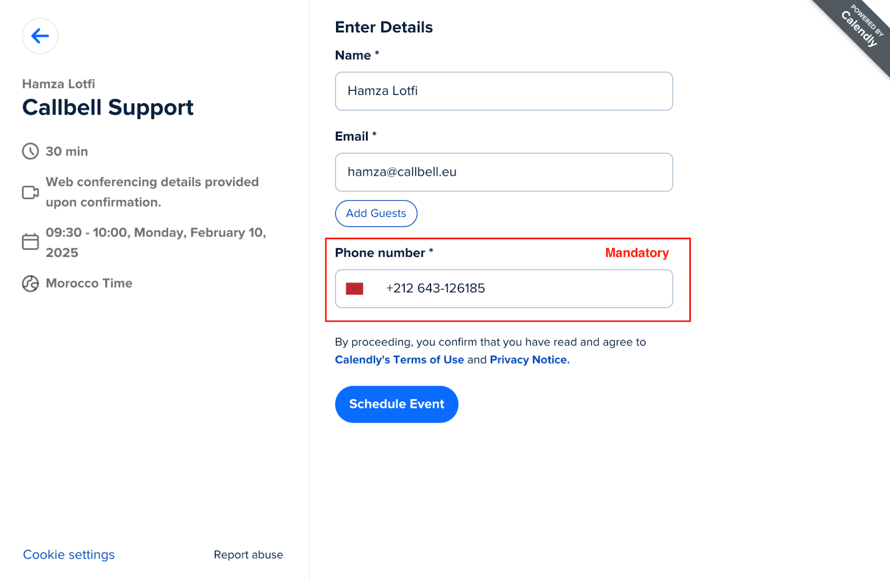
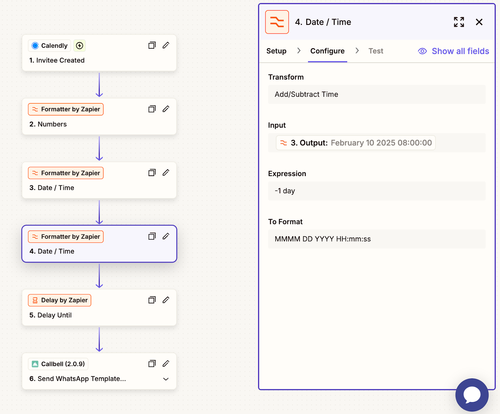
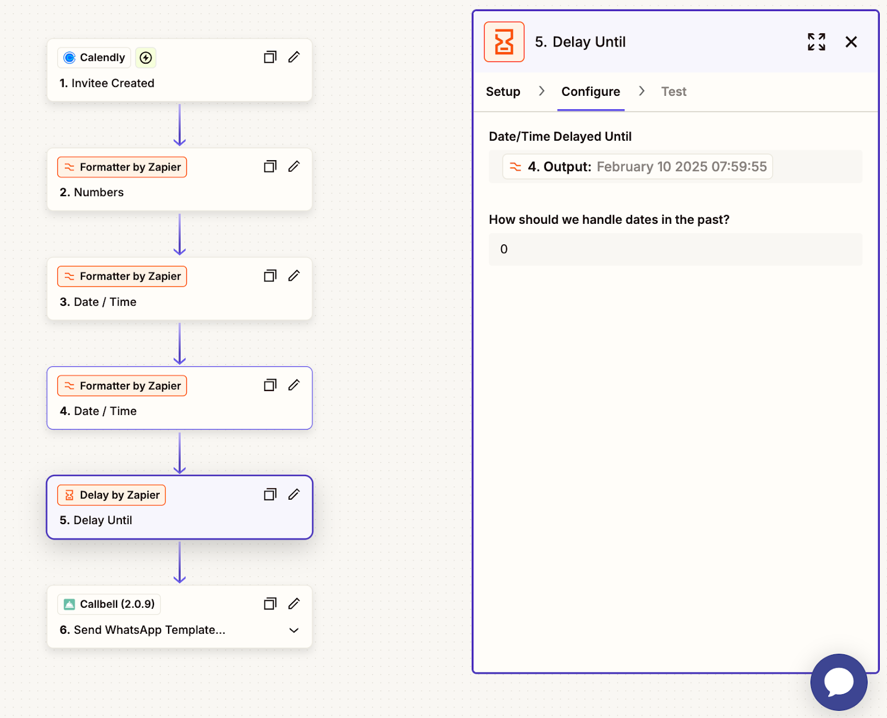

# Integración de Calendly

## Automatiza la Comunicación de Citas por WhatsApp con Callbell

> En las siguientes guías, aprenderá cómo integrar Calendly con Callbell usando Zapier. Esta integración le permite automatizar las comunicaciones relacionadas con citas por WhatsApp, asegurando una experiencia fluida tanto para usted como para sus clientes.

Con esta configuración, usted podrá:

- Enviar confirmaciones de citas automatizadas por WhatsApp a través de Callbell.
- Enviar recordatorios de citas automatizados por WhatsApp para reducir las ausencias.
- Enviar seguimientos automatizados después de la cita por WhatsApp para mantener el compromiso y mejorar la experiencia del cliente.

Cada guía le proporcionará instrucciones paso a paso sobre cómo configurar estos flujos de trabajo usando Zapier, Calendly y Callbell.

---

## Guía 1: Enviar Confirmaciones de Citas Automatizadas

Envíe una confirmación de cita automatizada como un mensaje de WhatsApp a través de Callbell.

<iframe width="100%" height="500" src="https://www.youtube.com/embed/J3575_ZeixI?si=2Ol8iP-NdWR-s07A" title="Seguimientos Automáticos de Citas en WhatsApp" frameborder="0" allow="accelerometer; autoplay; clipboard-write; encrypted-media; gyroscope; picture-in-picture; web-share" referrerpolicy="strict-origin-when-cross-origin" allowfullscreen></iframe>

### Explicación Paso a Paso

1. **Cree su Página de reservas de citas de Calendly**

   Diseñe su página de reservas de Calendly para recopilar información esencial, como:

   - **Nombre**
   - **Número de teléfono** (obligatorio)
   - **Dirección de email** (opcional)

   

2. **Prepara las plantillas de mensajes en Callbell**

   Cree el mensaje para la plantilla que desea enviar a los nuevos clientes potenciales en Callbell.
   Al diseñar la plantilla:

   - Utilice variables personalizadas (por ejemplo, `{{variable 1}}`, `{{variable 2}}`) para personalizar el mensaje.
   - Estas variables se completarán dinámicamente en Zapier.
   - [Obtenga más información sobre cómo crear plantillas con variables en Callbell](https://callbellsupport.zendesk.com/hc/es/articles/360007759237--Qu%C3%A9-son-las-plantillas-de-mensajes-y-para-qu%C3%A9-sirven)

   > **NB:** En la mayoría de los casos, las plantillas de WhatsApp que se envían se utilizan para confirmar o recordar una cita. Recomendamos intentar que se aprueben en la categoría "Utilidad", que cuesta la mitad en comparación con "Marketing".

   

3. **Crea un Zap: Calendly será el Activador**

   - Inicie sesión en Zapier y cree un nuevo Zap.
   - Configure el activador como **"Invitee Created"**.
   - Conecte su cuenta de Calendly.
   - Pruebe el activador para asegurarse de que Zapier recupere correctamente los datos de envío de la reserva.

   

4. **Formatee el Número de Teléfono**

   - Agregue la acción **Formatter** de Zapier para asegurarse de que el número de teléfono enviado a través de Calendly esté formateado correctamente para Callbell.
   - Seleccione la acción **Numbers** en Formatter.
   - Elija **Format Phone Number** como el tipo de transformación.
   - Asigne el campo del número de teléfono de Typeform.
   - Seleccione el formato de salida **E164**.

   

5. **Envíe el mensaje de plantilla con variables personalizadas a través de Callbell**

   - Agregue una acción **Send Template Message** en Zapier.
   - Conecte su cuenta de Callbell.
   - Asigne el campo del número de teléfono formateado del paso anterior al campo **"To"**.
   - Copie y pegue el UUID de la plantilla que creó en el Paso 2.
   - Copie y pegue el UUID del canal de su cuenta de Callbell.
   - Complete las variables de su plantilla en el campo **"Template values"**.

   

### Notas Finales

Con esta configuración, cada nueva cita de Calendly activará un mensaje de confirmación de WhatsApp automatizado a través de Callbell, asegurando que sus clientes reciban una confirmación de cita instantánea.
Para obtener ayuda adicional, consulte:

- [Centro de Ayuda de Callbell](https://callbellsupport.zendesk.com/hc/es)
- [Documentación de Ayuda de Zapier](https://help.zapier.com/hc/en-us)

---

## Guía 2: Enviar recordatorios de citas automatizados

Envíe un recordatorio de cita automatizado como un mensaje de WhatsApp a través de Callbell.

<iframe width="100%" height="500" src="https://www.youtube.com/embed/nI5Zb5V1meE?si=N2yyfMpomN4YyOvN" title="Recordatorios Automáticos de Citas en WhatsApp" frameborder="0" allow="accelerometer; autoplay; clipboard-write; encrypted-media; gyroscope; picture-in-picture; web-share" referrerpolicy="strict-origin-when-cross-origin" allowfullscreen></iframe>

### Explicación Paso a Paso

El proceso de configuración es similar al flujo de trabajo de confirmación de cita.

1. Siga los pasos descritos en la **Guía 1: Enviar Confirmaciones de Citas Automatizadas**.

2. Agregue los siguientes pasos adicionales de Zapier **antes** del último paso "Envíe el mensaje de plantilla con variables personalizadas a través de Callbell" para completar este flujo de trabajo:

   1. **Agregue una Acción de Formatter**
      En Zapier, haga clic en "Add a Step" y seleccione **Formatter**.

      - Elija **Date/Time** como el Evento.
      - En **Transform**, seleccione **Format**.
      - En el campo **Input**, seleccione **Scheduled Event Start Time**.
      - En **To Format**, elija el formato de fecha/hora deseado (por ejemplo, `DD/MM/YYYY HH:mm`).
      - En **To Timezone**, seleccione la zona horaria apropiada para el evento.

      

   2. **Agregue otra Acción de Formatter para Ajustar la Hora del Recordatorio**
      En Zapier, haga clic en "Add a Step" y seleccione **Formatter**.

      - Elija **Date/Time** como el Evento.
      - En **Transform**, seleccione **Add/Subtract Time**.
      - En el campo **Input**, seleccione el Output de la fecha formateada del Paso 3.
      - En el campo **Expression**, ingrese `-1 day` para enviar el recordatorio un día antes de la cita.
      - Mantenga el **To Format** igual que en el Paso 3 para mantener la coherencia.

      

   3. **Agregue una Acción de Delay**
      En Zapier, haga clic en "Add a Step" y seleccione **Delay**.

      - Elija **Delay Until** como el Evento.
      - En el campo **Date/Time Delayed Until**, seleccione el Output del Paso 4 anterior (la hora del recordatorio ajustada).
      - En "How should we handle dates in the past?", seleccione **Always continue** para asegurarse de que el flujo de trabajo se ejecute sin problemas, incluso si la condición de demora se pasa ligeramente por alto.

      

### Notas Finales

Con esta configuración, cada cita programada en Calendly activará un recordatorio de WhatsApp automático a través de Callbell, asegurando que sus clientes reciban una notificación oportuna un día antes de su cita. Este flujo de trabajo ayuda a reducir las ausencias y mejora la asistencia general a las citas.
Para obtener ayuda adicional, consulte:

- [Centro de Ayuda de Callbell](https://callbellsupport.zendesk.com/hc/es)
- [Documentación de Ayuda de Zapier](https://help.zapier.com/hc/en-us)

---

## Guía 3: Enviar Seguimientos automatizados después de la cita

Envíe seguimientos de cita automatizados como un mensaje de WhatsApp a través de Callbell.

<iframe width="100%" height="500" src="https://www.youtube.com/embed/AiM7VsO3is0?si=Qb5EnKVUXTF7_B-J" title="Automatiza la Comunicación de Citas por WhatsApp con Callbell" frameborder="0" allow="accelerometer; autoplay; clipboard-write; encrypted-media; gyroscope; picture-in-picture; web-share" referrerpolicy="strict-origin-when-cross-origin" allowfullscreen></iframe>

### Explicación Paso a Paso

El proceso de configuración es similar al flujo de trabajo de confirmación de cita.

1. Siga los pasos descritos en la **Guía 1: Enviar Confirmaciones de Citas Automatizadas**.

2. Agregue los siguientes pasos adicionales de Zapier **antes** del último paso "Envíe el mensaje de plantilla con variables personalizadas a través de Callbell" para completar este flujo de trabajo:

   1. **Agregue una Acción de Formatter**
      En Zapier, haga clic en "Add a Step" y seleccione **Formatter**.

      - Elija **Date/Time** como el Evento.
      - En **Transform**, seleccione **Format**.
      - En el campo **Input**, seleccione **Scheduled Event End Time**.
      - En **To Format**, elija el formato de fecha/hora deseado (por ejemplo, `DD/MM/AAAA HH:mm`).
      - En **To Timezone**, seleccione la zona horaria apropiada para el evento.

      

   2. **Agregue otra acción de formatter para ajustar la hora del seguimiento**
      En Zapier, haga clic en "Add a Step" y seleccione **Formatter**.

      - Elija **Date/Time** como el Evento.
      - En **Transform**, seleccione **Add/Subtract Time**.
      - En el campo **Input**, seleccione el Output de la fecha formateada del Paso 3.
      - En el campo **Expression**, ingrese `+15 minutos` para enviar el recordatorio 15 minutos después de la cita.
      - Mantenga el **To Format** igual que en el Paso 3 para mantener la coherencia.

      

   3. **Agregue una acción de delay**
      En Zapier, haga clic en "Add a Step" y seleccione **Delay**.

      - Elija **Delay Until** como el Evento.
      - En el campo **Date/Time Delayed Until**, seleccione el Output del Paso 4 anterior (la hora del seguimiento ajustada).
      - En "How should we handle dates in the past?", seleccione **Always continue** para asegurarse de que el flujo de trabajo funcione correctamente, incluso si la condición de demora se pasa ligeramente por alto.

      

### Notas Finales

Con esta configuración, cada cita de Calendly completada activará un mensaje de seguimiento automatizado de WhatsApp a través de Callbell. Esto asegura un compromiso continuo con sus clientes, ya sea para la recopilación de comentarios, los próximos pasos o la programación de citas futuras. Este flujo de trabajo ayuda a mejorar las relaciones con los clientes y mejora la calidad general del servicio.
Para obtener ayuda adicional, consulte:

- [Centro de ayuda de Callbell](https://callbellsupport.zendesk.com/hc/es)
- [Documentación de ayuda de Zapier](https://help.zapier.com/hc/en-us)
