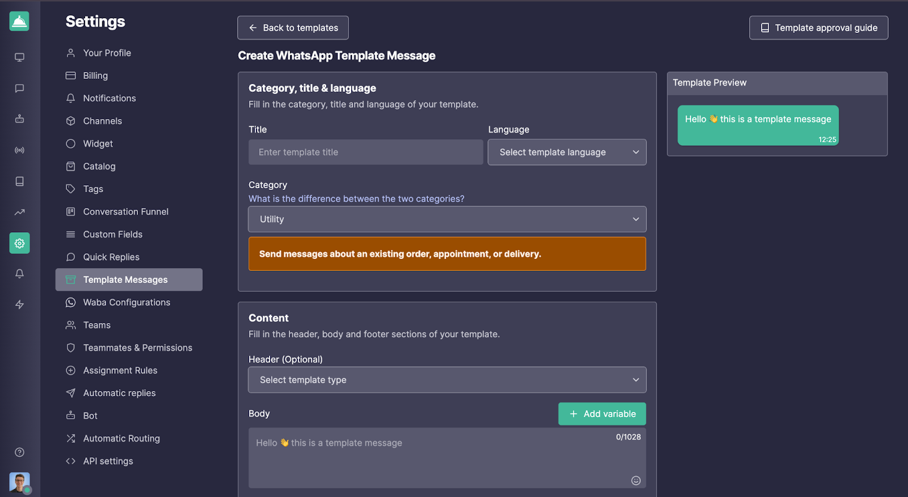

# Integración con Pipedrive

## Automatiza la Comunicación de WhatsApp en tu CRM con Callbell

Aprende cómo integrar Pipedrive con Callbell usando Zapier para automatizar las comunicaciones en WhatsApp.

## Introducción

> En la siguiente guía, aprenderás cómo integrar Pipedrive con Callbell usando Zapier. Esta integración te permite automatizar las comunicaciones de WhatsApp basadas en las actividades de Pipedrive, asegurando un proceso de ventas y gestión de clientes sin problemas.

### Con esta configuración, podrás:

- Crear automáticamente nuevos contactos de Pipedrive en Callbell
- Enviar automáticamente plantillas de WhatsApp cuando un trato cambia su estado en Pipedrive
- Enviar automáticamente plantillas de WhatsApp cuando un trato se gana

Cada guía proporciona instrucciones paso a paso sobre cómo configurar estos flujos de trabajo utilizando Zapier, Pipedrive y Callbell.

## Guía 1: Crear Automáticamente Nuevos Contactos de Pipedrive en Callbell

En esta guía, te mostraremos cómo crear automáticamente nuevos contactos en Callbell cada vez que se agregue un nuevo contacto en Pipedrive. Esta integración asegura que los contactos de tu CRM estén automáticamente disponibles en Callbell.

<iframe width="100%" height="500" src="https://www.youtube.com/embed/rc7xa8RVVHE?si=CBsR6FqZog0mc3nD" title="Crear automáticamente nuevos contactos desde Pipedrive en Callbell" frameborder="0" allow="accelerometer; autoplay; clipboard-write; encrypted-media; gyroscope; picture-in-picture; web-share" referrerpolicy="strict-origin-when-cross-origin" allowfullscreen></iframe>

### Explicación Paso a Paso

#### 1. Crear un Zap: Pipedrive como el Disparador

- Inicia sesión en Zapier y crea un nuevo Zap.
- Configura el disparador como "Nueva Persona" (esto activará el Zap cada vez que se agregue un nuevo contacto en Pipedrive).
- Conecta tu cuenta de Pipedrive.
- Prueba el disparador para asegurarte de que Zapier recupera correctamente los nuevos datos de contacto de Pipedrive.

#### 2. Crear un Contacto en Callbell

- Selecciona Callbell como la aplicación de acción.
- Establece la acción como "Crear Contacto" (esto creará un nuevo contacto en Callbell cuando se active).
- Conecta tu cuenta de Callbell.
- Mapea los campos de Pipedrive a Callbell:
  - **Nombre** → Mapea desde el nombre de contacto de Pipedrive.
  - **Número de Teléfono** → Mapea desde el número de teléfono de contacto de Pipedrive.
  - Mapea cualquier campo relevante adicional si es necesario.
- Prueba la acción para asegurarte de que Zapier crea exitosamente un contacto en Callbell.

### Notas Finales

Con esta configuración, cada nuevo contacto añadido en Pipedrive se creará automáticamente en Callbell. Este flujo de trabajo ahorra tiempo, reduce la entrada manual de datos y asegura que tu equipo pueda interactuar instantáneamente con nuevos contactos.

**Para ayuda adicional, consulta:**

- [Centro de Ayuda de Callbell](https://callbellsupport.zendesk.com/hc/es)
- [Documentación de Ayuda de Zapier](https://help.zapier.com/hc/en-us)

---

## Guía 2: Enviar Automáticamente Mensajes de Plantilla de WhatsApp cuando un Trato Cambia su Estado en Pipedrive

En esta guía, te mostraremos cómo enviar automáticamente un mensaje de WhatsApp a través de Callbell cada vez que un trato cambia su estado en Pipedrive.

<iframe width="100%" height="500" src="https://www.youtube.com/embed/O6tFnZL0nEE?si=nHZEZMknmLi9mBim" title="Envía automáticamente mensajes de plantillas de WhatsApp en Pipedrive" frameborder="0" allow="accelerometer; autoplay; clipboard-write; encrypted-media; gyroscope; picture-in-picture; web-share" referrerpolicy="strict-origin-when-cross-origin" allowfullscreen></iframe>

### Explicación Paso a Paso

#### 1. Preparar las Plantillas de Mensaje en Callbell

- Crea la plantilla de mensaje que deseas enviar.
- Utiliza variables personalizadas (p. ej., `{{variable 1}}, {{variable 2}}`) para personalizar el mensaje.
- Aprende más sobre las plantillas de Callbell: [Guía de Plantillas](https://callbellsupport.zendesk.com/hc/es/articles/360007759237)

#### 2. Crear un Zap – Pipedrive como el Disparador

- Inicia sesión en Zapier y crea un nuevo Zap.
- Configura el disparador como "Trato Actualizado".
- Conecta tu cuenta de Pipedrive.
- Prueba el disparador para asegurarte de que Zapier recupera correctamente los datos del trato.

#### 3. Formatear el Número de Teléfono

- Usa la acción "Formatter" de Zapier para formatear el número correctamente para Callbell.
- Selecciona **Formato E164**.

#### 4. Enviar el Mensaje de Plantilla a través de Callbell

- Agrega una acción "Enviar Mensaje de Plantilla" en Zapier.
- Mapea el número formateado al campo "Para".
- Copia y pega el **UUID de la plantilla** y el **UUID del canal** de Callbell.

### Notas Finales

Este flujo de trabajo mejora la comunicación con el cliente y los mantiene informados sobre el estado de sus tratos.

---

## Guía 3: Enviar Automáticamente Plantillas de WhatsApp cuando un Trato se Gana

Esta guía te enseñará a enviar automáticamente un mensaje de WhatsApp cada vez que un trato se marque como "Ganado" en Pipedrive.

<iframe width="100%" height="500" src="https://www.youtube.com/embed/BYvEoy7U3WU?si=TTcxZDGwADGsJ5_z" title="Envía automáticamente plantillas de WhatsApp cuando se gana un trato" frameborder="0" allow="accelerometer; autoplay; clipboard-write; encrypted-media; gyroscope; picture-in-picture; web-share" referrerpolicy="strict-origin-when-cross-origin" allowfullscreen></iframe>

### Explicación Paso a Paso

El proceso es similar a **Guía 2**, pero con un filtro adicional para **"Estado del Trato" → "Ganado"**.

#### Crear un Zap – Pipedrive como el Disparador

- Inicia sesión en Zapier y crea un nuevo Zap.
- Configura el disparador como "Trato Actualizado".
- Conecta tu cuenta de Pipedrive.
- Filtra solo los tratos con **Estado: Ganado**.
- Prueba el disparador.

### Notas Finales

Cada vez que un trato se marque como "Ganado", Callbell enviará automáticamente un mensaje de confirmación en WhatsApp.

**Para ayuda adicional, consulta:**

- [Centro de Ayuda de Callbell](https://callbellsupport.zendesk.com/hc/es)
- [Documentación de Ayuda de Zapier](https://help.zapier.com/hc/en-us)
