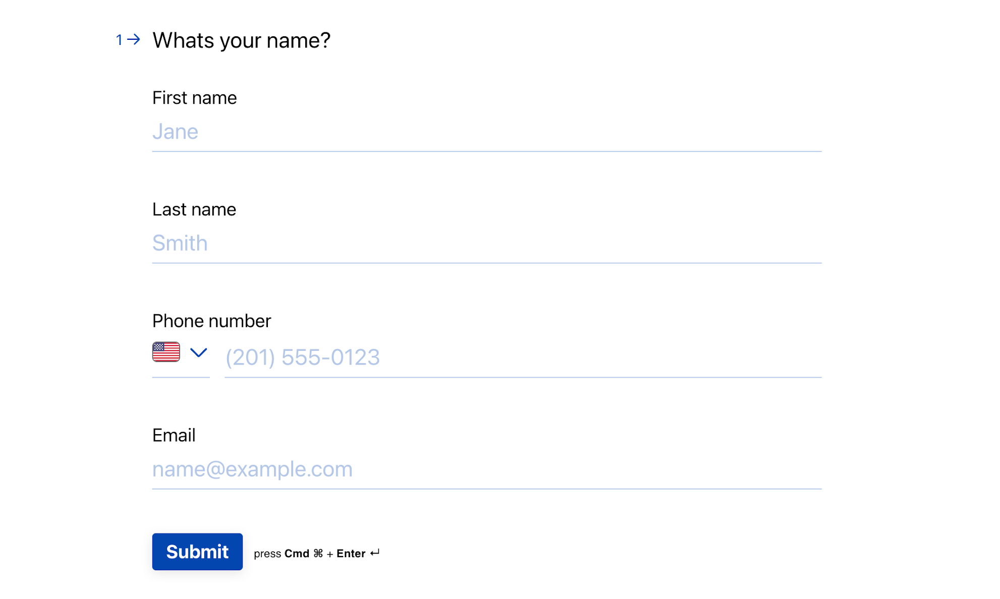
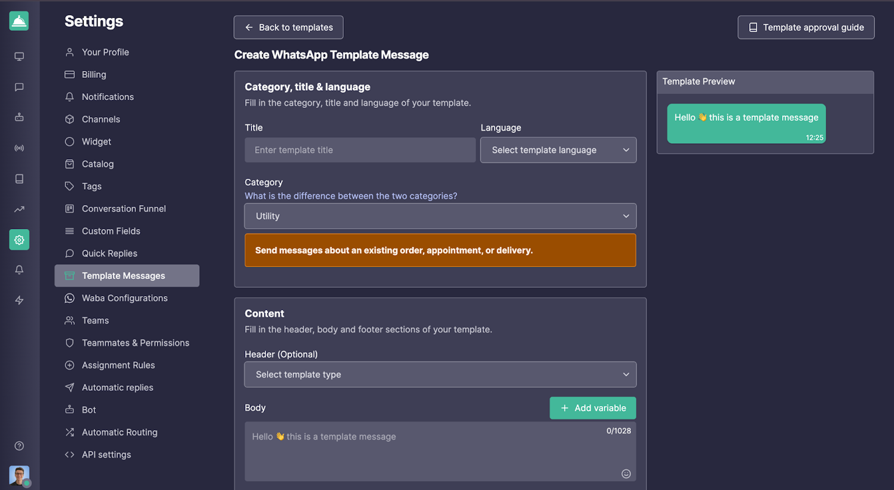

# Integración con Typeform - Automatizar la comunicación con el Lead en Callbell

Simplifica la comunicación con el lead, integrando Callbell y Typeform a través de Zapier. Esta guía te ayudará a configurar un flujo de trabajo automatizado para recopilar datos de leads desde Typeform, formatearlos y enviar un mensaje de plantilla personalizado por WhatsApp a través de Callbell utilizando variables personalizadas.

Link: https://zapier.com/apps/callbell/integrations/typeform

<iframe width="100%" height="500" src="https://www.youtube.com/embed/KekOitxlaDI?si=lNh3oWyfFazMFbQD" title="Integración con Typeform - Automatizar la comunicación con el Lead en Callbell" frameborder="0" allow="accelerometer; autoplay; clipboard-write; encrypted-media; gyroscope; picture-in-picture; web-share" referrerpolicy="strict-origin-when-cross-origin" allowfullscreen></iframe>

## Introducción

Este artículo explica cómo automatizar la calificación de leads y la comunicación utilizando Typeform, Callbell y Zapier. Al final, tendrás un flujo de trabajo completamente automatizado que enviará un mensaje de plantilla personalizado por WhatsApp a los leads tan pronto como envíen su información a través de Typeform.

## Explicación paso a paso

### 1. **Crea el Typeform deseado**

Diseña tu Typeform para recopilar información esencial, como:

- Nombre
- Número telefónico (indispensable)
- Dirección de Email (opcional)

### 2. **Prepara las plantillas de mensajes en Callbell**

Crea la plantilla de mensaje que deseas enviar a los nuevos leads en Callbell. Al diseñar la plantilla:

- Utiliza variables personalizadas (por ejemplo, {{variable 1}}, {{variable 2}}) para personalizar el mensaje.
- Estas variables se completarán dinámicamente en Zapier utilizando los datos del lead obtenidos de Typeform.
- Aprende más sobre cómo crear plantillas con variables en Callbell: https://callbellsupport.zendesk.com/hc/es/articles/360007759237--Qu%C3%A9-son-las-plantillas-de-mensajes-y-para-qu%C3%A9-sirven

### 3. **Crea un Zap: Typeform como disparador**

- Inicia sesión en Zapier y crea un nuevo Zap.
- Configura el disparador en "New Entry in Typeform".
- Conecta tu cuenta de Typeform y selecciona el formulario que diseñaste en el Paso 1.
- Prueba el disparador para asegurarte de que Zapier recupera correctamente los datos enviados en el formulario.

### 4. **Formatea el número de teléfono**

**Nota:** _Si el campo de número de teléfono en Typeform es del tipo "phone number", no es necesario realizar este paso._

Agrega la acción **"Formatter"** de Zapier para asegurarte de que el número de teléfono enviado desde Typeform esté correctamente formateado para Callbell.

- Selecciona la acción "Numbers" en Formatter.
- Elige "Format Phone Number" como tipo de transformación.
- Asigna el campo del número de teléfono de Typeform.
- Selecciona el formato de salida E164.

### 5. **Envía el mensaje de plantilla con variables personalizadas a través de Callbell**

Agrega la acción **"Send Template Message"** en Zapier.

- Conecta tu cuenta de Callbell.
- Asigna el campo de número de teléfono formateado del paso anterior al campo "To".
- Copia y pega el UUID de la plantilla que creaste en el Paso 2.
- Copia y pega el UUID del canal desde tu cuenta de Callbell.
- Completa las variables de tu plantilla en el campo **“Valores de plantilla”**.

  

## Notas finales

Con esta configuración, cada nuevo lead de Typeform recibirá automáticamente un mensaje personalizado por WhatsApp a través de Callbell, con variables personalizadas completadas dinámicamente. Este flujo de trabajo garantiza una comunicación oportuna y personalizada con tus leads.

Para obtener ayuda adicional, consulta:

- [Centro de ayuda de Callbell](https://callbellsupport.zendesk.com/hc/es)
- [Documentación de ayuda de Zapier](https://help.zapier.com/hc/en-us)
