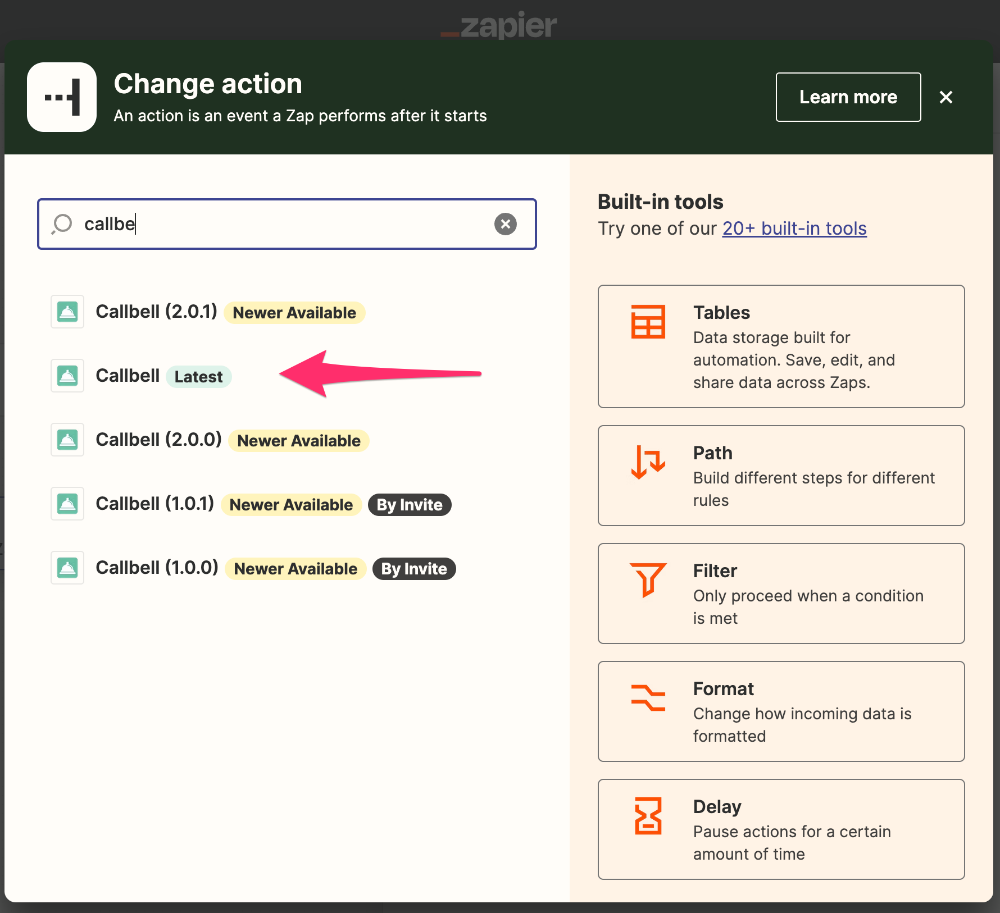
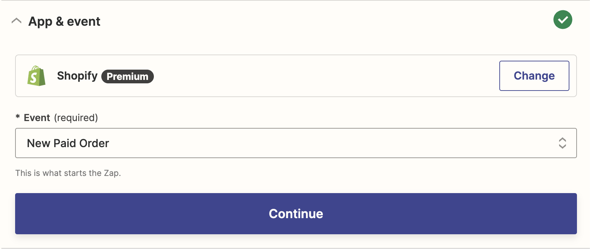

# Usar Ação no Zapier

Aqui mostraremos como usar Callbell no Zapier como uma **Ação**

## Como uma Ação

Certifique-se de selecionar o aplicativo Callbell (mais recente) correto:



Nossa integração Callbell permite que você use o Callbell como uma ação. Isso significa que você pode enviar dados de outros aplicativos para o Callbell.

### Ações Suportadas

- Criar Mensagem (limitado a mensagens em **texto** apenas)
- Criar Contato

#### Criar Mensagem

Esta ação criará uma nova mensagem no Callbell.
Você pode usar esta ação para enviar dados de outros aplicativos para o Callbell.

#### Criar Contato

Esta ação criará um novo contato no Callbell.
Você pode usar esta ação para enviar dados de outros aplicativos para o Callbell.

## Exemplo com Ação de Mensagem Criada

Digamos que você queira enviar uma mensagem para um cliente quando um novo pedido é feito em sua loja online. Você pode usar o Zapier para enviar os dados de sua loja online para o Callbell.

Sua loja online é o **Gatilho** e o Callbell é a **Ação**.

Configure seu Zap:


### Etapa 1: Configurar o Gatilho

Neste exemplo, usaremos o Shopify como Gatilho.

Selecione o Shopify como o aplicativo de gatilho:



Selecione o evento de gatilho:

Usaremos o evento "Novo Pedido Pago" como o Gatilho.

Em seguida, clique em "Continuar". Será solicitado que você conecte sua conta Shopify ao Zapier.

Depois de conectar sua conta Shopify, será solicitado que você selecione a loja que deseja usar.

Então clique em "Continuar".

### Etapa 2: Configurar a Ação

Selecione o Callbell como o aplicativo de Ação e, em seguida, selecione a ação "Criar Mensagem".

Em seguida, clique em "Continuar". Será solicitado que você conecte sua conta Callbell ao Zapier.

Depois de conectar sua conta Callbell, será necessário configurar a mensagem.

Selecione o número do WhatsApp que você deseja usar para enviar a mensagem.

Em seguida, selecione o contato para o qual deseja enviar a mensagem.

Em seguida, configure a mensagem.

Você pode usar os dados do Gatilho para configurar a mensagem.

Por exemplo, você pode usar os dados do Gatilho para configurar a mensagem assim:

```
Olá {{first_name}}, seu pedido {{order_number}} foi confirmado.
```

Em seguida, clique em "Continuar".

### Etapa 3: Testar seu Zap

Você pode testar seu Zap clicando em "Testar e Revisar".

Se tudo estiver configurado corretamente, você verá uma mensagem de sucesso.

Em seguida, clique em "Ativar Zap".

Seu Zap está agora ativo!