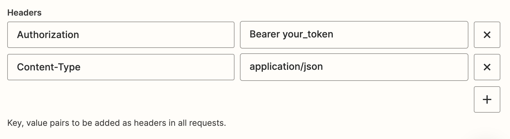

# Usando Webhooks Avançados

Aqui veremos como usar o Callbell através do Zapier, utilizando o webhook personalizado do Zapier como uma ação.
Esta é uma maneira mais avançada de usar o Callbell no Zapier, mas oferece mais flexibilidade porque você pode usar nossa API pública para realizar ações.

Consulte a <a href="https://docs.callbell.eu/api/reference/introduction'">referência da API</a> para obter mais informações sobre os endpoints e os payloads.

## Usando o Webhook Personalizado do Zapier

Certifique-se de selecionar o aplicativo Callbell correto (o mais recente):

Em seguida, selecione "Webhooks by Zapier" como o aplicativo de ação:

A ação recomendada é "Solicitação Personalizada" aqui:

Independentemente da ação que você escolher, precisará configurar corretamente a URL do webhook.

### URL do Webhook

A URL do webhook é a URL que o Zapier usará para enviar dados para o Callbell.

:::info

Nesta [seção](https://docs.callbell.eu/api/reference/contacts_api/post_contacts), você pode encontrar a `url` a ser usada para o webhook.

:::

### Payload do Webhook

O payload do webhook é os dados que o Zapier enviará para o Callbell.

O payload deve estar no formato JSON.

### Autenticação

Você precisará autenticar sua solicitação para o Callbell.

Você pode fazer isso adicionando os seguintes cabeçalhos à sua solicitação:

O `Content-Type` definido como `application/json` é **obrigatório**.