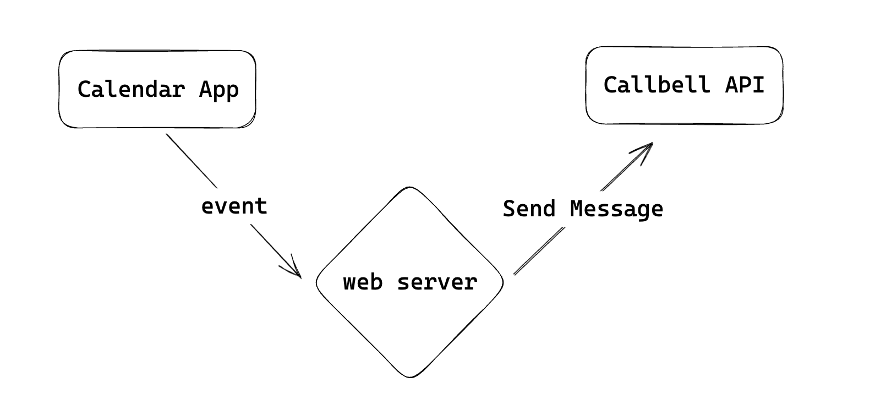

# Comment faire et exemples

Ce guide vous montrera comment utiliser l'API Callbell pour envoyer des messages, obtenir des mises à jour et maintenir les informations de contact à jour.

## Débuter avec Callbell

Si vous êtes nouveau dans Callbell, vous pouvez commencer avec notre [Guide de démarrage avec Callbell](/bot/getting_started).
Nous examinerons également quelques exemples d'utilisation de l'API Callbell.

Les exemples se divisent en deux catégories : **Événements causés par des actions** et **Actions déclenchées par des événements**.

## Événements causés par des actions

Les événements causés par des actions sont des mises à jour qui se produisent en raison d'une action. Par exemple, lorsque quelqu'un rejoint votre site web, cela déclenche un nouvel événement. Vous pouvez vous inscrire à ces événements et être averti lorsqu'ils se produisent.

Vous trouverez ici des exemples d'événements que l'API Callbell peut déclencher. Utilisez ces exemples pour comprendre comment utiliser l'API Callbell pour envoyer des messages et mettre à jour les informations de contact lorsqu'un nouvel événement se produit.

:::info
Pour l'endpoint webhook, vous pouvez utiliser un service tel que [RequestBin](https://requestbin.com/) ou [Webhook.site](https://webhook.site/). Ce sont des endpoints temporaires pour tester votre configuration. Pour une utilisation réelle, vous devrez créer votre propre endpoint. Vous aurez besoin d'un serveur web pour recevoir les événements et envoyer des messages à vos clients à l'aide de votre propre endpoint. Vous pouvez utiliser n'importe quel langage de programmation pour cela.
:::

### Événements de messages

Vous pouvez utiliser l'API Callbell pour envoyer des messages lorsque se produit un nouvel événement.
Nous utiliserons l'[API Messages](/api/reference/messages_api/introduction) pour envoyer des messages. Consultez la section [Webhooks](/api/reference/webhooks/introduction) pour en savoir plus sur l'inscription aux événements.

Tout d'abord, nous devons configurer un endpoint webhook pour obtenir les événements. Nous utiliserons [RequestBin](https://requestbin.com/) pour créer un endpoint temporaire.

1. Allez sur [RequestBin](https://requestbin.com/) et cliquez sur **Créer un RequestBin**.
2. Copiez l'URL du nouveau RequestBin que vous venez de créer.
3. Configurez votre endpoint webhook sur Callbell. Consultez la section [Webhooks](/api/reference/webhooks/introduction) pour plus d'informations.

#### 🤖 Envoyer un message avec un chatbot lors de l'arrivée d'un nouveau message

Dans cet exemple, nous verrons comment utiliser l'API Callbell pour envoyer un message avec un chatbot lorsqu'un nouvel événement se produit. Supposons que nous voulions envoyer un message de chatbot lorsqu'un nouveau message arrive. Nous suivrons les étapes de l'exemple précédent pour configurer un endpoint webhook et obtenir les événements.

Après avoir configuré le endpoint webhook, nous pouvons utiliser l'API Callbell pour envoyer un message de chatbot lorsqu'un nouveau message arrive. Consultez l'[API Messages](/api/reference/messages_api/introduction) pour en savoir plus sur l'envoi de messages.

Voici un diagramme montrant comment l'API Callbell envoie un message de chatbot lorsqu'un nouveau message arrive.

### Mise à jour des contacts

Vous pouvez également utiliser l'API Callbell pour maintenir les informations de contact à jour.
Nous utiliserons l'[API Contacts](/api/reference/contacts_api/introduction) pour créer et mettre à jour des contacts.

#### 📝 Ajout d'un contact dans un CRM lorsqu'un nouveau contact est créé

Dans cet exemple, nous verrons comment utiliser l'API Callbell pour ajouter un contact lorsqu'un nouvel utilisateur rejoint.

Supposons que nous voulions ajouter un contact dans un CRM lorsqu'un nouveau contact est créé dans Callbell. Nous suivrons les étapes de l'exemple précédent pour configurer un endpoint webhook et obtenir les événements.

Après avoir configuré le endpoint webhook, nous pouvons utiliser l'API Callbell pour ajouter un contact dans un CRM lorsqu'un nouveau contact est créé dans Callbell. Consultez l'[API Contacts](/api/reference/contacts_api/introduction) pour en savoir plus sur la création de contacts.

:::info
Vous pouvez utiliser les mêmes étapes pour mettre à jour un contact lorsque l'utilisateur modifie son profil.
:::

Voici un diagramme montrant comment l'API Callbell ajoute un contact dans un CRM lorsqu'un nouveau contact est créé dans Callbell.

## Actions déclenchées par des événements

Les actions déclenchées par des événements sont des actions qui se produisent en raison d'une mise à jour. Par exemple, lorsque un nouveau message arrive, vous pouvez envoyer un message au client. Vous pouvez utiliser l'API Callbell pour envoyer des messages et maintenir les informations de contact à jour lorsqu'un nouvel événement se produit.

### Envoyer un message

Ici, nous verrons comment utiliser l'API Callbell pour envoyer des messages lorsqu'un nouvel événement se produit. Comme indiqué dans la section [Webhooks](/api/reference/webhooks/introduction), vous pouvez vous inscrire à différents événements et être averti lorsqu'ils se produisent.

Vous devrez configurer un endpoint webhook pour obtenir les événements, puis utiliser l'API Callbell pour envoyer des messages à vos clients.

:::info
Pour l'endpoint webhook, vous pouvez utiliser un service tel que [RequestBin](https://requestbin.com/) ou [Webhook.site](https://webhook.site/). Ce sont des endpoints temporaires pour tester votre configuration. Pour une utilisation réelle, vous devrez créer votre propre endpoint.
Vous aurez besoin d'un serveur web pour recevoir les événements et envoyer des messages à vos clients à l'aide de votre propre endpoint. Vous pouvez utiliser n'importe quel langage de programmation pour cela.
:::

#### 🛒 Envoyer un message lorsqu'une nouvelle commande est passée

Dans cet exemple, nous verrons comment utiliser l'API Callbell pour envoyer un message à un client lorsqu'un nouvel événement se produit.
Supposons que nous voulions envoyer un message à un client lorsqu'une nouvelle commande est passée sur notre boutique en ligne.

Tout d'abord, nous devons configurer un endpoint webhook pour obtenir les événements. Nous utiliserons [RequestBin](https://requestbin.com/) pour créer un endpoint temporaire.

1. Allez sur [RequestBin](https://requestbin.com/) et cliquez sur **Créer un RequestBin**.
2. Copiez l'URL du nouveau RequestBin que vous venez de créer.
3. Configurez votre endpoint webhook sur Callbell. Consultez la section [Webhooks](/api/reference/webhooks/introduction) pour plus d'informations.

Maintenant que nous avons configuré un endpoint webhook qui recevra les événements, nous pouvons utiliser l'API Callbell pour envoyer un message au client.

Consultez l'[API Messages](/api/reference/messages_api/introduction) pour en savoir plus sur l'envoi de messages.

Voici un diagramme montrant comment l'API Callbell envoie un message au client lorsqu'une nouvelle commande est passée.

#### 📅 Envoyer un message lorsqu'un nouveau rendez-vous est fixé

Dans cet exemple, nous verrons comment utiliser l'API Callbell pour envoyer un message à un client lorsqu'un nouvel événement se produit.
Supposons que nous voulions envoyer un message à un client lorsqu'un nouveau rendez-vous est fixé.

Nous suivrons les étapes de l'exemple précédent pour configurer un endpoint webhook et obtenir les événements.

Maintenant que nous avons configuré un endpoint webhook qui recevra les événements, nous pouvons utiliser l'API Callbell pour envoyer un message au client lorsqu'un nouveau rendez-vous est fixé. Consultez l'[API Messages](/api/reference/messages_api/introduction) pour en savoir plus sur l'envoi de messages. Voici un diagramme montrant comment l'API Callbell envoie un message au client lorsqu'un nouveau rendez-vous est fixé.

### Utilisation de Zapier

Vous pouvez utiliser Zapier pour lier Callbell à des milliers d'autres applications. Zapier est un outil qui vous aide à relier des applications ensemble et à automatiser des tâches. Vous pouvez utiliser Zapier pour lier Callbell à d'autres applications telles que Slack, Gmail, Google Sheets, et bien d'autres.

Il existe déjà de nombreuses intégrations disponibles sur Zapier que vous pouvez utiliser pour lier Callbell à d'autres applications. Vous pouvez également créer vos propres intégrations à l'aide de Zapier.

Voici quelques exemples de Zaps que vous pouvez créer avec Zapier:

- Envoyer un message lorsqu'un nouvel e-mail arrive (Gmail)
- Envoyer un message lorsqu'un nouveau rendez-vous est fixé (Calendly)
- Envoyer un message lorsqu'une nouvelle commande est passée (Shopify)
- Envoyer un message lorsqu'un nouveau contact est créé (HubSpot)
- Envoyer un message lorsqu'un nouveau contact est créé (Mailchimp)
- Envoyer un message lorsqu'un nouveau contact est créé (Salesforce)
- Envoyer un message lorsqu'un nouveau contact est créé (Zendesk)
- Envoyer un message lorsqu'un nouveau contact est créé (Intercom)
- Envoyer un message lorsqu'un nouveau contact est créé (Pipedrive)
- Envoyer un message lorsqu'un nouveau formulaire est rempli (Typeform)
- Ajouter un contact lorsqu'un nouveau formulaire est rempli (Typeform)
- Envoyer un message lorsqu'un nouveau formulaire est rempli (Google Forms)
- Ajouter un contact lorsqu'un nouveau formulaire est rempli (Google Forms)

Et bien d'autres...

Vous pouvez également créer vos propres intégrations à l'aide de Zapier. Consultez la [Plateforme de développeur Zapier](https://zapier.com/developer) pour plus d'informations.