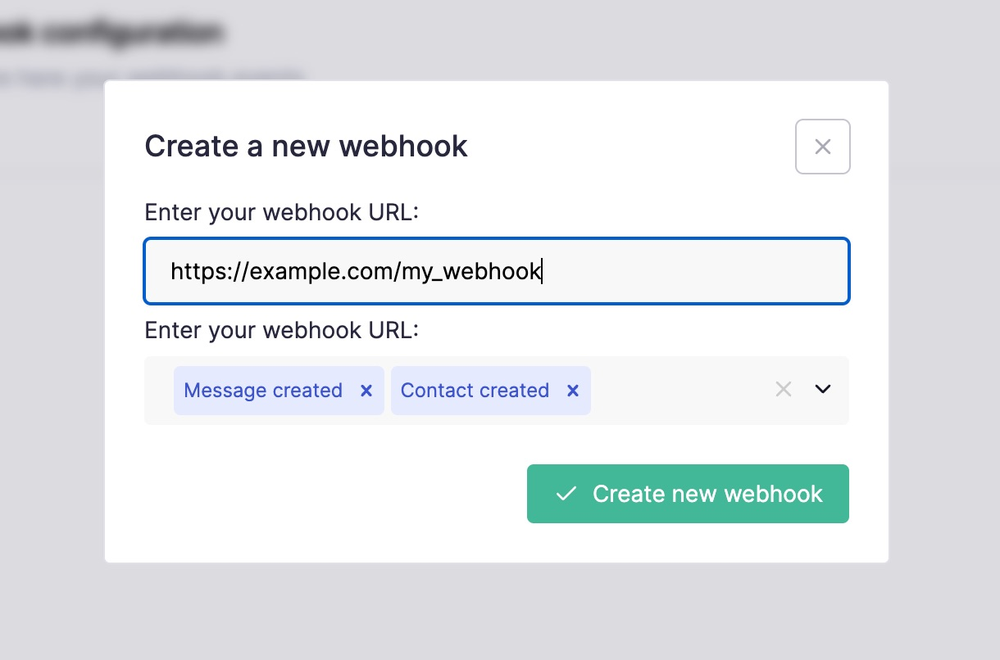

# Introduction

L'API de Callbell fournit des **webhooks HTTP** pour les événements d'application les plus courants :

- **Événements de message**
- **Événements de notification de statut de message**
- **Événements de contact**
- **Événements de conversation**

## Comment s'abonner aux événements

:::info
Cela peut également être fait de manière programmatique à partir de [WebhooksEndpoint](./../webhooks_api/introduction.md)
:::

Sur votre tableau de bord Callbell, accédez à la section [**"Paramètres de l'API"**](https://dash.callbell.eu/settings/api_settings/webhooks) et cliquez sur l'onglet "Webhooks" :

Dans le champ URL, ajoutez votre URL de point de terminaison (par exemple `https://myapp.com/callbell_endpoint`) et sélectionnez les événements auxquels vous souhaitez vous abonner :

:::info
Assurez-vous également d'**inclure** le protocole (`http` or `https`) dans votre endpoint de webhook :

✅ **Bon** : `https://www.myexample.com`

❌ **Mauvais** : `www.example.com`
:::

Après avoir cliqué sur "Create new webhook", vous devriez recevoir une notification de réussite. Vous pouvez toujours modifier les événements de webhook ultérieurement :

:::caution
Callbell ne prend pas en charge `localhost` en tant qu'URL de webhook. Si vous avez besoin de déboguer une application locale, utilisez plutôt un service pour exposer votre environnement de développement local comme [Ngrok](https://ngrok.com).
:::