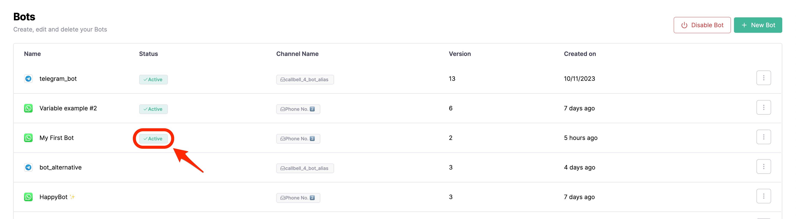

# Commencer

Ce guide étape par étape vous guidera dans la création de votre premier chatbot avec Callbell.

## Prérequis

Vous devez créer un compte sur Callbell et avoir configuré au moins **1 canal** afin de pouvoir suivre ce guide.

- Inscrivez-vous sur [Callbell](https://dash.callbell.eu/users/sign_up)
- Consultez plus d'informations sur notre [intégration de l'API WhatsApp Business](https://callbellsupport.zendesk.com/hc/en-us/articles/360007805898-How-to-integrate-WhatsApp-into-Callbell-through-the-WhatsApp-Business-APIs) pour utiliser le générateur de flux du bot avec WhatsApp.

## Créer votre premier chatbot

Accédez à la section **Bot Builder** dans la barre latérale gauche et cliquez sur le bouton **Créer un nouveau bot**:

Une fenêtre modale s'ouvrira vous demandant de choisir un nom pour votre bot et le canal que vous souhaitez utiliser avec celui-ci:

Après avoir cliqué sur le bouton **Créer bot**, vous serez redirigé vers la page du générateur de bot où vous pourrez commencer à créer votre premier chatbot:

## Ajouter une nouvelle action

Pour que le bot fonctionne, vous devrez ajouter au moins une action. Par exemple, répondons à l'utilisateur avec un message lorsqu'il envoie un message au bot.

Cliquez sur le bouton **Ajouter une nouvelle action** et sélectionnez l'action **Envoyer un message**:

Un panneau s'ouvrira vous permettant de configurer l'action. Dans ce cas, nous ajouterons simplement un message texte simple:

Après avoir cliqué sur le bouton **Enregistrer**, vous serez redirigé vers la page du générateur de bot où vous pourrez voir l'action que vous venez de créer:

## Testez votre bot

Pour tester votre bot, vous devez cliquer sur le bouton **Exécuter le simulateur** dans le coin supérieur droit de la page. Cela ouvrira un panneau où vous pourrez tester votre nouveau flux:

Cliquez simplement sur le bouton **Envoyer** et vous verrez le bot répondre avec le message que vous venez de configurer:

## Publiez votre bot

Une fois satisfait de votre bot, vous pouvez le publier en cliquant sur le bouton **Publier le brouillon** dans le coin supérieur droit de la page:

Après avoir cliqué sur le bouton **Publier le brouillon** et confirmé, votre flux de bot sera publié; en même temps, vous devrez **activer votre bot** pour le rendre disponible à vos clients. Vous pouvez le faire en revenant à la section "Bots" dans la barre latérale droite et en cliquant sur le bouton **Activer le bot**:

Vous pouvez confirmer que le bot est activé en vérifiant son statut dans la section "Bots":

## Testez votre bot en production

Maintenant que votre bot est activé, vous pouvez le tester en production en envoyant un message sur le canal que vous avez configuré. Dans ce cas, nous enverrons un message au numéro WhatsApp que nous avons configuré dans la section [Prérequis](#prerequisites):

## Et ensuite?

Maintenant que vous avez créé votre premier chatbot, vous pouvez commencer à explorer les autres actions disponibles dans le générateur de bot.