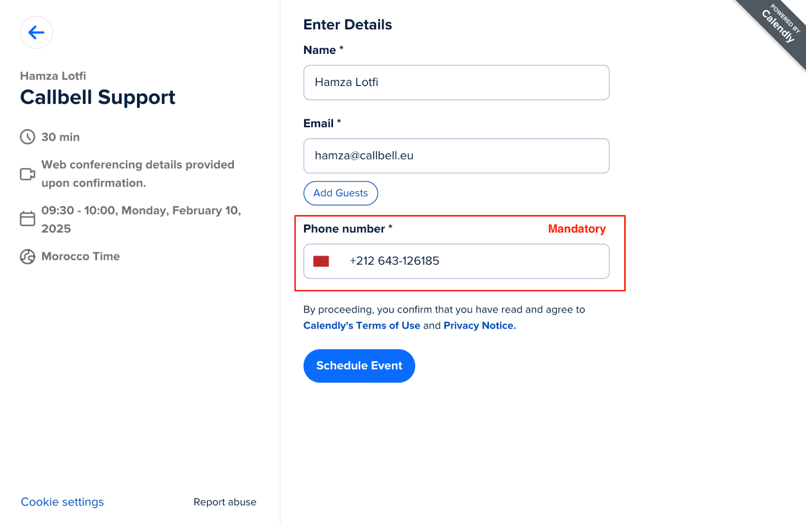
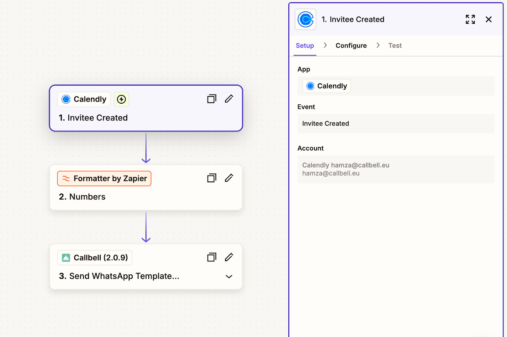
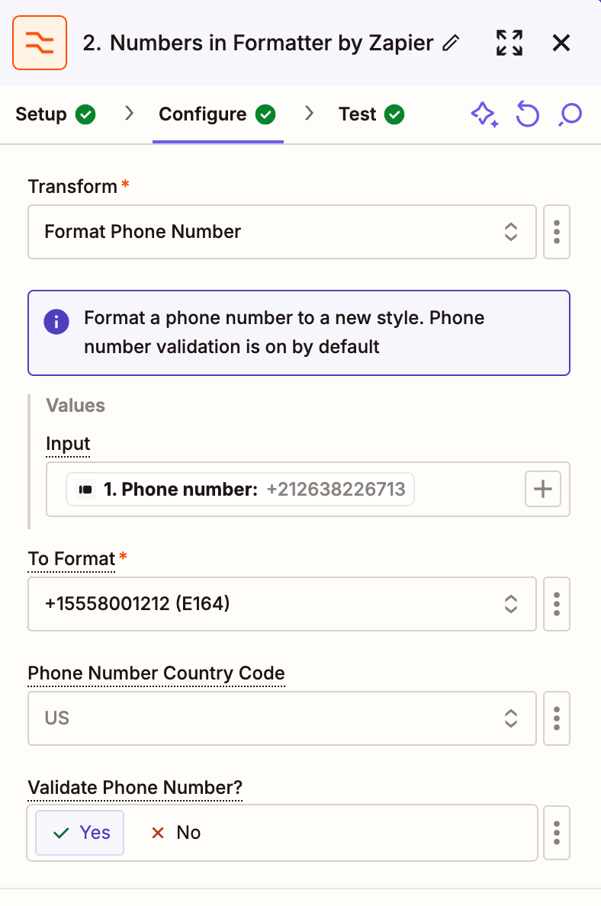
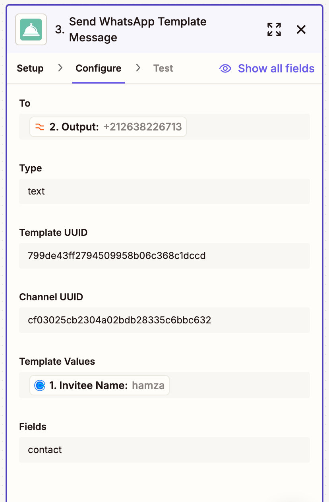
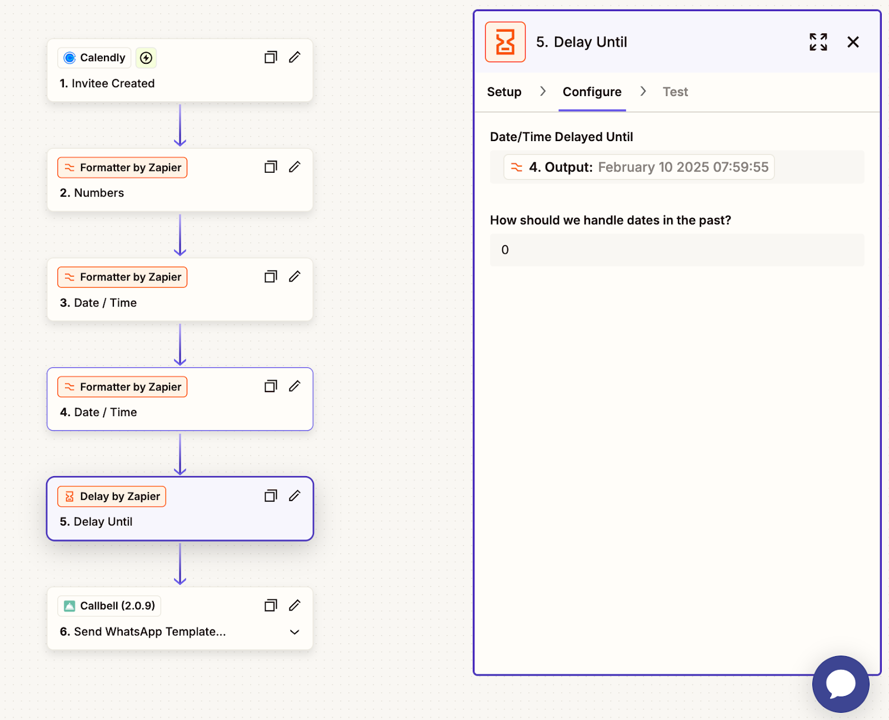

# Intégration de Calendly

## Automatisez la communication des rendez-vous sur WhatsApp avec Callbell

> Dans les guides suivants, vous apprendrez à intégrer Calendly avec Callbell en utilisant Zapier. Cette intégration vous permet d'automatiser les communications liées aux rendez-vous sur WhatsApp, garantissant une expérience fluide pour vous et vos clients.

Avec cette configuration, vous pouvez :

- Envoyer des confirmations de rendez-vous automatisées via WhatsApp grâce à Callbell.
- Envoyer des rappels de rendez-vous automatisés via WhatsApp pour réduire les absences.
- Envoyer des suivis automatisés après le rendez-vous via WhatsApp pour maintenir l'engagement et améliorer l'expérience client.

Chaque guide vous fournira des instructions étape par étape pour configurer ces automatisations en utilisant Zapier, Calendly et Callbell.

---

## Guide 1: Envoyer des confirmations de rendez-vous automatisées

Envoyer une confirmation de rendez-vous automatisée par WhatsApp via Callbell.

<iframe width="100%" height="500" src="https://www.youtube.com/embed/HYcK4FROqXk?si=h01y4UqeIZhtTF2O" title="Suivi Automatique des Rendez-vous sur WhatsApp" frameborder="0" allow="accelerometer; autoplay; clipboard-write; encrypted-media; gyroscope; picture-in-picture; web-share" referrerpolicy="strict-origin-when-cross-origin" allowfullscreen></iframe>

### Explication étape par étape

1. **Créez votre page de réservation Calendly**

   Concevez votre page de réservation Calendly pour collecter des informations essentielles, telles que :

   - **Nom**
   - **Numéro de téléphone** (obligatoire)
   - **Adresse e-mail** (facultative)

   

2. **Préparez les modèles de message dans Callbell**

   Créez le modèle de message que vous souhaitez envoyer aux nouveaux prospects dans Callbell. Lors de la conception du modèle :

   - Utilisez des variables personnalisées (par exemple, `{{variable 1}}`, `{{variable 2}}`) pour personnaliser le message.
   - Ces variables seront remplies dynamiquement dans Zapier à l'aide des données des prospects provenant de Typeform.
   - [En savoir plus sur la création de modèles avec des variables dans Callbell](https://callbellsupport.zendesk.com/hc/fr/articles/360007759237-Qu-est-ce-que-les-mod%C3%A8les-de-message-et-%C3%A0-quoi-servent-ils)

   > **N.B. :** Dans la plupart des cas, les modèles WhatsApp envoyés sont utilisés pour confirmer ou rappeler un rendez-vous. Nous vous recommandons d'essayer de les faire approuver sous la catégorie "Utilitaire", qui coûte moitié moins cher que la catégorie "Marketing".

3. **Créez un Zap : Calendly comme ‘Trigger’**

   - Connectez-vous à Zapier et créez un nouveau Zap.
   - Choisissez **"Invitee Created"** comme ‘Trigger’.
   - Connectez votre compte Calendly.
   - Testez pour vous assurer que Zapier récupère correctement les données de la soumission de réservation.

   

4. **Formatage du numéro de téléphone**

   - Ajoutez l’action **“Formatter”** de Zapier pour vous assurer que le numéro de téléphone soumis via Typeform est correctement formaté pour Callbell.
   - Sélectionnez l’action **“Numbers”**.
   - Choisissez **“Format Phone Number”** comme type de transformation.
   - Mappez le champ du numéro de téléphone collecté depuis Typeform.
   - Sélectionnez le format de sortie **E164**.

   

5. **Envoyez le message avec des variables personnalisées via Callbell**

   - Ajoutez l’action **“Send Template Message”** dans Zapier.
   - Connectez votre compte Callbell.
   - Mappez le numéro de téléphone formaté de l’étape précédente au champ **"To"**.
   - Copiez et collez l’UUID du modèle créé à l’étape 2.
   - Copiez et collez l’UUID du canal depuis votre compte Callbell.
   - Remplissez les variables du modèle dans le champ **"Template values"**.

   

### Notes finales

Grâce à cette configuration, chaque nouveau rendez-vous Calendly déclenchera un message de confirmation WhatsApp automatisé via Callbell, garantissant à vos clients une confirmation instantanée de leur rendez-vous.
Pour plus d'informations, consultez :

- [Centre d'aide Callbell](https://callbellsupport.zendesk.com/hc/en-us)
- [Documentation d'aide Zapier](https://help.zapier.com/hc/en-us)

---

## Guide 2 : Envoyer des rappels de rendez-vous automatisés

Envoyez un rappel de rendez-vous automatisé par message WhatsApp via Callbell.

<iframe width="100%" height="500" src="https://www.youtube.com/embed/_VH9MTkfrcI?si=h6SW8WMdwbbUfm8O" title="Rappels Automatiques de Rendez-vous sur WhatsApp" frameborder="0" allow="accelerometer; autoplay; clipboard-write; encrypted-media; gyroscope; picture-in-picture; web-share" referrerpolicy="strict-origin-when-cross-origin" allowfullscreen></iframe>

### Explication étape par étape

Le processus de configuration est similaire à celui de la confirmation de rendez-vous.

1. **Suivez les étapes décrites dans le Guide 1 : Envoyer des confirmations de rendez-vous automatisées**

2. **Ajoutez les étapes Zapier supplémentaires suivantes avant la dernière étape "Envoyer le modèle de message avec des variables personnalisées via Callbell" pour compléter le processus :**

   1. **Ajouter une action de formateur**
      Dans Zapier, cliquez sur "Ajouter une étape" et sélectionnez **Formateur**.

      - Choisissez **"Date/Heure"** comme Evénement.
      - Sous **"Transformer"**, sélectionnez **"Format"**.
      - Dans le champ **"Input"**, sélectionnez **"Heure de début de l'événement programmé"**.
      - Sous **"Formater vers"**, choisissez le format de date/heure souhaité (par exemple, `JJ/MM/AAAA HH:mm`).
      - Dans **"Vers le fuseau horaire"**, sélectionnez le fuseau horaire approprié pour l'événement.

      

   2. **Ajouter une autre action de formateur pour ajuster l'heure de rappel**
      Dans Zapier, cliquez sur "Ajouter une étape" et sélectionnez **Formateur**.

      - Choisissez **"Date/Heure"** comme Evènement.
      - Sous **"Transformer"**, sélectionnez **"Ajouter/Soustraire du temps"**.
      - Dans le champ **"Input"**, sélectionnez le Résultat de la date formatée de l'étape précédente.
      - Dans le champ **"Expression"**, entrez `-1 jour` pour envoyer le rappel un jour avant le rendez-vous.
      - Gardez le **Format de destination** identique à celui de l'étape précédente pour maintenir la cohérence.

      

   3. **Ajoutez une action de délai**
      Dans Zapier, cliquez sur "Ajouter une étape" et sélectionnez **"Délai"**.

      - Choisissez **"Délai jusqu'à"** comme événement.
      - Dans le champ **"Date/Heure du délai"**, sélectionnez le résultat de l'étape précédente (l'heure de rappel ajustée).
      - Sous **"Comment devons-nous gérer les dates dans le passé ?"**, sélectionnez **"Toujours continuer"** pour garantir que le flux de travail se déroule correctement même si la condition de délai est légèrement dépassée.

      

### Notes finales

Grâce à cette configuration, chaque rendez-vous programmé dans Calendly déclenchera un rappel WhatsApp automatisé via Callbell, garantissant à vos clients une notification en temps opportun un jour avant leur rendez-vous. Ce flux de travail aide à réduire les absences et à améliorer la participation globale aux rendez-vous.
Pour plus d'informations, consultez :

- [Centre d'aide Callbell](https://callbellsupport.zendesk.com/hc/en-us)
- [Documentation d'aide Zapier](https://help.zapier.com/hc/en-us)

---

## Guide 3: Envoyer des suivis automatisés après le rendez-vous

Envoyer des suivis de rendez-vous automatisés par WhatsApp via Callbell.

<iframe width="100%" height="500" src="https://www.youtube.com/embed/ehwlLJk0h6M?si=peSmatuN5_McFPvW" title="Automatisez la Communication des Rendez-vous sur WhatsApp avec Callbell" frameborder="0" allow="accelerometer; autoplay; clipboard-write; encrypted-media; gyroscope; picture-in-picture; web-share" referrerpolicy="strict-origin-when-cross-origin" allowfullscreen></iframe>

### Explication étape par étape

Le processus de configuration est similaire à celui de la confirmation de rendez-vous.

1. **Suivez les étapes décrites dans le Guide 1 : Envoyer des confirmations de rendez-vous automatisées**

2. **Ajoutez les étapes Zapier supplémentaires suivantes avant la dernière étape "Envoyer le modèle de message avec des variables personnalisées via Callbell" pour compléter le processus :**

   1. **Ajouter une action de formateur**
      Dans Zapier, cliquez sur "Ajouter une étape" et sélectionnez **Formateur**.

      - Choisissez **"Date/Heure"** comme Evénement.
      - Sous **"Transformer"**, sélectionnez **"Format"**.
      - Dans le champ **"Input"**, sélectionnez **"Heure de fin de l'événement programmé"**.
      - Sous **"Formater vers"**, choisissez le format de date/heure souhaité (par exemple, `JJ/MM/AAAA HH:mm`).
      - Dans **"Vers le fuseau horaire"**, sélectionnez le fuseau horaire approprié pour l'événement.

      

   2. **Ajouter une autre action de formateur pour ajuster l'heure de rappel**
      Dans Zapier, cliquez sur "Ajouter une étape" et sélectionnez **Formateur**.

      - Choisissez **"Date/Heure"** comme Evènement.
      - Sous **"Transformer"**, sélectionnez **"Ajouter/Soustraire du temps"**.
      - Dans le champ **"Input"**, sélectionnez le Résultat de la date formatée de l'étape précédente.
      - Dans le champ **"Expression"**, entrez `+15 minutes` pour envoyer le suivi 15 minutes après le rendez-vous.
      - Gardez le **Format de destination** identique à celui de l'étape précédente pour maintenir la cohérence.

      

   3. **Ajoutez une action de délai**
      Dans Zapier, cliquez sur "Ajouter une étape" et sélectionnez **"Délai"**.

      - Choisissez **"Délai jusqu'à"** comme événement.
      - Dans le champ **"Date/Heure du délai"**, sélectionnez le résultat de l'étape précédente (l'heure de suivi ajustée).
      - Sous **"Comment devons-nous gérer les dates dans le passé ?"**, sélectionnez **"Toujours continuer"** pour garantir que le flux de travail se déroule correctement même si la condition de délai est légèrement dépassée.

      

### Notes finales

Grâce à cette configuration, chaque rendez-vous Calendly terminé déclenchera un message de suivi WhatsApp automatisé via Callbell. Cela garantit un engagement continu avec vos clients, que ce soit pour la collecte de commentaires, les prochaines étapes ou la planification de rendez-vous futurs. Ce flux de travail permet d'améliorer les relations avec les clients et la qualité globale du service.
Pour plus d'informations, consultez :

- [Centre d'aide Callbell](https://callbellsupport.zendesk.com/hc/en-us)
- [Documentation d'aide Zapier](https://help.zapier.com/hc/en-us)
