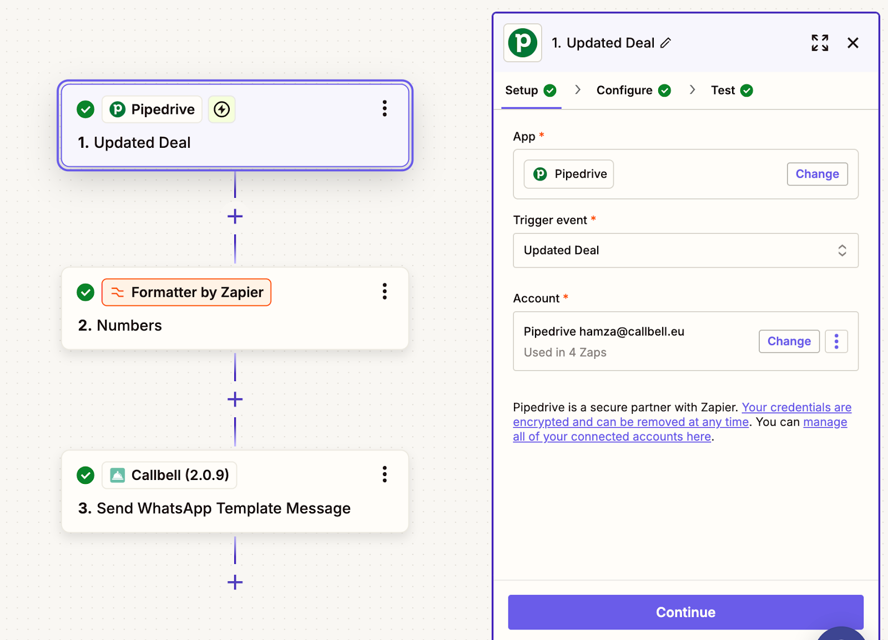
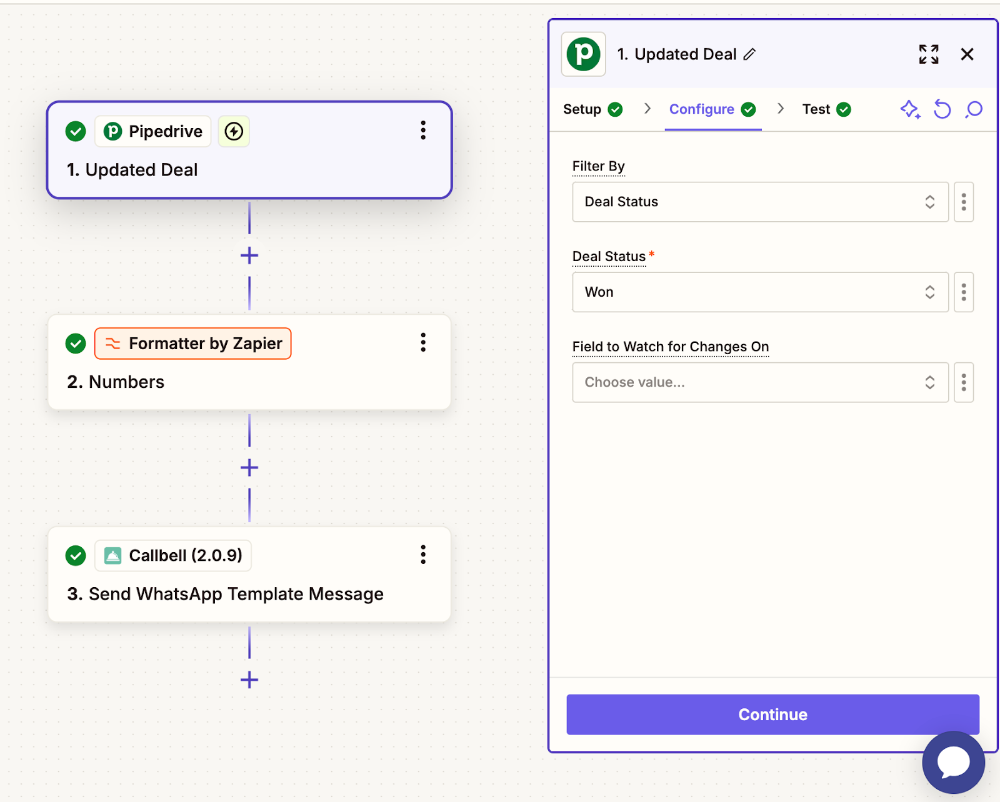

# Intégration Pipedrive

## Automatiser la communication CRM WhatsApp avec Callbell

Apprenez à intégrer Pipedrive avec Callbell en utilisant Zapier pour automatiser les communications WhatsApp.

## Introduction

> Dans le guide suivant, vous apprendrez à intégrer Pipedrive avec Callbell en utilisant Zapier. Cette intégration vous permet d'automatiser les communications WhatsApp basées sur les activités Pipedrive, assurant ainsi un processus de vente et de gestion de la clientèle sans faille.

### Grâce à cette configuration, vous pouvez :

- Créer automatiquement de nouveaux contacts de Pipedrive dans Callbell
- Envoyer automatiquement des modèles WhatsApp lorsqu'une affaire change de statut dans Pipedrive
- Envoyer automatiquement des modèles WhatsApp lorsqu'une affaire est gagnée

Chaque guide fournira des instructions étape par étape pour configurer ces flux de travail à l'aide de Zapier, Pipedrive et Callbell.

## Guide 1 : Création automatique de nouveaux contacts dans Callbell à partir de Pipedrive

Dans ce guide, nous allons vous expliquer comment créer automatiquement de nouveaux contacts dans Callbell chaque fois qu'un nouveau contact est ajouté dans Pipedrive. Cette intégration garantit que vos contacts de votre CRM sont automatiquement disponibles dans Callbell.

<iframe width="100%" height="500" src="https://www.youtube.com/embed/t23DZqwR4RM?si=eGA7Mei9ej5jTCFI" title="Créer automatiquement de nouveaux contacts à partir de Pipedrive dans Callbell" frameborder="0" allow="accelerometer; autoplay; clipboard-write; encrypted-media; gyroscope; picture-in-picture; web-share" referrerpolicy="strict-origin-when-cross-origin" allowfullscreen></iframe>

### Explication étape par étape

#### 1. Créer un Zap : Pipedrive comme déclencheur

- Connectez-vous à Zapier et créez un nouveau Zap.
- Définissez le ‘trigger’ sur **"New Person"** (cela déclenchera le Zap chaque fois qu'un nouveau contact est ajouté dans Pipedrive).
- Connectez votre compte Pipedrive.
- Testez le trigger pour vous assurer que Zapier récupère correctement les nouvelles données de contact de Pipedrive.

#### 2. Créer un contact sur Callbell

- Sélectionnez **Callbell** comme application d'action.
- Définissez l'action sur **"Créer un contact"** (cela créera un nouveau contact dans Callbell lors du déclenchement).
- Connectez votre compte Callbell.
- Associez les champs de Pipedrive à Callbell :
  - **Nom** → Correspond au nom du contact dans Pipedrive.
  - **Numéro de téléphone** → Correspond au numéro de téléphone du contact dans Pipedrive.
  - Associez tout autre champ pertinent si nécessaire.
- Testez l'action pour vous assurer que Zapier crée avec succès un contact dans Callbell.

### Notes finales

Grâce à cette configuration, chaque nouveau contact ajouté dans Pipedrive sera automatiquement créé dans Callbell. Ce flux de travail permet de gagner du temps, de réduire la saisie manuelle des données et de garantir que votre équipe peut interagir instantanément avec les nouveaux contacts.

**Pour plus d'informations, consultez :**

- [Centre d'aide Callbell](https://callbellsupport.zendesk.com/hc/en-us)
- [Documentation d'aide Zapier](https://help.zapier.com/hc/en-us)

---

## Guide 2 : Envoyer automatiquement des messages modèles WhatsApp lorsqu'une affaire change de statut dans Pipedrive

Dans ce guide, nous vous expliquerons comment envoyer automatiquement un message WhatsApp via Callbell chaque fois qu'une affaire change de statut dans Pipedrive.

<iframe width="100%" height="500" src="https://www.youtube.com/embed/rdc8K8eYjo0?si=aIlV9v8rD2ZU2thB" title="Envoyer automatiquement des messages de modèles WhatsApp dans Pipedrive" frameborder="0" allow="accelerometer; autoplay; clipboard-write; encrypted-media; gyroscope; picture-in-picture; web-share" referrerpolicy="strict-origin-when-cross-origin" allowfullscreen></iframe>

### Explication étape par étape

#### 1. Préparer les modèles de message dans Callbell

- Créez le modèle de message que vous souhaitez envoyer.
- Utilisez des **variables personnalisées** (ex. `{{variable 1}}, {{variable 2}}`) pour personnaliser le message.
- En savoir plus : [Créer des modèles avec des variables](https://callbellsupport.zendesk.com/hc/fr/articles/360007759237-Qu-est-ce-que-les-modèles-de-message-et-à-quoi-servent-ils).

#### 2. Créer un Zap - Pipedrive comme déclencheur

- Connectez-vous à Zapier et créez un **nouveau Zap**.
- Définissez le **trigger** sur **"Updated Deal"**.
- Connectez votre compte Pipedrive.
- Testez le trigger.

#### 3. Formatage du numéro de téléphone

- Ajoutez l’action **"Formatter"** de Zapier pour formater le numéro.
- Sélectionnez **"Numbers"** puis **"Format Phone Number"**.
- Mappez le champ du numéro et sélectionnez le format **E164**.

#### 4. Envoyer le message via Callbell

- Ajoutez l’action **"Send Template Message"** dans Zapier.
- Connectez votre compte Callbell.
- Remplissez l'UUID du modèle et du canal Callbell.
- Mappez les valeurs du modèle.

### Notes finales

Grâce à cette configuration, vos clients recevront automatiquement des notifications WhatsApp lorsque leurs transactions avancent.

---

## Guide 3 : Envoyer automatiquement un message WhatsApp lorsqu'une affaire est gagnée

Ce guide vous montre comment envoyer automatiquement un message WhatsApp lorsque **une transaction est marquée comme gagnée** dans Pipedrive.

<iframe width="100%" height="500" src="https://www.youtube.com/embed/IjSVvQqy1L8?si=svKYokHS0IK8a3kb" title="Envoyez automatiquement des modèles WhatsApp lorsqu'une affaire est remportée" frameborder="0" allow="accelerometer; autoplay; clipboard-write; encrypted-media; gyroscope; picture-in-picture; web-share" referrerpolicy="strict-origin-when-cross-origin" allowfullscreen></iframe>

### Explication étape par étape

#### 1. Créer un Zap - Pipedrive comme déclencheur

- Connectez-vous à **Zapier** et créez un **nouveau Zap**.
- Définissez le **trigger** sur **"Updated Deal"**.
- Connectez votre compte Pipedrive.
- Dans le **champ Filtrer par**, sélectionnez **Statut du deal**.
- Sélectionnez **"Gagné"** pour déclencher l'automatisation uniquement lorsqu'une transaction est gagnée.
- Testez le trigger.

### Notes finales

Grâce à cette configuration, chaque fois qu'une transaction est **marquée comme gagnée**, un message WhatsApp automatisé sera envoyé, assurant une communication fluide avec vos clients.

**Pour plus d'informations, consultez :**

- [Centre d'aide Callbell](https://callbellsupport.zendesk.com/hc/en-us)
- [Documentation d'aide Zapier](https://help.zapier.com/hc/en-us)
