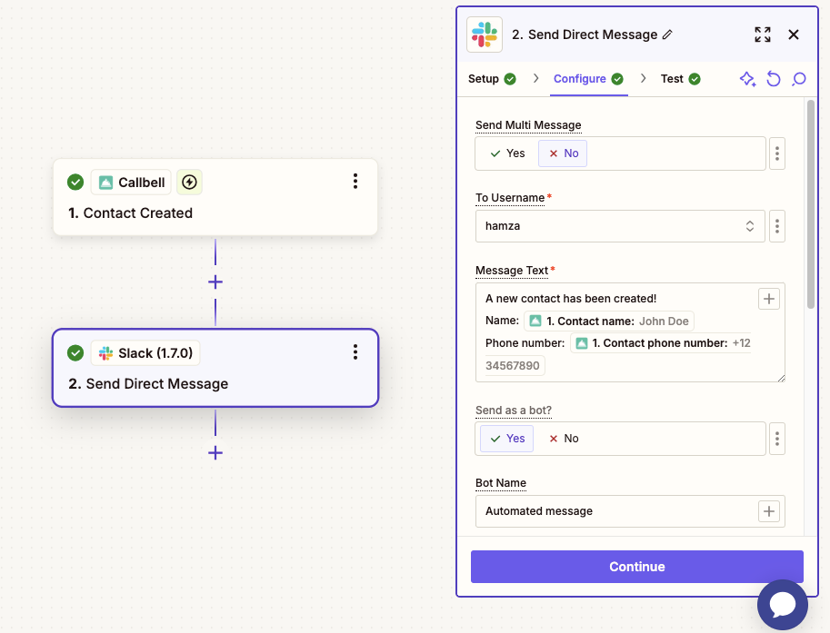

# Intégration Slack

## Automatisez les notifications internes depuis Callbell

Dans les guides suivants, vous apprendrez à intégrer Callbell avec Slack via Zapier. Cette intégration permet à votre équipe de rester informée en temps réel en envoyant automatiquement des messages Slack basés sur des événements spécifiques dans Callbell.

Avec cette configuration, vous pouvez :

- Notifier votre équipe sur Slack lorsqu’un nouveau contact est créé dans Callbell
- Notifier votre équipe sur Slack lorsqu’une conversation est ouverte dans Callbell
- Notifier votre équipe sur Slack lorsqu’une conversation est fermée dans Callbell

Chaque guide vous proposera des instructions pas à pas pour configurer ces workflows à l’aide de Callbell, Zapier et Slack.

---

## Guide 1 : Notifier Slack lorsqu’un nouveau contact est créé dans Callbell

Publiez automatiquement un message dans Slack chaque fois qu’un nouveau contact est créé dans Callbell.

### 1. Créer un Zap : Callbell comme déclencheur

1. Connectez‑vous à Zapier et cliquez sur **Create Zap**.
2. Choisissez **Callbell** comme application de déclenchement (trigger app).
3. Sélectionnez l’événement **New Contact Created**.
4. Connectez votre compte Callbell.
5. Testez le déclencheur pour vous assurer que les données du nouveau contact sont bien récupérées (nom, numéro de téléphone, etc.).

### 2. Ajouter Slack comme action

1. Cliquez sur **+ Add Action**.
2. Sélectionnez **Slack** comme application d’action (action app).
3. Choisissez **Send Channel Message** ou **Send Direct Message**, selon le workflow de votre équipe.
4. Connectez votre compte Slack et choisissez le canal de destination (par exemple `#new‑leads`, `#support`, ou un message direct).
5. Dans **Message Text**, insérez des champs dynamiques provenant de l’étape Callbell, comme `{{Contact Name}}` et `{{Phone Number}}`.

### 3. Personnaliser les paramètres du message Slack

- (Optionnel) Ajoutez une icône ou une image personnalisée au message.
- Incluez un lien vers le Zap ou vers l’URL du contact dans Callbell, si disponible.
- Utilisez la mise en forme Slack : emojis, mentions (par ex. `<!here>` ou `<@U123456>`), gras, liens, etc.

### Notes finales

Ce workflow permet à votre équipe commerciale ou de support de voir chaque nouveau contact immédiatement dans Slack.

Pour plus d’informations, consultez :

- [Centre d’aide Callbell](https://callbellsupport.zendesk.com/hc/fr)
- [Documentation Zapier](https://help.zapier.com/hc/en-us)

---

## Guide 2 : Notifier Slack lorsqu’une conversation est ouverte dans Callbell

Publiez automatiquement un message dans Slack chaque fois qu’une conversation est ouverte dans Callbell.

### 1. Créer un Zap : Callbell comme déclencheur

1. Connectez‑vous à Zapier et cliquez sur **Create Zap**.
2. Choisissez **Callbell** comme application de déclenchement (trigger app).
3. Sélectionnez l’événement **Conversation Opened**.
4. Connectez votre compte Callbell.
5. Testez le déclencheur pour vous assurer que les données de la conversation sont bien récupérées.

### 2. Ajouter Slack comme action

1. Cliquez sur **+ Add Action**.
2. Sélectionnez **Slack** comme application d’action (action app).
3. Choisissez **Send Channel Message** ou **Send Direct Message**, selon le workflow de votre équipe.
4. Connectez votre compte Slack et choisissez le canal (par exemple `#activity‑feed`, `#support‑messages`, ou un message direct).
5. Dans **Message Text**, insérez des champs dynamiques comme `{{Contact Name}}`, `{{Conversation ID}}` ou un extrait du premier message.

### 3. Personnaliser les paramètres du message Slack

- (Optionnel) Ajoutez une icône ou une image, ou un lien vers le Zap ou la conversation Callbell.
- Mentionnez des utilisateurs (`<!here>`, `<@U123456>`) pour alerter votre équipe.
- Formatez avec du gras, italique et des liens pour plus de clarté.

### Notes finales

Ce workflow permet à votre équipe de rester informée en temps réel dès qu’une nouvelle conversation est ouverte dans Callbell, idéal pour suivre les demandes entrantes et améliorer les temps de réponse.

Pour plus d’informations, consultez :

- [Centre d’aide Callbell](https://callbellsupport.zendesk.com/hc/fr)
- [Documentation Zapier](https://help.zapier.com/hc/en-us)

---

## Guide 3 : Notifier Slack lorsqu’une conversation est fermée dans Callbell

Publiez automatiquement un message dans Slack chaque fois qu’une conversation est fermée dans Callbell.

### 1. Créer un Zap : Callbell comme déclencheur

1. Connectez‑vous à Zapier et cliquez sur **Create Zap**.
2. Choisissez **Callbell** comme application de déclenchement (trigger app).
3. Sélectionnez l’événement **Conversation Closed**.
4. Connectez votre compte Callbell.
5. Testez le déclencheur pour vous assurer que les données de clôture sont bien récupérées.

### 2. Ajouter Slack comme action

1. Cliquez sur **+ Add Action**.
2. Sélectionnez **Slack** comme application d’action (action app).
3. Choisissez **Send Channel Message** ou **Send Direct Message**, selon le workflow de votre équipe.
4. Connectez votre compte Slack et choisissez le canal (par exemple `#closed‑conversations`, `#support‑logs`, ou un message direct).
5. Dans **Message Text**, insérez des champs dynamiques tels que `{{Contact Name}}`, `{{Closed At}}` et un résumé de l’issue de la conversation.

### 3. Personnaliser les paramètres du message Slack

- (Optionnel) Ajoutez une icône ou un lien vers le Zap ou l’URL de la conversation dans Callbell.
- Utilisez des mentions (`<!here>`), des emojis et de la mise en forme pour mettre en avant les informations clés.

### Notes finales

Ce workflow informe votre équipe à chaque clôture de conversation dans Callbell, permettant aux managers de passer en revue les échanges et d’assurer les suivis nécessaires.

Pour plus d’informations, consultez :

- [Centre d’aide Callbell](https://callbellsupport.zendesk.com/hc/fr)
- [Documentation Zapier](https://help.zapier.com/hc/en-us)
