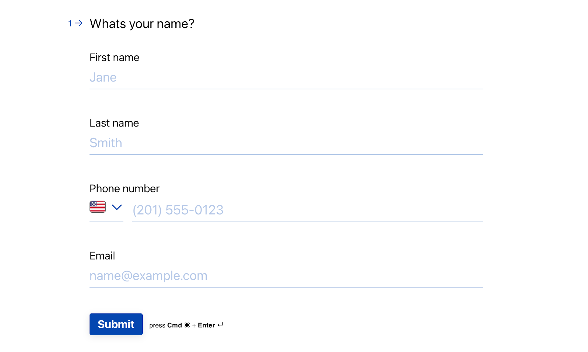
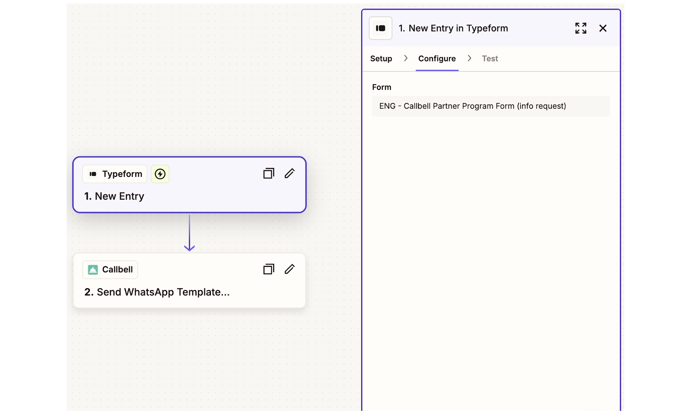
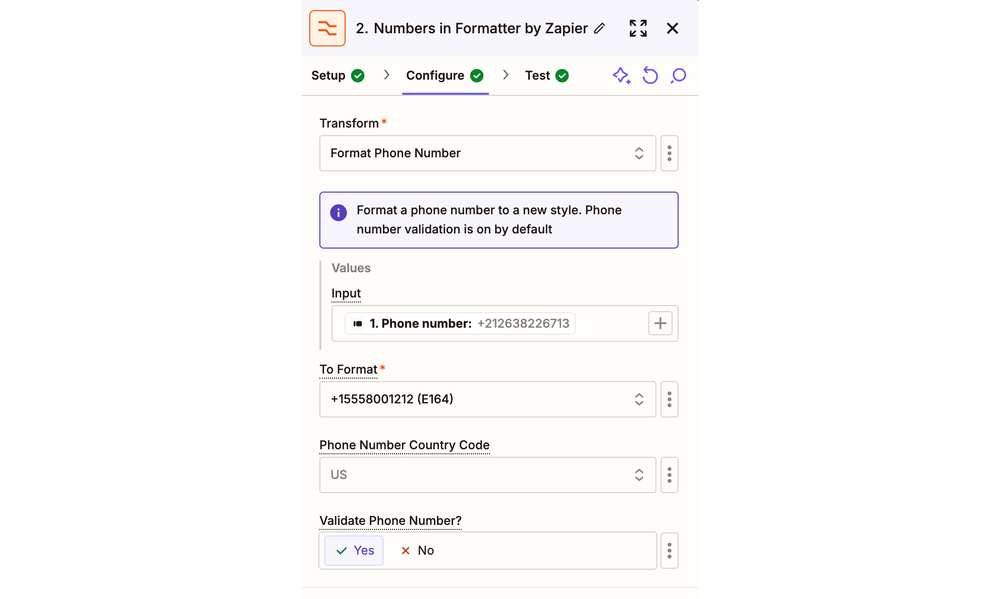
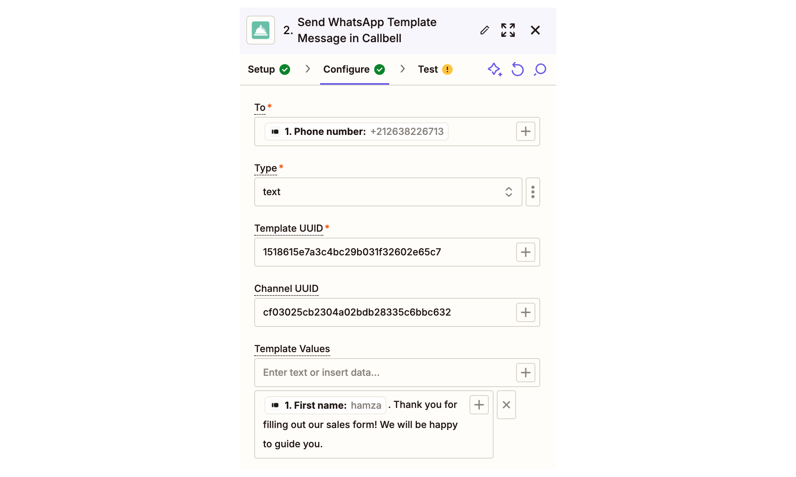

# Intégration Typeform - Automatisez la communication avec les prospects via Callbell

Simplifiez la communication avec les prospects en intégrant Typeform et Callbell via Zapier. Ce guide vous aidera à mettre en place un flux de travail automatisé pour collecter les données des prospects depuis Typeform, les formater et envoyer un message de modèle WhatsApp personnalisé via Callbell en utilisant des variables personnalisées.

Lien : https://zapier.com/apps/callbell/integrations/typeform

<iframe width="100%" height="500" src="https://www.youtube.com/embed/ZzTXCJzE6hc?si=aMmE22BgyKkLoAfz" title="Intégration Typeform - Automatisez la communication avec les prospects via Callbell" frameborder="0" allow="accelerometer; autoplay; clipboard-write; encrypted-media; gyroscope; picture-in-picture; web-share" referrerpolicy="strict-origin-when-cross-origin" allowfullscreen></iframe>

## Introduction

Cet article explique comment automatiser la qualification des prospects et la communication en utilisant Typeform, Callbell et Zapier. À la fin, vous disposerez d'un flux de travail entièrement automatisé qui envoie un message de modèle WhatsApp personnalisé aux prospects dès qu'ils soumettent leurs informations via Typeform.

## Explication étape par étape

### 1. **Créez le Typeform souhaité**

Concevez votre Typeform pour collecter les informations essentielles, telles que :

- Nom
- Numéro de téléphone (obligatoire)
- Adresse e-mail (optionnelle)

### 2. **Préparez les modèles de message dans Callbell**

Créez le modèle de message que vous souhaitez envoyer aux nouveaux prospects dans Callbell. Lors de la conception du modèle :

- Utilisez des variables personnalisées (par exemple, {{variable 1}}, {{variable 2}}) pour personnaliser le message.
- Ces variables seront remplies dynamiquement dans Zapier à l'aide des données des prospects provenant de Typeform.
- En savoir plus sur la création de modèles avec des variables dans Callbell : [https://callbellsupport.zendesk.com/hc/fr/articles/360007759237-Qu-est-ce-que-les-modèles-de-message-et-à-quoi-servent-ils](https://callbellsupport.zendesk.com/hc/fr/articles/360007759237-Qu-est-ce-que-les-modèles-de-message-et-à-quoi-servent-ils)

### 3. **Créez un Zap : Typeform comme trigger**

- Connectez-vous à Zapier et créez un nouveau Zap.
- Choisissez “New Entry in Typeform” comme trigger.
- Connectez votre compte Typeform et sélectionnez le formulaire que vous avez conçu à l'étape 1.
- Testez pour vous assurer que Zapier récupère correctement les données de soumission du formulaire.

### 4. **Formatage du numéro de téléphone**

Note : **Si le champ du numéro de téléphone dans Typeform est de type « numéro de téléphone », il n'est pas nécessaire de réaliser l'étape de formatage du numéro.**

Ajoutez l’action **“Formatter”** de Zapier pour vous assurer que le numéro de téléphone soumis via Typeform est correctement formaté pour Callbell.

- Sélectionnez l’action **“Numbers”**.
- Choisissez **“Format Phone Number”** comme type de transformation.
- Mappez le champ du numéro de téléphone collecté depuis Typeform.
- Sélectionnez le format de sortie E164.

### 5. **Envoyez le message avec des variables personnalisées via Callbell**

Ajoutez l’action **“Send Template Message”** dans Zapier.

- Connectez votre compte Callbell.
- Mappez le numéro de téléphone formaté de l’étape précédente au champ **“To”**.
- Copiez et collez l’UUID du modèle créé à l’étape 2.
- Copiez et collez l’UUID du canal depuis votre compte Callbell.
- Remplissez les variables du modèle dans le champ **“Template values”**.

### Notes finales

Grâce à cette configuration, chaque nouveau prospect provenant de Typeform recevra automatiquement un message WhatsApp personnalisé via Callbell, avec des variables remplies dynamiquement. Ce flux de travail garantit une communication rapide et personnalisée avec vos prospects.

Pour plus d'informations, consultez :

- [Centre d'aide Callbell](https://callbellsupport.zendesk.com/hc/fr)
- [Documentation d'aide Zapier](https://help.zapier.com/hc/en-us)
