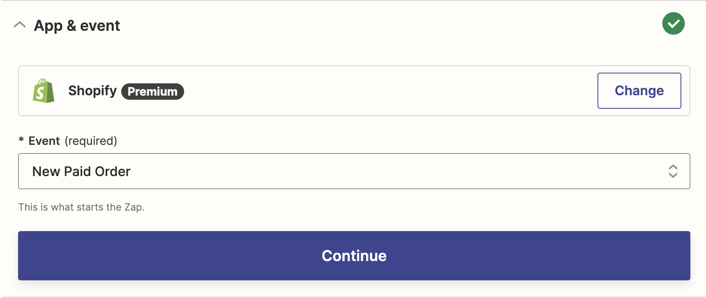

# Utiliser Action dans Zapier

Ici, nous vous montrerons comment utiliser Callbell dans Zapier en tant qu'**Action**

## En tant qu'action

Assurez-vous de sélectionner la bonne application Callbell (la plus récente) :


Notre intégration Callbell vous permet d'utiliser Callbell en tant qu'action. Cela signifie que vous pouvez envoyer des données depuis d'autres applications vers Callbell.

### Actions prises en charge

- Créer un message (limité aux messages **texte** seulement)
- Créer un contact

#### Créer un message

Cette action permet de créer un nouveau message dans Callbell.
Vous pouvez utiliser cette action pour envoyer des données depuis d'autres applications vers Callbell.

#### Créer un contact

Cette action permet de créer un nouveau contact dans Callbell.
Vous pouvez utiliser cette action pour envoyer des données depuis d'autres applications vers Callbell.

## Exemple avec l'action de création de message

Supposons que vous souhaitez envoyer un message à un client lorsqu'une nouvelle commande est passée sur votre boutique en ligne. Vous pouvez utiliser Zapier pour envoyer les données de votre boutique en ligne vers Callbell.

Votre boutique en ligne est le **Déclencheur** et Callbell est l'**Action**.

Configurez votre Zap :


### Étape 1 : Configurez votre déclencheur

Dans cet exemple, nous utiliserons Shopify comme déclencheur.

Sélectionnez Shopify comme application de déclencheur :



Sélectionnez l'événement déclencheur :

Nous utiliserons l'événement "Nouvelle commande payée" comme déclencheur.

Ensuite, cliquez sur "Continuer". On vous demandera de connecter votre compte Shopify à Zapier.

Une fois que vous avez connecté votre compte Shopify, vous devrez sélectionner la boutique que vous souhaitez utiliser.

Ensuite, cliquez sur "Continuer".

### Étape 2 : Configurez votre action

Sélectionnez Callbell comme application d'action, puis sélectionnez l'action "Créer un message".

Ensuite, cliquez sur "Continuer". On vous demandera de connecter votre compte Callbell à Zapier.

Une fois que vous avez connecté votre compte Callbell, vous devrez configurer le message.

Sélectionnez le numéro WhatsApp que vous souhaitez utiliser pour envoyer le message.

Ensuite, sélectionnez le contact auquel vous souhaitez envoyer le message.

Ensuite, configurez le message.

Vous pouvez utiliser les données du Déclencheur pour configurer le message.

Par exemple, vous pouvez utiliser les données du Déclencheur pour configurer le message comme ceci :

```
Bonjour {{first_name}}, votre commande {{order_number}} a été confirmée.
```

Ensuite, cliquez sur "Continuer".

### Étape 3 : Testez votre Zap

Vous pouvez tester votre Zap en cliquant sur "Tester et vérifier".

Si tout est configuré correctement, vous verrez un message de succès.

Ensuite, cliquez sur "Activer Zap".

Votre Zap est maintenant actif !