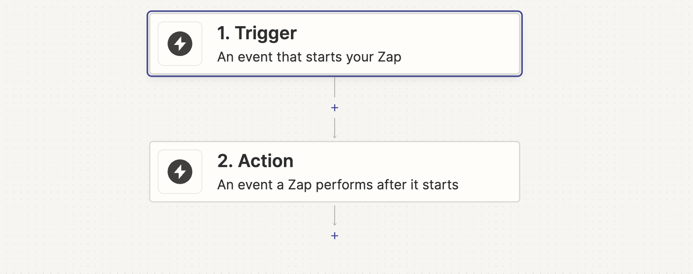

# Utiliser Trigger dans Zapier

Ici, nous allons vous montrer comment utiliser Callbell dans Zapier en tant que **Trigger**

## En tant que Trigger

Assurez-vous de sélectionner la bonne application Callbell (la dernière) :

Notre intégration Callbell vous permet d'utiliser Callbell en tant que déclencheur. Cela signifie que vous pouvez envoyer des données de Callbell vers d'autres applications.

### Déclencheurs pris en charge

- Contact créé
- Contact mis à jour
- Contact supprimé
- Message créé
- Mise à jour de l'état du message
- Événement entrant (déclencheur obsolète)

Nous vous recommandons d'utiliser les 5 premiers déclencheurs, car le dernier sera obsolète à un moment donné.

#### Contact créé

Ce déclencheur est activé lorsqu'un nouveau contact est créé dans Callbell.

#### Contact mis à jour

Ce déclencheur est activé lorsqu'un contact est mis à jour dans Callbell.

#### Contact supprimé

Ce déclencheur est activé lorsqu'un contact est supprimé dans Callbell.

#### Message créé

Ce déclencheur est activé lorsqu'un nouveau message est créé dans Callbell. Le message peut être entrant ou sortant.

#### Mise à jour de l'état du message

Ce déclencheur est activé lorsqu'un statut de message est mis à jour dans Callbell.

## Exemple avec le déclencheur Contact créé

Supposons que vous ayez un CRM externe et que vous souhaitiez envoyer des données de Callbell vers votre CRM. Vous pouvez utiliser Zapier pour envoyer les données de Callbell vers votre CRM.

Callbell est le **Trigger** et votre CRM est l'**Action**.

Configurez votre Zap :

### Étape 1 : Configurez votre Trigger

Dans cet exemple, nous utiliserons Callbell comme Trigger.

Sélectionnez Callbell comme application Trigger, puis sélectionnez le déclencheur "Contact Created".

### Étape 2 : Configurez votre Action

Sélectionnez votre CRM comme application Action.

Ensuite, cliquez sur "Continuer". On vous demandera de connecter votre compte CRM à Zapier.

Une fois que vous avez connecté votre compte CRM, vous devrez configurer l'action.

Sélectionnez les données que vous souhaitez envoyer à votre CRM.

Ensuite, cliquez sur "Continuer".

Ensuite, cliquez sur "Tester et continuer".

Ensuite, cliquez sur "Activer Zap".

### Étape 3 : Testez votre Zap

Une fois que vous avez activé votre Zap, vous pouvez le tester en créant un nouveau contact dans Callbell.