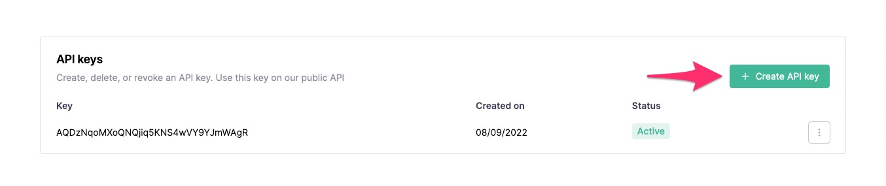

# Come iniziare

Questa guida passo passo vi guiderà nell'uso dell'API di Callbell per inviare un messaggio.

## Prerequisiti

Per poter seguire questa guida è necessario creare un account su Callbell e aver configurato un canale WhatsApp Business.

- Iscriviti a [Callbell](https://dash.callbell.eu/users/sign_up)
- Maggiori informazioni sulla nostra [integrazione API WhatsApp Business](https://callbellsupport.zendesk.com/hc/en-us/articles/360007805898-How-to-integrate-WhatsApp-into-Callbell-through-the-WhatsApp-Business-APIs)

## Ottenere le chiavi API

Andate alla pagina delle chiavi API di Callbell nelle impostazioni (https://dash.callbell.eu/settings/api_settings/keys) per generare una nuova chiave API:



Dopo aver cliccato sul pulsante **Create API Key** assicuratevi di copiare il token e di conservarlo in modo sicuro.

:::attenzione
La chiave API verrà mostrata solo in questa schermata. Se si perde l'accesso alla chiave, è necessario generarne una nuova.
:::

## Inviare un messaggio di prova utilizzando cURL

Utilizzando il metodo [Messages API' send message] (/docs/api/reference/messages_api/post_send_messages.md) si può verificare se la chiave API funziona come previsto:

```bash
curl -X POST "https://api.callbell.eu/v1/messages/send" \
  -H "Authorization: Bearer <REPLACE_API_KEY_HERE>" \
  -H "Content-Type: application/json" \
  -d '{
    "to": "<SOSTITUIRE_IL_NUMERO_DI_TELEFONO_QUI>",
    "da": "whatsapp",
    "tipo": "text",
    "contenuto": {
      "text": "Ciao da Callbell API!"
    }
  }'
```

Basta sostituire `REPLACE_API_KEY_HERE` con la chiave API generata nel passaggio [Getting your API keys](#getting-your-api-keys) e `REPLACE_PHONE_NUMBER_HERE` con il numero di telefono del destinatario.

:::info
Assicurarsi che il numero di telefono del destinatario abbia effettuato l'accesso e che si sia **entro la regola delle 24 ore** di WhatsApp Business API.
:::

Se il messaggio è stato inviato correttamente, riceverete una risposta simile a questa:

```json
{
  "message": {
    "uuid": "<MESSAGE_UUID>",
    "stato": "enqueued"
  }
}
```

Questo significa che il messaggio è stato _successivamente messo in attesa_ per essere inviato al numero di telefono desiderato.

### Recuperare lo stato di un messaggio

Per sapere se il nostro messaggio di prova è stato consegnato con successo, possiamo usare uno dei seguenti metodi:

- Utilizzare l'endpoint [get message status](api/reference/messages_api/get_message_status.md)
- Abilitare **Webhooks** nella sezione delle chiavi API e sottoscrivere il tipo di evento `message_status_updated

In questo esempio utilizzeremo il primo metodo; per verificare lo stato del messaggio di prova è sufficiente eseguire il seguente cURL da un terminale:

```bash
curl -X GET "https://api.callbell.eu/v1/messages/status/<REPLACE_UUID_HERE>" \
  -H "Authorization: Bearer <REPLACE_API_KEY_HERE>" \
  -H "Content-Type: application/json"
```

Assicurarsi di sostituire `REPLACE_API_KEY_HERE` con la propria chiave API e `REPLACE_UUID_HERE` con l'identificatore del messaggio ottenuto dal passo [Send a test message](#send-a-test-message-using-curl).

Si otterrà la seguente risposta:

```json
{
  "messaggio": {
    "uuid": "<MESSAGE_UUID>",
    "stato": "delivered"
  }
}
```

Questo conferma che il messaggio è stato inviato con successo all'utente, ma non è ancora stato letto.

### Passi successivi

Provate a esplorare le nostre API [Messages](/docs/api/reference/messages_api/introduction.md) e [Contacts](/docs/api/reference/contacts_api/introduction.md) per ulteriori esempi.
