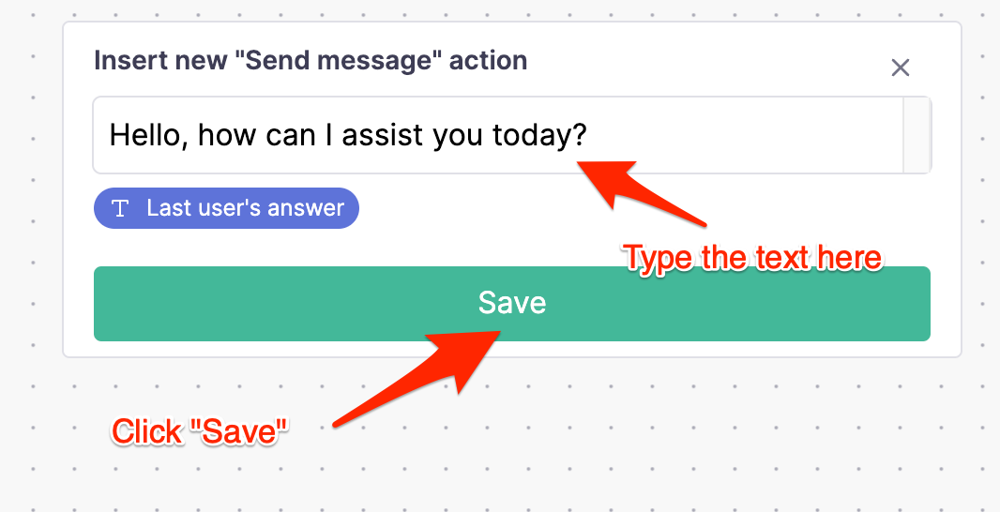
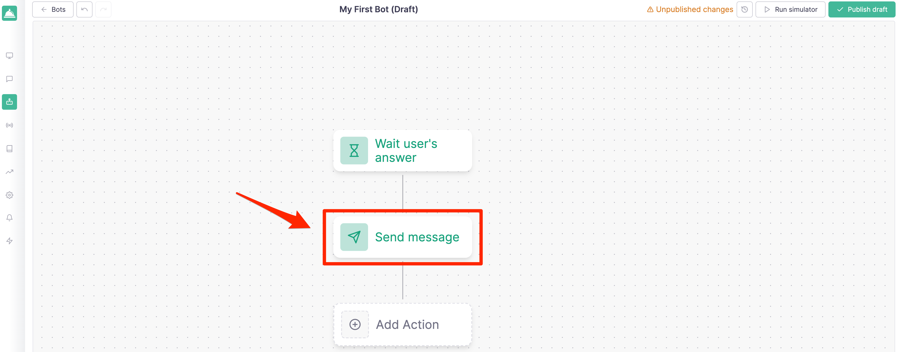
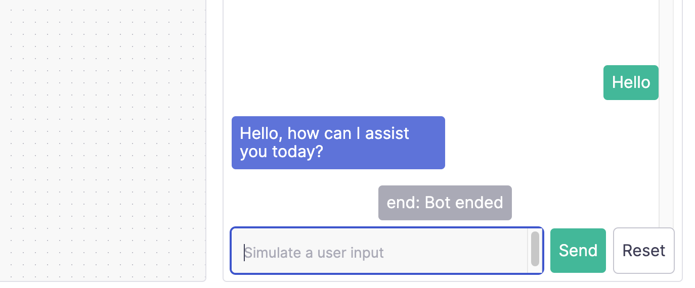
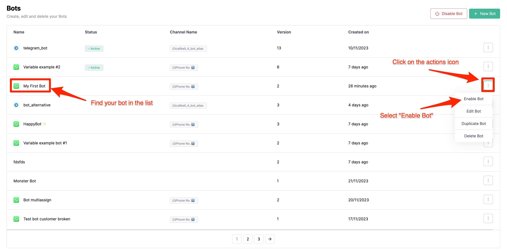

# Come iniziare

Questa guida passo passo vi guiderà nella costruzione del vostro primo chatbot con Callbell.

## Prerequisiti

Per poter seguire questa guida è necessario creare un account su Callbell e aver configurato almeno **1 canale**.

- Iscriviti a [Callbell](https://dash.callbell.eu/users/sign_up)
- Vedere maggiori informazioni sulla nostra [integrazione API WhatsApp Business](https://callbellsupport.zendesk.com/hc/en-us/articles/360007805898-How-to-integrate-WhatsApp-into-Callbell-through-the-WhatsApp-Business-APIs) per utilizzare il costruttore di flussi bot con WhatsApp.

## Creare il vostro primo chatbot

Andate alla sezione **Bot Builder** nella barra laterale sinistra e cliccate sul pulsante **Create new bot**:

Si aprirà una finestra modale che vi chiederà di scegliere un nome per il vostro bot e il canale con cui volete usarlo:

Dopo aver fatto clic sul pulsante **Crea bot**, sarete reindirizzati alla pagina del costruttore di bot, dove potrete iniziare a costruire il vostro primo chatbot:

## Aggiunta di una nuova azione

Affinché il bot funzioni, è necessario aggiungere almeno un'azione. Per esempio, rispondiamo all'utente con un messaggio quando invia un messaggio al bot.

Fare clic sul pulsante **Aggiungi nuova azione** e selezionare l'azione **Invia messaggio**:

Si aprirà un pannello per configurare l'azione. In questo caso aggiungeremo un semplice messaggio di testo:

Dopo aver cliccato sul pulsante **Save**, si verrà reindirizzati alla pagina del bot builder, dove si potrà vedere l'azione appena creata:

## Testare il bot

Per testare il bot, è necessario fare clic sul pulsante **Simulatore di esecuzione** nell'angolo in alto a destra della pagina. Si aprirà un pannello in cui sarà possibile testare il nuovo flusso:

Basta fare clic sul pulsante **Invia** per vedere il bot rispondere con il messaggio appena configurato:

## Pubblicare il bot

Una volta che si è soddisfatti del proprio bot, è possibile pubblicarlo facendo clic sul pulsante **Publish Draft** nell'angolo in alto a destra della pagina:

Dopo aver cliccato sul pulsante **Publish draft** e aver confermato, il flusso del bot sarà pubblicato; allo stesso tempo sarà necessario **abilitare il bot** per renderlo disponibile ai clienti. Per farlo, basta tornare alla sezione "Bot" nella barra laterale sinistra e cliccare sul pulsante **Abilita bot**:

Si può confermare che il bot è abilitato controllando lo stato nella sezione "Bot":

## Testare il bot in produzione

Ora che il bot è abilitato, è possibile testarlo in produzione inviando un messaggio al canale con cui è stato configurato. In questo caso, invieremo un messaggio al numero WhatsApp che abbiamo configurato nella sezione [Prerequisiti](#prerequisiti):

## Cosa c'è ora?

Ora che avete creato il vostro primo chatbot, potete iniziare a esplorare le altre azioni disponibili nel costruttore di bot.