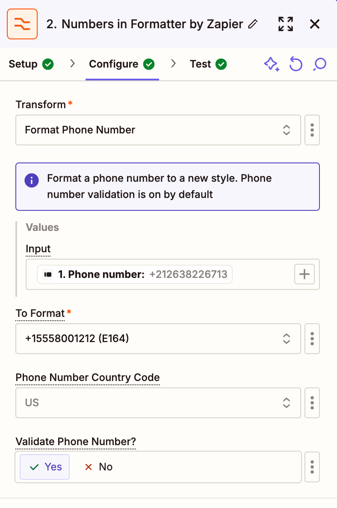

# Integrazione Calendly

## Automatizza la Comunicazione degli Appuntamenti su WhatsApp con Callbell

> In queste guide, imparerai come integrare Calendly con Callbell utilizzando Zapier. Questa integrazione ti consente di automatizzare le comunicazioni su WhatsApp relative agli appuntamenti, garantendo un’esperienza fluida sia per te che per i tuoi clienti.

Grazie a questa configurazione, potrai:

- Inviare conferme di appuntamento automatiche via WhatsApp tramite Callbell.
- Inviare promemoria automatici via WhatsApp per ridurre le mancate presenze.
- Inviare follow-up automatici dopo l’appuntamento via WhatsApp per mantenere il coinvolgimento e migliorare l’esperienza del cliente.

Ogni guida fornirà istruzioni dettagliate su come configurare questi flussi di lavoro utilizzando Zapier, Calendly e Callbell.

---

## Guida 1: Inviare Conferme Automatiche degli Appuntamenti

Inviare una conferma di appuntamento automatica come messaggio WhatsApp tramite Callbell.

Video:

<iframe width="100%" height="500" src="https://www.youtube.com/embed/RKsK5Jyt2zY?si=53cVZQzAGEY1kuEd" title="Follow-up Automatici degli Appuntamenti su WhatsApp" frameborder="0" allow="accelerometer; autoplay; clipboard-write; encrypted-media; gyroscope; picture-in-picture; web-share" referrerpolicy="strict-origin-when-cross-origin" allowfullscreen></iframe>

### Step-by-Step

1. **Crea la tua pagina di prenotazione Calendly**

   Configura la tua pagina di prenotazione su Calendly per raccogliere informazioni essenziali, come:

   - **Nome**
   - **Numero di telefono** (Obbligatorio)
   - **Email** (opzionale)

   

2. **Prepara i Modelli di Messaggio in Callbell**

   Crea il modello di messaggio che desideri inviare ai nuovi lead in Callbell. Durante la progettazione del modello:

   - Usa variabili personalizzate (ad es., `{{variable 1}}`, `{{variable 2}}`) per personalizzare il messaggio.
   - Queste variabili saranno compilate dinamicamente in Zapier.
   - [Scopri di più sulla creazione di modelli con variabili in Callbell](https://callbellsupport.zendesk.com/hc/it/articles/360007759237-Cosa-sono-i-messaggi-template-e-a-cosa-servono)

   > **NB:** Nella maggior parte dei casi, i modelli WhatsApp inviati vengono utilizzati per confermare o ricordare un appuntamento. Raccomandiamo di provare a farli approvare nella categoria “Utilità”, che costa la metà rispetto a “Marketing”.

   

3. **Crea uno Zap: Calendly come Trigger**

   - Accedi a Zapier e crea un nuovo Zap.
   - Imposta il trigger su **"Invite Created"**.
   - Collega il tuo account Calendly.
   - Testa il trigger per assicurarti che Zapier recuperi correttamente i dati di invio della prenotazione.

   

4. **Formatta il Numero di Telefono**

   - Aggiungi l'azione **Formatter** di Zapier per assicurarti che il numero di telefono inviato tramite Calendly sia formattato correttamente per Callbell.
   - Seleziona l'azione **Numbers** in Formatter.
   - Scegli **Format Phone Number** come tipo di trasformazione.
   - Mappa il campo del numero di telefono da Typeform.
   - Seleziona il formato di output **E164**.

   

5. **Invia il Modello di Messaggio con Variabili Personalizzate tramite Callbell**

   - Aggiungi un'azione **Send Template Message** in Zapier.
   - Collega il tuo account Callbell.
   - Mappa il campo del numero di telefono formattato dal passaggio precedente al campo **"To"**.
   - Copia e incolla l'UUID del modello creato nel passaggio 2.
   - Copia e incolla l'UUID del canale dal tuo account Callbell.
   - Compila le variabili del tuo modello nel campo **"Template values"**.

   

### Note Finali

Con questa configurazione, ogni nuovo appuntamento Calendly attiverà un messaggio di conferma WhatsApp automatico tramite Callbell, assicurando che i tuoi clienti ricevano una conferma di appuntamento istantanea. Per ulteriore aiuto, controlla:

- [Callbell Help Center](https://callbellsupport.zendesk.com/hc/it)
- [Zapier Help Documentation](https://help.zapier.com/hc/en-us)

---

## Guida 2: Inviare Promemoria Automatici degli Appuntamenti

Inviare un promemoria di appuntamento automatico come messaggio WhatsApp tramite Callbell.

Video:

<iframe width="100%" height="500" src="https://www.youtube.com/embed/uzFiGhX2POQ?si=n9RT_Ky4FcYVLAZK" title="Promemoria Automatici per Appuntamenti su WhatsApp" frameborder="0" allow="accelerometer; autoplay; clipboard-write; encrypted-media; gyroscope; picture-in-picture; web-share" referrerpolicy="strict-origin-when-cross-origin" allowfullscreen></iframe>

### Step-by-Step Explanation

Il processo di configurazione è simile al flusso di lavoro di conferma dell'appuntamento.

1. Segui i passaggi descritti nella **Guida 1: Inviare Conferme Automatiche degli Appuntamenti**.

2. Aggiungi i seguenti passaggi aggiuntivi di Zapier **prima** dell'ultimo passaggio "Invia il Modello di Messaggio con Variabili Personalizzate tramite Callbell" per completare questo flusso di lavoro:

   1. **Aggiungi un'Azione Formatter**
      In Zapier, fai clic su "Add a Step" e seleziona **Formatter**.

      - Scegli **Date/Time** come Event.
      - In **Transform**, seleziona **Format**.
      - Nel campo **Input**, seleziona **Scheduled Event Start Time**.
      - In **To Format**, scegli il formato di data/ora desiderato (ad es., `DD/MM/YYYY HH:mm`).
      - In **To Timezone**, seleziona il fuso orario appropriato per l'evento.

      

   2. **Aggiungi un'altra Azione Formatter per Regolare l'Ora del Promemoria**
      In Zapier, fai clic su "Add a Step" e seleziona **Formatter**.

      - Scegli **Date/Time** come Event.
      - In **Transform**, seleziona **Add/Subtract Time**.
      - Nel campo **Input**, seleziona l'Output della data formattata dal passaggio precedente.
      - Nel campo **Expression**, inserisci `-1 day` per inviare il promemoria un giorno prima dell'appuntamento.
      - Mantieni il **To Format** lo stesso del passaggio precedente per mantenere la coerenza.

      

   3. **Aggiungi un'Azione Delay**
      In Zapier, fai clic su "Add a Step" e seleziona **Delay**.

      - Scegli **Delay Until** come Event.
      - Nel campo **Date/Time Delayed Until**, seleziona l'Output dal passaggio precedente (l'ora del promemoria regolata).
      - In "How should we handle dates in the past?", seleziona **Always continue** per assicurarti che il flusso di lavoro funzioni correttamente anche se la condizione di ritardo viene leggermente mancata.

      

### Note Finali

Con questa configurazione, ogni appuntamento programmato in Calendly attiverà un promemoria WhatsApp automatico tramite Callbell, assicurando che i tuoi clienti ricevano una notifica tempestiva un giorno prima del loro appuntamento. Questo flusso di lavoro aiuta a ridurre le mancate presenze e migliora la partecipazione complessiva agli appuntamenti.
Per ulteriore aiuto, controlla:

- [Callbell Help Center](https://callbellsupport.zendesk.com/hc/it)
- [Zapier Help Documentation](https://help.zapier.com/hc/en-us)

---

## Guida 3: Inviare Follow-up Automatici Dopo l'Appuntamento

Inviare follow-up di appuntamento automatici come messaggio WhatsApp tramite Callbell.

Video:

<iframe width="100%" height="500" src="https://www.youtube.com/embed/Ntb9Zz3eNvQ?si=EbxVhBVNLDLuW-QZ" title="Automatizza la Comunicazione degli Appuntamenti su WhatsApp con Callbell" frameborder="0" allow="accelerometer; autoplay; clipboard-write; encrypted-media; gyroscope; picture-in-picture; web-share" referrerpolicy="strict-origin-when-cross-origin" allowfullscreen></iframe>

### Step-by-Step Explanation

Il processo di configurazione è simile al flusso di lavoro di conferma dell'appuntamento.

1. Segui i passaggi descritti nella **Guida 1: Inviare Conferme Automatiche degli Appuntamenti**.

2. Aggiungi i seguenti passaggi aggiuntivi di Zapier **prima** dell'ultimo passaggio "Invia il Modello di Messaggio con Variabili Personalizzate tramite Callbell" per completare questo flusso di lavoro:

   1. **Aggiungi un'Azione Formatter**

      In Zapier, fai clic su "Aggiungi un passaggio" e seleziona **Formatter**.

      - Scegli **Data/Ora** come Evento.
      - In **Trasformazione**, seleziona **Formatta**.
      - Nel campo **Input**, seleziona **Orario di fine evento programmato**.
      - In **Formato**, scegli il formato di data/ora desiderato (ad es., `GG/MM/AAAA HH:mm`).
      - In **Fuso orario**, seleziona il fuso orario appropriato per l'evento.

      

   2. **Aggiungi un'altra Azione Formatter per Regolare l'Ora del Follow-up**

      In Zapier, fai clic su "Aggiungi un passaggio" e seleziona **Formatter**.

      - Scegli **Data/Ora** come Evento.
      - In **Trasformazione**, seleziona **Aggiungi/Sottrai Tempo**.
      - Nel campo **Input**, seleziona l'Output della data formattata dal passaggio precedente.
      - Nel campo **Espressione**, inserisci `+15 minuti` per inviare il follow-up 15 minuti dopo l'appuntamento.
      - Mantieni il **Formato** lo stesso del passaggio precedente per mantenere la coerenza.

      

   3. **Aggiungi un'Azione Delay**
      In Zapier, fai clic su "Aggiungi un passaggio" e seleziona **Delay**.

      - Scegli **Ritarda Fino a** come Evento.
      - Nel campo **Data/Ora Ritardata Fino a**, seleziona l'Output dal passaggio precedente (l'ora del follow-up regolata).
      - In "Come dovremmo gestire le date nel passato?", seleziona **Continua sempre** per assicurarti che il flusso di lavoro funzioni correttamente anche se la condizione di ritardo viene leggermente mancata.

      

### Note Finali

Con questa configurazione, ogni appuntamento Calendly completato attiverà un messaggio di follow-up WhatsApp automatico tramite Callbell. Ciò garantisce un coinvolgimento continuo con i tuoi clienti, sia per la raccolta di feedback, i passaggi successivi o la pianificazione di appuntamenti futuri. Questo flusso di lavoro aiuta a migliorare le relazioni con i clienti e la qualità complessiva del servizio.
Per ulteriore aiuto, controlla:

- [Callbell Help Center](https://callbellsupport.zendesk.com/hc/it)
- [Zapier Help Documentation](https://help.zapier.com/hc/en-us)
