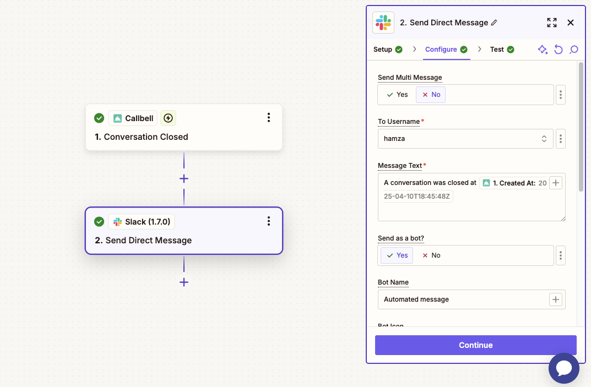

# Integrazione con Slack

## Automatizza le Notifiche Interne da Callbell

In queste guide, imparerai come integrare Callbell con Slack utilizzando Zapier. Questa integrazione aiuta il tuo team a restare informato in tempo reale inviando messaggi Slack automatici in base a eventi specifici in Callbell.

Con questa configurazione, puoi:

- Notificare il tuo team su Slack quando viene creato un nuovo contatto in Callbell
- Notificare il tuo team su Slack quando viene aperta una conversazione in Callbell
- Notificare il tuo team su Slack quando viene chiusa una conversazione in Callbell

Ogni guida ti fornirà istruzioni passo dopo passo per impostare questi flussi di lavoro usando Callbell, Zapier e Slack.

---

## Guida 1: Notifica Slack Quando Viene Creato un Nuovo Contatto in Callbell

Pubblica automaticamente un messaggio in Slack ogni volta che viene creato un nuovo contatto in Callbell.

### 1. Crea uno Zap con Callbell come Trigger

1. Accedi a Zapier e clicca **Crea Zap**.
2. Scegli **Callbell** come app trigger.
3. Seleziona l’evento trigger **New Contact Created**.
4. Collega il tuo account Callbell.
5. Testa il trigger per verificare che stia recuperando i dati del nuovo contatto (nome, numero di telefono, ecc.).

### 2. Aggiungi Slack come Azione

1. Clicca **+ Add Action**.
2. Seleziona **Slack** come app per l’azione.
3. Scegli **Send Channel Message** o **Send Direct Message**, a seconda del tuo flusso di lavoro.
4. Collega il tuo account Slack e scegli il canale di destinazione (es. `#nuovi-lead`, `#supporto` o un DM).
5. Scrivi il testo del messaggio, inserendo campi dinamici dalla fase precedente (es. `{{Contact Name}}`, `{{Phone Number}}`).

### 3. Personalizza le Impostazioni del Messaggio Slack (Opzionale)

- Puoi aggiungere un’icona o un’immagine al messaggio, includere un link allo Zap o all’URL del contatto Callbell (se disponibile).
- Puoi anche usare emoji, menzionare utenti specifici (es. `<!here>` o `<@U123456>`) e utilizzare altre opzioni di formattazione.

### Note finali

Questo flusso di lavoro mantiene aggiornato il tuo team non appena entra un nuovo contatto in Callbell.

Per ulteriori informazioni:

- [Callbell Help Center](https://callbellsupport.zendesk.com/hc/it)
- [Zapier Help Documentation](https://help.zapier.com/hc/en-us)

---

## Guida 2: Notifica Slack Quando Viene Aperta una Conversazione in Callbell

Pubblica automaticamente un messaggio in Slack ogni volta che una conversazione viene aperta in Callbell.

### 1. Crea uno Zap con Callbell come Trigger

1. Accedi a Zapier e clicca **Crea Zap**.
2. Scegli **Callbell** come app trigger.
3. Seleziona l’evento trigger **Conversation Opened**.
4. Collega il tuo account Callbell.
5. Testa il trigger per verificare che stia recuperando i dati corretti della conversazione.

### 2. Aggiungi Slack come Azione

1. Clicca **+ Add Action**.
2. Seleziona **Slack** come app per l’azione.
3. Scegli **Send Channel Message** o **Send Direct Message**, a seconda del flusso di lavoro.
4. Collega il tuo account Slack e scegli il canale di destinazione (es. `#attività`, `#messaggi-supporto` o un DM).
5. Scrivi il testo del messaggio, inserendo campi dinamici (es. `{{Contact Name}}`, `{{Conversation ID}}` o l’anteprima del primo messaggio).

### 3. Personalizza le Impostazioni del Messaggio Slack (Opzionale)

- Puoi aggiungere icone, immagini o un link allo Zap o all’URL della conversazione Callbell (se disponibile).
- Tagga utenti o usa `<!here>` per avvisare il team.
- Applica formattazione con grassetto, corsivo e link per maggiore chiarezza.

### Note finali

Questo flusso aiuta il tuo team a rimanere aggiornato in tempo reale ogni volta che viene aperta una nuova conversazione, migliorando i tempi di risposta.

Per ulteriori informazioni:

- [Callbell Help Center](https://callbellsupport.zendesk.com/hc/it)
- [Zapier Help Documentation](https://help.zapier.com/hc/en-us)

---

## Guida 3: Notifica Slack Quando una Conversazione Viene Chiusa in Callbell

Pubblica automaticamente un messaggio in Slack ogni volta che una conversazione viene chiusa in Callbell.

### 1. Crea uno Zap con Callbell come Trigger

1. Accedi a Zapier e clicca **Crea Zap**.
2. Scegli **Callbell** come app trigger.
3. Seleziona l’evento trigger **Conversation Closed**.
4. Collega il tuo account Callbell.
5. Testa il trigger per assicurarti che stia recuperando i dati corretti.

### 2. Aggiungi Slack come Azione

1. Clicca **+ Add Action**.
2. Seleziona **Slack** come app per l’azione.
3. Scegli **Send Channel Message** o **Send Direct Message**, in base al tuo flusso di lavoro.
4. Collega il tuo account Slack e scegli il canale di destinazione (es. `#conversazioni-chiuse`, `#log-supporto` o un DM).
5. Scrivi il testo del messaggio, inserendo campi dinamici come `{{Contact Name}}`, `{{Closed At}}` e un sommario dell’esito della conversazione.

### 3. Personalizza le Impostazioni del Messaggio Slack (Opzionale)

- Puoi aggiungere icone, immagini o un link allo Zap o all’URL della conversazione Callbell (se disponibile).
- Usa menzioni (`<!here>`), emoji e formattazione per evidenziare i dettagli chiave.

### Note finali

Questo flusso di lavoro informa il tuo team ogni volta che una conversazione si conclude, permettendo a manager o colleghi di rivedere i risultati e fare follow‑up se necessario.

Per ulteriori informazioni:

- [Callbell Help Center](https://callbellsupport.zendesk.com/hc/it)
- [Zapier Help Documentation](https://help.zapier.com/hc/en-us)
