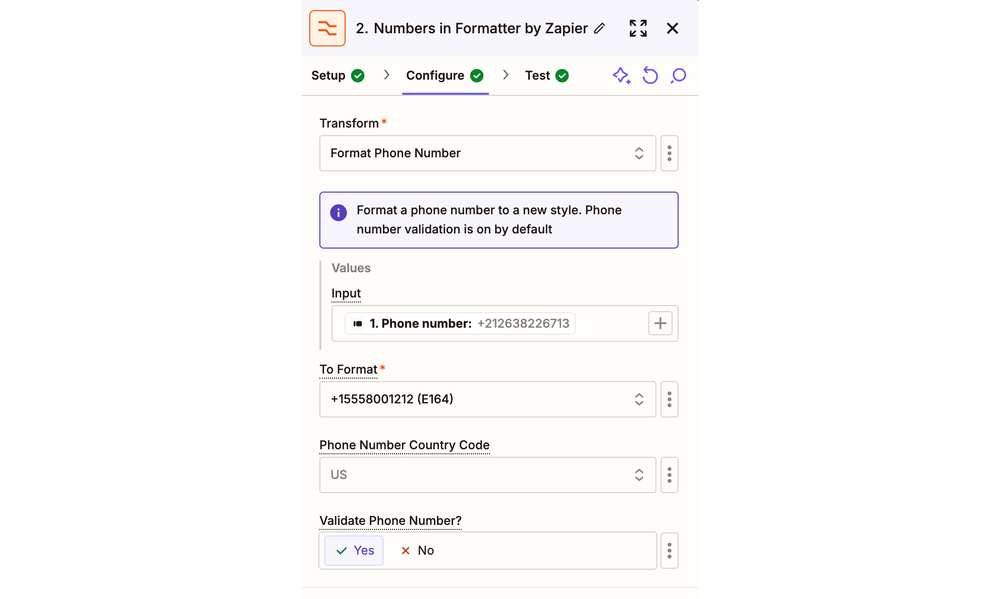

# Integrazione Typeform - Automatizza la comunicazione con i lead con Callbell

Questa guida ti aiuterà a configurare un flusso automatizzato per raccogliere i dati dei lead da Typeform, formattarli e inviare un messaggio personalizzato su WhatsApp tramite Callbell utilizzando variabili personalizzate.

Link: https://zapier.com/apps/callbell/integrations/typeform

<iframe width="100%" height="500" src="https://www.youtube.com/embed/Xl2Jnz7F4bM?si=4QhSvD83V2CSs-oT" title="Integrazione Typeform - Automatizza la comunicazione con i lead con Callbell" frameborder="0" allow="accelerometer; autoplay; clipboard-write; encrypted-media; gyroscope; picture-in-picture; web-share" referrerpolicy="strict-origin-when-cross-origin" allowfullscreen></iframe>

## Introduzione

Questo articolo spiega come automatizzare la qualifica e la presa di contatto con i lead utilizzando Typeform, Callbell e Zapier. Alla fine della guida, potrai costruire un flusso completamente automatizzato che invierà un messaggio WhatsApp personalizzato ai lead non appena inviano le loro informazioni tramite Typeform.

## Step-by-Step

### 1. **Crea un form su Typeform**

Progetta il tuo Typeform per raccogliere informazioni essenziali, come:

- Nome
- Numero di telefono (obbligatorio)
- Email (opzionale)

### 2. **Prepara il modello di messaggio (Template) in Callbell**

Crea il modello di messaggio che desideri inviare ai nuovi lead in Callbell. In questa fase:

- Utilizza variabili personalizzate (es. {{variabile 1}}, {{variabile 2}}) per personalizzare il messaggio.
- Queste variabili verranno compilate dinamicamente in Zapier utilizzando i dati del lead raccolti da Typeform.
- Scopri di più su come creare modelli con variabili in Callbell: [Callbell Help Center](https://callbellsupport.zendesk.com/hc/it/articles/360007759237-Cosa-sono-i-messaggi-template-e-a-cosa-servono)

### 3. **Crea uno Zap: Typeform sarà il Trigger**

- Accedi a Zapier e crea un nuovo Zap.
- Imposta il trigger su “New Entry in Typeform”.
- Collega il tuo account Typeform e seleziona il modulo creato nel passo 1.
- Testa il trigger per verificare che Zapier recuperi correttamente i dati del modulo.

### 4. **Formatta il Numero di Telefono**

**Nota**: Se il campo del numero di telefono in Typeform è già di tipo “phone number”, questo passaggio non è necessario.

Aggiungi uno Za "Formatter” per garantire che il numero di telefono inserito sia compatibile con Callbell:

- Seleziona l’azione “Numbers”.
- Scegli “Format Phone Number” come tipo di trasformazione.
- Mappa il campo del numero di telefono raccolto da Typeform.
- Seleziona il formato di output E164.

### 5. **Invia il Messaggio con Variabili Personalizzate tramite Callbell**

Aggiungi l’azione “Send Template Message” in Zapier.

- Collega il tuo account Callbell.
- Mappa il numero di telefono formattato dal passaggio precedente nel campo “To”.
- Copia e incolla l’UUID del modello creato nel Passaggio 2.
- Copia e incolla l’UUID del canale dal tuo account Callbell.
- Compila le variabili del modello nel campo “Template values”.

## Note finali

Grazie a questa configurazione, ogni nuovo lead proveniente da Typeform riceverà automaticamente un messaggio WhatsApp personalizzato tramite Callbell, con variabili compilate dinamicamente. Questo workflow assicura una comunicazione tempestiva e su misura con i tuoi lead.

Per maggiori informazioni controlla:

- [Callbell Help Center](https://callbellsupport.zendesk.com/hc/it)
- [Zapier Help Documentation](https://help.zapier.com/hc/en-us)
