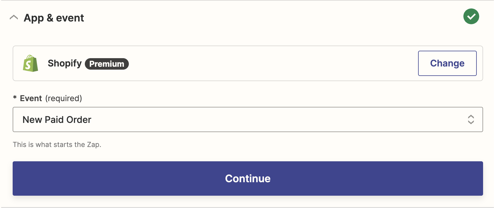

# Usando Action in Zapier

Qui ti mostreremo come utilizzare Callbell in Zapier come **Action**

## Come Action

Assicurati di selezionare la giusta app Callbell (la più recente):


La nostra integrazione di Callbell ti consente di utilizzare Callbell come action. Questo significa che puoi inviare dati da altre app a Callbell.

### Azioni supportate

- Creare un messaggio (limitato solo a messaggi di **testo**)
- Creare un contatto

#### Creare un messaggio

Questa azione creerà un nuovo messaggio in Callbell.
Puoi utilizzare questa azione per inviare dati da altre app a Callbell.

#### Creare un contatto

Questa azione creerà un nuovo contatto in Callbell.
Puoi utilizzare questa azione per inviare dati da altre app a Callbell.

## Esempio con azione di creazione messaggio

Immagina di voler inviare un messaggio a un cliente quando viene effettuato un nuovo ordine sul tuo negozio online. Puoi utilizzare Zapier per inviare i dati dal tuo negozio online a Callbell.

Il tuo negozio online è il **Trigger** e Callbell è l'**Action**.

Configura il tuo Zap:


### Passaggio 1: Configura il tuo Trigger

In questo esempio, utilizzeremo Shopify come Trigger.

Seleziona Shopify come app Trigger:



Seleziona l'evento Trigger:

Utilizzeremo l'evento "Nuovo ordine pagato" come Trigger.

Quindi fai clic su "Continua". Ti verrà chiesto di collegare il tuo account Shopify a Zapier.

Una volta collegato il tuo account Shopify, ti verrà chiesto di selezionare il negozio che desideri utilizzare.

Quindi fai clic su "Continua".

### Passaggio 2: Configura la tua Action

Seleziona Callbell come app Action, quindi seleziona l'azione "Crea messaggio".

Quindi fai clic su "Continua". Ti verrà chiesto di collegare il tuo account Callbell a Zapier.

Una volta collegato il tuo account Callbell, dovrai configurare il messaggio.

Seleziona il numero di WhatsApp che desideri utilizzare per inviare il messaggio.

Quindi seleziona il contatto a cui desideri inviare il messaggio.

Quindi configura il messaggio.

Puoi utilizzare i dati dal Trigger per configurare il messaggio.

Ad esempio, puoi utilizzare i dati dal Trigger per configurare il messaggio in questo modo:

```
Ciao {{first_name}}, il tuo ordine {{order_number}} è stato confermato.
```

Quindi fai clic su "Continua".

### Passaggio 3: Testa il tuo Zap

Puoi testare il tuo Zap facendo clic su "Test & Revisione".

Se tutto è stato configurato correttamente, vedrai un messaggio di successo.

Quindi fai clic su "Attiva Zap".

Il tuo Zap è adesso attivo!