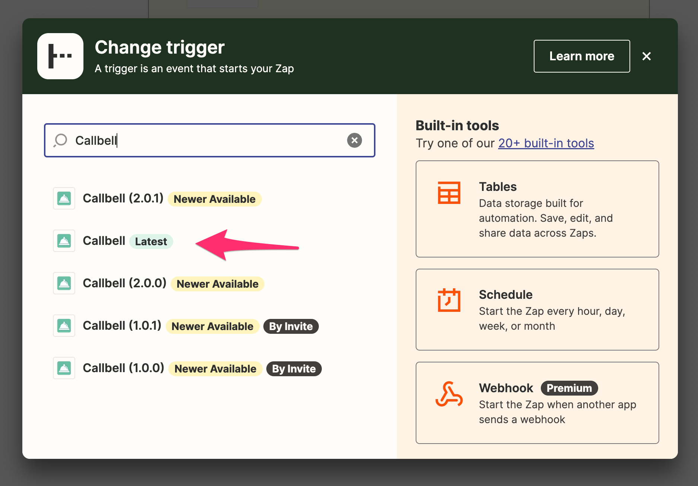
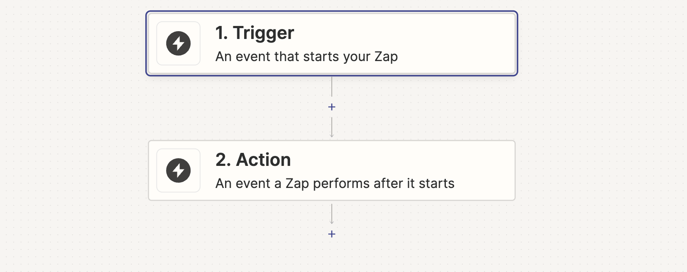

# Usando o Trigger no Zapier

Aqui vamos mostrar como usar o Callbell no Zapier como um **Trigger**.

## Como Trigger

Certifique-se de selecionar o aplicativo certo do Callbell (mais recente):

Nossa integração do Callbell permite que você use o Callbell como um trigger. Isso significa que você pode enviar dados do Callbell para outros aplicativos.

### Triggers Suportados

- Contato Criado
- Contato Atualizado
- Contato Excluído
- Mensagem Criada
- Status da Mensagem Atualizado
- Evento de Entrada (trigger legado)

Recomendamos que você use os primeiros 5 triggers, pois o último será descontinuado em algum momento.

#### Contato Criado

Esse trigger será ativado quando um novo contato for criado no Callbell.

#### Contato Atualizado

Esse trigger será ativado quando um contato for atualizado no Callbell.

#### Contato Excluído

Esse trigger será ativado quando um contato for excluído no Callbell.

#### Mensagem Criada

Esse trigger será ativado quando uma nova mensagem for criada no Callbell. A mensagem pode ser tanto de entrada quanto de saída.

#### Status da Mensagem Atualizado

Esse trigger será ativado quando o status de uma mensagem for atualizado no Callbell.

## Exemplo com o Trigger de Contato Criado

Digamos que você tenha um CRM externo e queira enviar dados do Callbell para o seu CRM. Você pode usar o Zapier para enviar os dados do Callbell para o seu CRM.

O Callbell é o **Trigger** e o seu CRM é a **Ação**.

Configure o seu Zap:

### Passo 1: Configure o seu Trigger

Neste exemplo, vamos usar o Callbell como o Trigger.

Selecione o Callbell como o aplicativo do Trigger e em seguida selecione o trigger "Contato Criado".

### Passo 2: Configure a sua Ação

Selecione o seu CRM como o aplicativo da Ação.

Em seguida, clique em "Continuar". Você será solicitado a conectar a sua conta do CRM ao Zapier.

Depois de conectar a sua conta do CRM, você terá que configurar a ação.

Selecione os dados que você deseja enviar para o seu CRM.

Em seguida, clique em "Continuar".

Depois, clique em "Testar e Continuar".

Em seguida, clique em "Ativar Zap".

### Passo 3: Teste o seu Zap

Depois de ativar o seu Zap, você pode testá-lo criando um novo contato no Callbell.