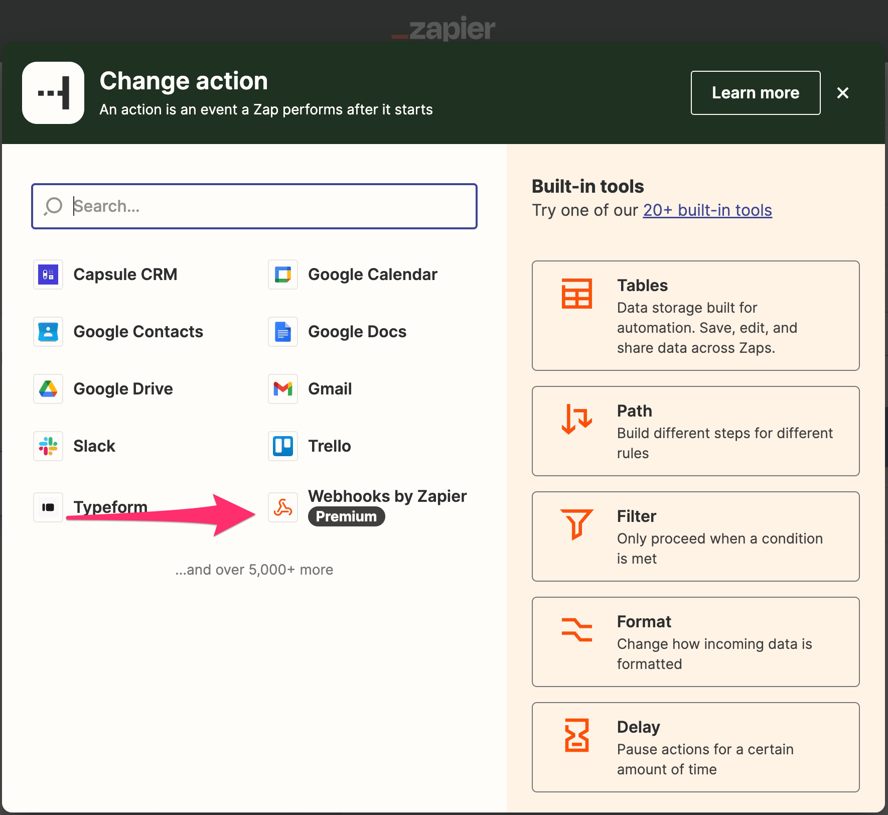

# Usare gli Advanced Webhooks

Qui vedremo come usare Callbell tramite Zapier utilizzando Zapier's custom webhook come azione.
Questo è un modo più avanzato per utilizzare Callbell in Zapier, ma ti offre maggiore flessibilità perché puoi utilizzare la nostra API pubblica per eseguire azioni.

Vedi <a href="https://docs.callbell.eu/api/reference/introduction'">API reference</a> per ulteriori informazioni sugli endpoint e sui payload.

## Uso del custom webhook di Zapier

Assicurati di selezionare l'app Callbell corretta (la più recente):

Quindi seleziona "Webhooks by Zapier" come app per l'azione:

L'azione consigliata è "Richiesta personalizzata" qui:

Indipendentemente dall'azione che scegli, dovrai configurare correttamente l'URL webhook.

### URL Webhook

L'URL webhook è l'URL che Zapier utilizzerà per inviare i dati a Callbell.

:::info

In [questa](https://docs.callbell.eu/api/reference/contacts_api/post_contacts) sezione puoi trovare l'URL da utilizzare per il webhook.

:::

### Payload Webhook

Il payload webhook è il dato che Zapier invierà a Callbell.

Il payload deve essere in formato JSON.

### Autenticazione

Dovrai autenticare la tua richiesta a Callbell.

Puoi farlo aggiungendo le seguenti intestazioni alla tua richiesta:

Il `Content-Type` impostato su `application/json` è **obbligatorio**.