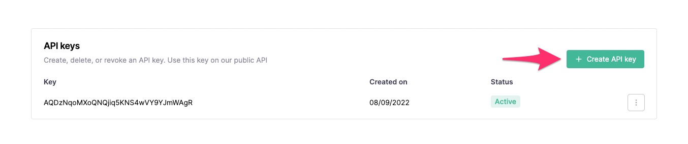

sidebar_position: 2
---

# Começando

Este guia passo a passo o guiará no uso da API do Callbell para enviar uma mensagem.

## Pré-requisitos

Você precisará criar uma conta no Callbell e ter configurado um canal do WhatsApp Business para poder seguir este guia.

- Cadastre-se no [Callbell](https://dash.callbell.eu/users/sign_up)
- Veja mais informações sobre nossa [integração com a API do WhatsApp Business](https://callbellsupport.zendesk.com/hc/en-us/articles/360007805898-How-to-integrate-WhatsApp-into-Callbell-through-the-WhatsApp-Business-APIs)

## Obtendo suas chaves de API

Acesse a página de chaves de API do Callbell nas configurações (https://dash.callbell.eu/settings/api_settings/keys) para gerar uma nova chave de API:



Depois de clicar no botão **Criar chave de API**, certifique-se de copiar o token e armazená-lo com segurança.

:::caution
A chave da API será mostrada apenas nesta tela. Se você perder o acesso a ela, será necessário gerar uma nova.
:::

## Enviar uma mensagem de teste usando cURL

Ao usar o método de envio de mensagem da [API de Mensagens](/api/reference/messages_api/post_send_messages.md), você pode testar se sua chave de API está funcionando como esperado:

```bash
curl -X POST "https://api.callbell.eu/v1/messages/send" \
  -H "Authorization: Bearer <REPLACE_API_KEY_HERE>" \
  -H "Content-Type: application/json" \
  -d '{
    "to": "<REPLACE_PHONE_NUMBER_HERE>",
    "from": "whatsapp",
    "type": "text",
    "content": {
      "text": "Olá a partir da API do Callbell!"
    }
  }'
```

Apenas substitua `REPLACE_API_KEY_HERE` pela chave da API gerada na etapa [Obtendo suas chaves de API](#obtendo-suas-chaves-de-api) e `REPLACE_PHONE_NUMBER_HERE` pelo número de telefone do destinatário.

:::info
Verifique se o número de telefone de destino _optou por receber_ e que você está **dentro da regra de 24 horas** do WhatsApp Business API.
:::

Se a mensagem for enviada corretamente, você receberá uma resposta semelhante a esta:

```json
{
  "message": {
    "uuid": "<MESSAGE_UUID>",
    "status": "enqueued"
  }
}
```

Isso significa que a mensagem foi enfileirada com sucesso para envio ao número de telefone desejado.

### Verificar o status de uma mensagem

Para saber se nossa mensagem de teste foi entregue com sucesso, podemos usar um dos seguintes métodos:

- Use o [endpoint de status da mensagem](api/reference/messages_api/get_message_status.md)
- Ative os **Webhooks** na seção de chaves da API e se inscreva no evento `message_status_updated`

Neste exemplo, usaremos o primeiro método; para verificar o status da mensagem de teste, execute o seguinte cURL a partir de um terminal:

```bash
curl -X GET "https://api.callbell.eu/v1/messages/status/<REPLACE_UUID_HERE>" \
  -H "Authorization: Bearer <REPLACE_API_KEY_HERE>" \
  -H "Content-Type: application/json"
```

Certifique-se de substituir `REPLACE_API_KEY_HERE` pela sua chave de API e `REPLACE_UUID_HERE` pelo identificador da mensagem obtido na etapa [Enviar uma mensagem de teste](#enviar-uma-mensagem-de-teste-usando-curl).

Você receberá a seguinte resposta:

```json
{
  "message": {
    "uuid": "<MESSAGE_UUID>",
    "status": "delivered"
  }
}
```

Isso confirma que a mensagem foi enviada com sucesso para o usuário, mas ainda não foi lida.

### Próximos passos

Tente explorar nossas APIs de [Mensagens](/api/reference/messages_api/introduction.md) e [Contatos](/api/reference/contacts_api/introduction.md) para obter mais exemplos.