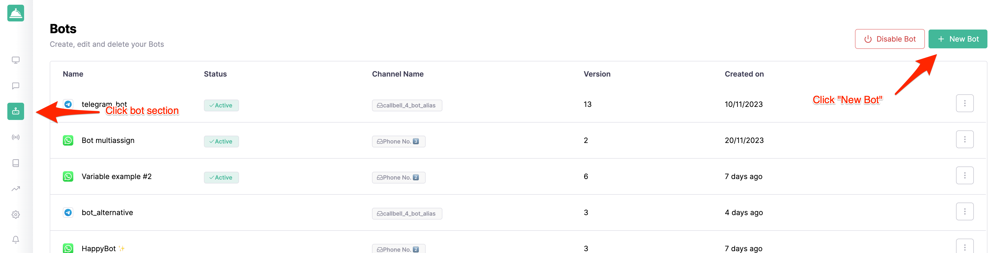
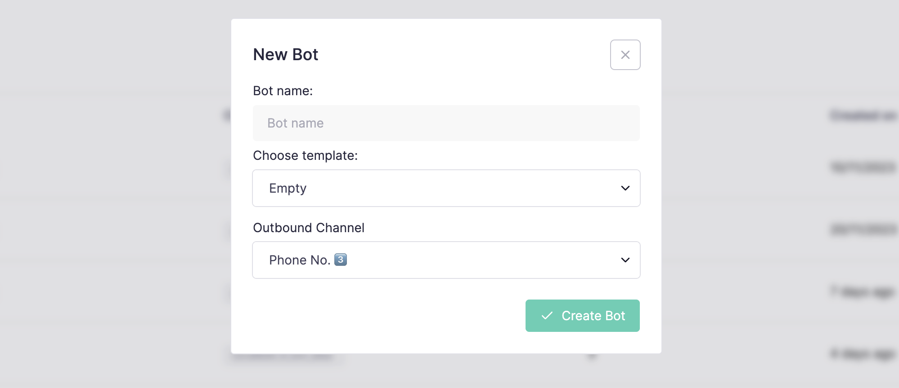

# Iniciando

Este guia passo a passo irá orientá-lo na construção do seu primeiro chatbot com o Callbell.

## Pré-requisitos

Você precisará criar uma conta no Callbell e ter configurado pelo menos **1 canal** para poder seguir este guia.

- Cadastre-se no [Callbell](https://dash.callbell.eu/users/sign_up)
- Veja mais informações sobre nossa [integração com API do WhatsApp Business](https://callbellsupport.zendesk.com/hc/en-us/articles/360007805898-How-to-integrate-WhatsApp-into-Callbell-through-the-WhatsApp-Business-APIs) para usar o construtor de fluxo do bot com o WhatsApp.

## Criando seu primeiro chatbot

Navegue até a seção **Bot Builder** na barra lateral esquerda e clique no botão **Criar novo bot**:

Será exibido um modal pedindo para você escolher um nome para o seu bot e o canal que você deseja usar:

Após clicar no botão **Criar bot**, você será redirecionado para a página do construtor do bot onde poderá começar a construir seu primeiro chatbot:

## Adicionando uma nova ação

Para que o bot funcione, você precisará adicionar pelo menos uma ação. Por exemplo, vamos responder ao usuário com uma mensagem quando ele enviar uma mensagem para o bot.

Clique no botão **Adicionar nova ação** e selecione a ação **Enviar mensagem**:

Um painel será aberto para que você possa configurar a ação. Neste caso, vamos adicionar apenas uma mensagem de texto simples:

Após clicar no botão **Salvar**, você será redirecionado para a página do construtor do bot onde poderá ver a ação que acabou de criar:

## Teste seu bot

Para testar seu bot, você precisará clicar no botão **Executar simulador** no canto superior direito da página. Isso abrirá um painel onde você pode testar seu novo fluxo:

Basta clicar no botão **Enviar** e você verá o bot respondendo com a mensagem que você acabou de configurar:

## Publique seu bot

Depois de estar satisfeito com seu bot, você pode publicá-lo clicando no botão **Publicar rascunho** no canto superior direito da página:

Após clicar no botão **Publicar rascunho** e confirmar, seu fluxo de bot será publicado; ao mesmo tempo, você precisará **ativar seu bot** para torná-lo disponível para seus clientes. Você pode fazer isso navegando de volta para a seção "Bots" na barra lateral direita e clicando no botão **Ativar bot**:

Você pode confirmar que o bot está ativado verificando o status na seção "Bots":

## Teste seu bot em produção

Agora que seu bot está ativado, você pode testá-lo em produção enviando uma mensagem para o canal que você o configurou. Neste caso, enviaremos uma mensagem para o número de WhatsApp que configuramos na seção [Pré-requisitos](#prerequisites):

## O que vem a seguir?

Agora que você criou seu primeiro chatbot, você pode explorar as outras ações disponíveis no construtor de bot.