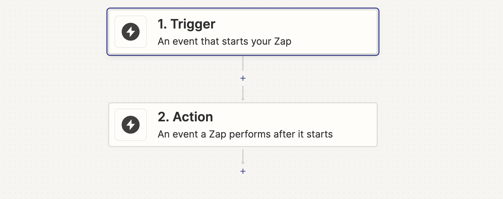

# Começando

## O que é Zapier?

Zapier é uma ferramenta que permite que você conecte os aplicativos que você usa todos os dias para automatizar tarefas e economizar tempo. Você pode se conectar com mais de 2.000+ aplicativos para criar suas próprias automações.

## Como o Zapier funciona?

O Zapier usa um **Zap** para conectar dois ou mais aplicativos juntos.

Um Zap é composto por um **Trigger** e uma ou mais **Actions**.

Sempre que o trigger acontece em um aplicativo, o Zapier automaticamente executará as ações ou buscas em outro aplicativo.

## Como usar Callbell com Zapier

### Configure seu Zap

Existem duas maneiras diferentes de integrar o Callbell com outros aplicativos: **Trigger** e **Action**.

### Trigger

Quando uma nova conversa é criada no Callbell, você pode enviar os dados para outro aplicativo. Por exemplo, você pode enviar os dados para uma Planilha do Google, um CRM ou um canal do Slack.

### Action

Quando um evento acontece em outro aplicativo, você pode enviar os dados para o Callbell. Por exemplo, você pode enviar dados de uma Planilha do Google, um CRM ou um canal do Slack para o Callbell.

### Exemplo

Digamos que você queira enviar uma mensagem para um cliente quando um novo pedido é feito em sua loja online. Você pode usar o Zapier para enviar os dados da sua loja online para o Callbell.

Sua loja online é o **Trigger** e o Callbell é a **Action**.

Na próxima seção, mostraremos como configurar um Zap.