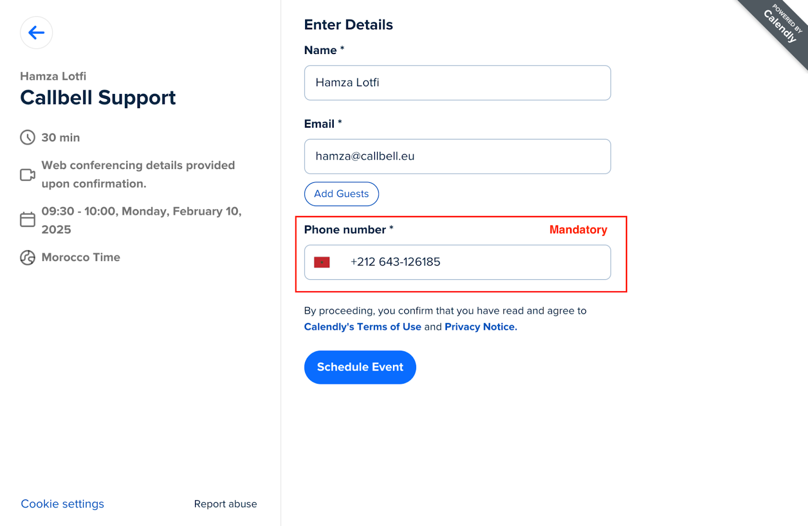

# Integração com Calendly

## Automatize a Comunicação de Agendamentos no WhatsApp com Callbell

> Nos guias a seguir, você aprenderá como integrar o Calendly com o Callbell usando o Zapier. Essa integração permite automatizar as comunicações relacionadas a agendamentos no WhatsApp, garantindo uma experiência mais fluida tanto para você quanto para seus clientes.

Com essa configuração, você poderá:

- Enviar confirmações automáticas de agendamentos via WhatsApp pelo Callbell.
- Enviar lembretes automáticos de agendamentos via WhatsApp para reduzir faltas.
- Enviar mensagens automáticas de acompanhamento após o agendamento via WhatsApp para manter o engajamento e melhorar a experiência do cliente.

Cada guia fornecerá instruções passo a passo sobre como configurar esses fluxos de trabalho usando Zapier, Calendly e Callbell.

---

## Guia 1: Enviar Confirmações Automáticas de Agendamentos

Envie uma confirmação automática de agendamento como mensagem no WhatsApp pelo Callbell.

<iframe width="100%" height="500" src="https://www.youtube.com/embed/_STFqvILCwA?si=N3wgLUfOhNS-QMzM" title="Seguimentos Automáticos de Agendamentos no WhatsApp" frameborder="0" allow="accelerometer; autoplay; clipboard-write; encrypted-media; gyroscope; picture-in-picture; web-share" referrerpolicy="strict-origin-when-cross-origin" allowfullscreen></iframe>

### Passo a Passo

1. **Crie sua Página de Agendamento no Calendly**

   Projete sua página de agendamento no Calendly para coletar informações essenciais, como:

   - **Nome**
   - **Número de telefone** (obrigatório)
   - **Endereço de e-mail** (opcional)

   

2. **Prepare Modelos de Mensagens no Callbell**

   Crie o modelo de mensagem que deseja enviar para novos leads no Callbell.
   Ao preparar o modelo:

   - Use variáveis personalizadas (exemplo: `{{variável 1}}`, `{{variável 2}}`) para personalizar a mensagem.
   - Essas variáveis serão preenchidas dinamicamente pelo Zapier.
   - [Obtenha mais informações sobre como criar modelos com variáveis na Callbell](https://callbellsupport.zendesk.com/hc/pt/articles/360007759237-O-que-s%C3%A3o-e-para-que-servem-os-modelos-de-mensagem)

   > **Dica:** Na maioria dos casos, os modelos de WhatsApp são usados para confirmar ou lembrar sobre um agendamento. Recomendamos solicitar a aprovação na categoria "Utilidade", que tem metade do custo da categoria "Marketing".

   

3. **Crie um Zap: Defina o Calendly como o Gatilho**

   - Acesse o Zapier e crie um novo Zap.
   - Defina o gatilho como **"Invitee Created"**.
   - Conecte sua conta do Calendly.
   - Teste o gatilho para garantir que o Zapier esteja recuperando corretamente os dados da reserva.

   

4. **Formate o Número de Telefone**

   - Adicione a ação **Formatter** no Zapier para garantir que o número enviado pelo Calendly esteja corretamente formatado para o Callbell.
   - Selecione a ação **Numbers** no Formatter.
   - Escolha **Format Phone Number** como o tipo de transformação.
   - Mapeie o campo do número de telefone do Typeform.
   - Selecione o formato de saída **E164**.

   

5. **Envie a Mensagem Modelo com Variáveis Personalizadas pelo Callbell**

   - Adicione a ação **Send Template Message** no Zapier.
   - Conecte sua conta do Callbell.
   - Mapeie o campo de número de telefone formatado da etapa anterior para o campo **"To"**.
   - Copie e cole o UUID do modelo criado na etapa 2.
   - Copie e cole o UUID do canal do seu Callbell.
   - Preencha suas variáveis do modelo no campo **"Template values"**.

   

### Notas Finais

Com essa configuração, todo novo agendamento no Calendly acionará automaticamente uma mensagem de confirmação no WhatsApp via Callbell, garantindo uma comunicação clara e imediata.
Para mais ajuda, confira:

- [Central de ajuda da Callbell](https://callbellsupport.zendesk.com/hc/pt)
- [Documentação de Ajuda do Zapier](https://help.zapier.com/hc/en-us)

---

## Guia 2: Enviar Lembretes Automáticos de Agendamentos

Envie lembretes automáticos de agendamento como mensagens no WhatsApp pelo Callbell.

<iframe width="100%" height="500" src="https://www.youtube.com/embed/lXPaYlAxZOw?si=_-hzgCJk1KZj5vy6" title="Lembretes Automáticos de Agendamentos no WhatsApp" frameborder="0" allow="accelerometer; autoplay; clipboard-write; encrypted-media; gyroscope; picture-in-picture; web-share" referrerpolicy="strict-origin-when-cross-origin" allowfullscreen></iframe>

### Passo a Passo

O processo de configuração é semelhante ao fluxo de confirmação de agendamento.

1. Siga os passos do **Guia 1: Enviar Confirmações Automáticas de Agendamentos**.

2. Adicione os seguintes passos adicionais no Zapier **antes** da última etapa "Envie a Mensagem Modelo com Variáveis Personalizadas pelo Callbell" para completar esse fluxo de trabalho:

   1. **Adicione uma Ação de Formatter**
      No Zapier, clique em "Add a Step" e selecione **Formatter**.

      - Escolha **Date/Time** como o Evento.
      - Em **Transform**, selecione **Format**.
      - No campo **Input**, selecione **Scheduled Event Start Time**.
      - Em **To Format**, escolha o formato de data/hora desejado (exemplo: `DD/MM/YYYY HH:mm`).
      - Em **To Timezone**, selecione o fuso horário correto.

      

   2. **Adicione Outra Ação de Formatter para Ajustar o Horário do Lembrete**
      No Zapier, clique em "Add a Step" e selecione **Formatter**.

      - Escolha **Date/Time** como o Evento.
      - Em **Transform**, selecione **Add/Subtract Time**.
      - No campo **Input**, selecione a saída da data formatada da etapa anterior.
      - No campo **Expression**, insira `-1 day` para enviar o lembrete um dia antes do agendamento.
      - Mantenha o **To Format** igual ao da etapa anterior para manter a coerência.

      

   3. **Adicione uma Ação de Delay**
      No Zapier, clique em "Add a Step" e selecione **Delay**.

      - Escolha **Delay Until** como o Evento.
      - No campo **Date/Time Delayed Until**, selecione a saída da etapa anterior (o horário ajustado do lembrete).
      - Em "How should we handle dates in the past?", selecione **Always continue** para garantir o funcionamento correto do fluxo, mesmo que a condição de atraso seja ligeiramente ultrapassada.

      

### Notas Finais

Com essa configuração, cada compromisso agendado no Calendly acionará um lembrete automático no WhatsApp via Callbell, garantindo que seus clientes recebam uma notificação no momento certo, um dia antes do agendamento. Esse fluxo ajuda a reduzir faltas e melhora a taxa de comparecimento.
Para mais ajuda, confira:

- [Central de ajuda da Callbell](https://callbellsupport.zendesk.com/hc/pt)
- [Documentação de Ajuda do Zapier](https://help.zapier.com/hc/en-us)

---

## Guia 3: Enviar Mensagens Automáticas de Acompanhamento Após o Agendamento

Envie acompanhamentos automatizados de agendamentos como uma mensagem no WhatsApp via Callbell.

<iframe width="100%" height="500" src="https://www.youtube.com/embed/ky1U7fvmrwA?si=fhGG8vXDML6ECAcc" title="Automatize a Comunicação de Agendamentos pelo WhatsApp com Callbell" frameborder="0" allow="accelerometer; autoplay; clipboard-write; encrypted-media; gyroscope; picture-in-picture; web-share" referrerpolicy="strict-origin-when-cross-origin" allowfullscreen></iframe>

### Passo a Passo

O processo de configuração é semelhante ao fluxo de trabalho de confirmação de agendamento.

1. Siga os passos descritos no **Guia 1: Enviar Confirmações Automáticas de Agendamentos**.

2. Adicione os seguintes passos adicionais no Zapier **antes** da última etapa "Envie a Mensagem Modelo com Variáveis Personalizadas pelo Callbell" para completar esse fluxo de trabalho:

   1. **Adicione uma Ação de Formatter**
      No Zapier, clique em "Add a Step" e selecione **Formatter**.

      - Escolha **Date/Time** como o Evento.
      - Em **Transform**, selecione **Format**.
      - No campo **Input**, selecione **Scheduled Event End Time**.
      - Em **To Format**, escolha o formato de data/hora desejado (exemplo: `DD/MM/AAAA HH:mm`).
      - Em **To Timezone**, selecione o fuso horário apropriado.

      

   2. **Adicione Outra Ação de Formatter para Ajustar o Horário do Acompanhamento**
      No Zapier, clique em "Add a Step" e selecione **Formatter**.

      - Escolha **Date/Time** como o Evento.
      - Em **Transform**, selecione **Add/Subtract Time**.
      - No campo **Input**, selecione a saída da data formatada da etapa anterior.
      - No campo **Expression**, insira `+15 minutos` para enviar o acompanhamento 15 minutos após o agendamento.
      - Mantenha o **To Format** igual ao da etapa anterior para garantir a consistência.

      

   3. **Adicione uma Ação de Delay**
      No Zapier, clique em "Add a Step" e selecione **Delay**.

      - Escolha **Delay Until** como o Evento.
      - No campo **Date/Time Delayed Until**, selecione a saída da etapa anterior (o horário ajustado para o acompanhamento).
      - Em "How should we handle dates in the past?", selecione **Always continue** para garantir o funcionamento correto do fluxo, mesmo que a condição de atraso seja ligeiramente ultrapassada.

      

### Notas Finais

Com essa configuração, cada agendamento concluído no Calendly acionará automaticamente uma mensagem de acompanhamento no WhatsApp via Callbell, garantindo um contato contínuo com seus clientes – seja para coleta de feedback, próximos passos ou agendamentos futuros. Esse fluxo ajuda a fortalecer o relacionamento com os clientes e aprimora a qualidade geral do serviço.
Para mais ajuda, confira:

- [Central de ajuda da Callbell](https://callbellsupport.zendesk.com/hc/pt)
- [Documentação de Ajuda do Zapier](https://help.zapier.com/hc/en-us)
