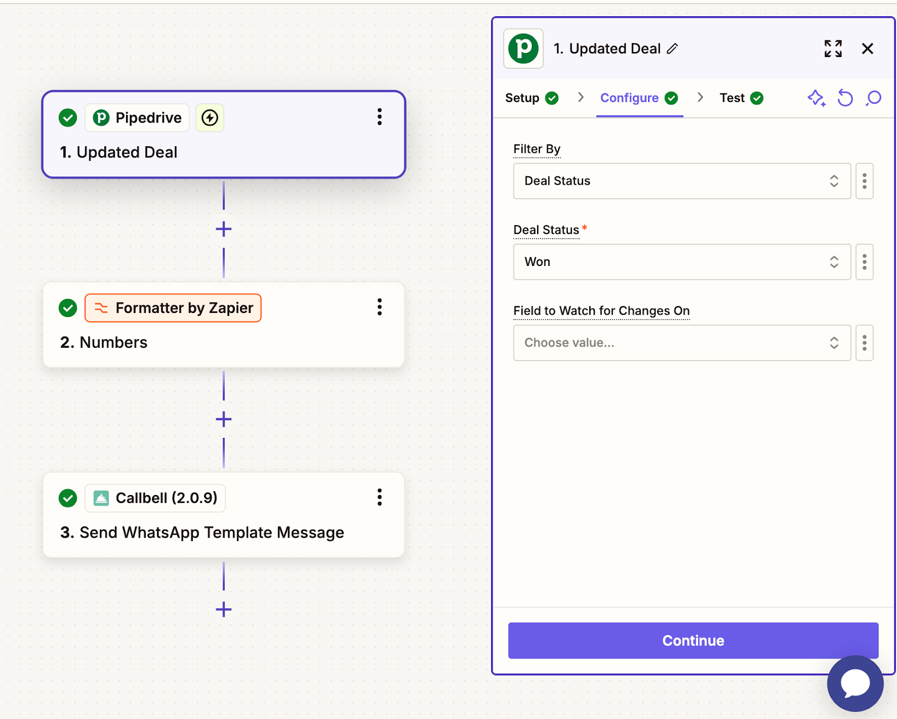

# Integração com Pipedrive

## Automatize a Comunicação do WhatsApp no CRM com Callbell

Saiba como integrar o Pipedrive com a Callbell usando o Zapier para automatizar as comunicações no WhatsApp.

## Introdução

> Neste guia, você aprenderá a integrar o Pipedrive com a Callbell usando o Zapier. Essa integração permite automatizar a comunicação via WhatsApp com base nas atividades do Pipedrive, garantindo um processo eficiente de vendas e gestão de clientes.

### Com essa configuração, você poderá:

- Criar automaticamente novos contatos do Pipedrive na Callbell.
- Enviar automaticamente modelos de mensagem do WhatsApp quando um negócio mudar de status no Pipedrive.
- Enviar automaticamente modelos de mensagem do WhatsApp quando um negócio for ganho.

Cada guia fornecerá instruções passo a passo para configurar esses fluxos de trabalho usando Zapier, Pipedrive e Callbell.

## Guia 1: Criar Automaticamente Novos Contatos do Pipedrive na Callbell

Neste guia, explicaremos como criar automaticamente novos contatos na Callbell sempre que um novo contato for adicionado no Pipedrive. Com essa integração, seus contatos do CRM serão adicionados automaticamente à Callbell.

<iframe width="100%" height="500" src="https://www.youtube.com/embed/jHcTS4GLEJc?si=huxg_BN8byMaekcq" title="Envie automaticamente mensagens de modelos do WhatsApp no Pipedrive" frameborder="0" allow="accelerometer; autoplay; clipboard-write; encrypted-media; gyroscope; picture-in-picture; web-share" referrerpolicy="strict-origin-when-cross-origin" allowfullscreen></iframe>

### Explicação Passo a Passo

#### 1. Criar um Zap: Pipedrive como Gatilho

- Acesse o Zapier e crie um novo Zap.
- Configure o gatilho como **"New Person"** (isso ativará o Zap sempre que um novo contato for adicionado no Pipedrive).
- Conecte sua conta do Pipedrive.
- Teste o gatilho para garantir que o Zapier recupera corretamente os dados do novo contato do Pipedrive.

#### 2. Criar um Contato na Callbell

- Selecione **Callbell** como o aplicativo de ação.
- Escolha a ação **"Create Contact"** (isso criará um novo contato na Callbell quando ativado).
- Conecte sua conta da Callbell.
- Mapeie os campos do Pipedrive para a Callbell:
  - **Nome** → Nome do contato no Pipedrive.
  - **Número de telefone** → Número do contato no Pipedrive.
  - Outros campos relevantes, se necessário.
- Teste a ação para garantir que o Zapier cria corretamente um contato na Callbell.

### Notas Finais

Com essa configuração, todo novo contato adicionado no Pipedrive será automaticamente criado na Callbell, economizando tempo e reduzindo a entrada manual de dados.

**Para suporte adicional, confira:**

- [Central de Ajuda Callbell](https://callbellsupport.zendesk.com/hc/pt)
- [Documentação do Zapier](https://help.zapier.com/hc/en-us)

## Guia 2: Enviar Automaticamente Mensagens via WhatsApp Quando um Negócio Mudar de Status no Pipedrive

Neste guia, explicaremos como enviar automaticamente uma mensagem via WhatsApp pela Callbell sempre que um negócio mudar de status no Pipedrive. Com essa integração, os clientes recebem atualizações em tempo real sobre o progresso do negócio, como lembretes, follow-ups ou notificações de status.

<iframe width="100%" height="500" src="https://www.youtube.com/embed/yRhaJFMkmDQ?si=QjE_ebv5TcFVpIhz" title="Envie automaticamente modelos do WhatsApp quando um negócio for fechado" frameborder="0" allow="accelerometer; autoplay; clipboard-write; encrypted-media; gyroscope; picture-in-picture; web-share" referrerpolicy="strict-origin-when-cross-origin" allowfullscreen></iframe>

### Explicação Passo a Passo

#### 1. Prepare os Modelos de Mensagem na Callbell

- Crie o modelo de mensagem que será enviado automaticamente.
- Use variáveis personalizadas (exemplo: `{{variável 1}}, {{variável 2}}`) para personalizar as mensagens.
- Saiba mais sobre modelos com variáveis: [Guia de Modelos de Mensagens](https://callbellsupport.zendesk.com/hc/pt/articles/360007759237-O-que-s%C3%A3o-e-para-que-servem-os-modelos-de-mensagem).

> **Dica:** Os modelos de mensagem do WhatsApp geralmente são aprovados mais rapidamente na categoria **"Utility"** (metade do custo da categoria **"Marketing"**).

#### 2. Criar um Zap – Pipedrive como Gatilho

- Acesse o Zapier e crie um novo Zap.
- Configure o gatilho como **"Updated Deal"**.
- Conecte sua conta do Pipedrive.
- Teste o gatilho para garantir que o Zapier recupera corretamente os dados do negócio atualizado.

#### 3. Formatar o Número de Telefone

- Adicione a ação **"Formatter"** no Zapier para garantir que o número esteja no formato correto.
- Selecione **"Numbers"** como ação do Formatter.
- Escolha **"Format Phone Number"** como tipo de transformação.
- Mapear o campo do número do telefone do Pipedrive.
- Selecione o formato **E164**.

#### 4. Enviar o Modelo de Mensagem via Callbell

- Adicione a ação **"Send Template Message"** no Zapier.
- Conecte sua conta da Callbell.
- Mapear o número de telefone formatado no campo **"To"**.
- Copie e cole o **UUID do template** criado no Passo 1.
- Copie e cole o **UUID do canal da Callbell**.
- Preencha os valores das variáveis no campo **"Template Values"**.

### Notas Finais

Com essa configuração, sempre que um negócio mudar de status no Pipedrive, o cliente receberá uma mensagem automática via WhatsApp.

**Para suporte adicional, confira:**

- [Central de Ajuda Callbell](https://callbellsupport.zendesk.com/hc/pt)
- [Documentação do Zapier](https://help.zapier.com/hc/en-us)

## Guia 3: Enviar Mensagens via WhatsApp Automaticamente Quando um Negócio for Ganhado no Pipedrive

Este guia explica como enviar automaticamente uma mensagem via WhatsApp pela Callbell sempre que um negócio for marcado como **"Ganho"** no Pipedrive.

<iframe width="100%" height="500" src="https://www.youtube.com/embed/_dDywjC2uu8?si=FypiyHT9q7eSM5Hg" title="Enviar mensagens automaticamente via WhatsApp quando um negócio for ganho" frameborder="0" allow="accelerometer; autoplay; clipboard-write; encrypted-media; gyroscope; picture-in-picture; web-share" referrerpolicy="strict-origin-when-cross-origin" allowfullscreen></iframe>

#### Criar um Zap com Pipedrive como Gatilho

- Acesse o Zapier e crie um novo Zap.
- Defina o gatilho como **"Updated Deal"**.
- No campo **"Filter By"**, selecione **"Deal Status"**.
- No campo **"Deal Status"**, selecione **"Won"**.

### Notas Finais

Com essa configuração, sempre que um negócio for ganho no Pipedrive, uma mensagem automática será enviada via Callbell.

**Para suporte adicional, confira:**

- [Central de Ajuda Callbell](https://callbellsupport.zendesk.com/hc/pt)
- [Documentação do Zapier](https://help.zapier.com/hc/en-us)
