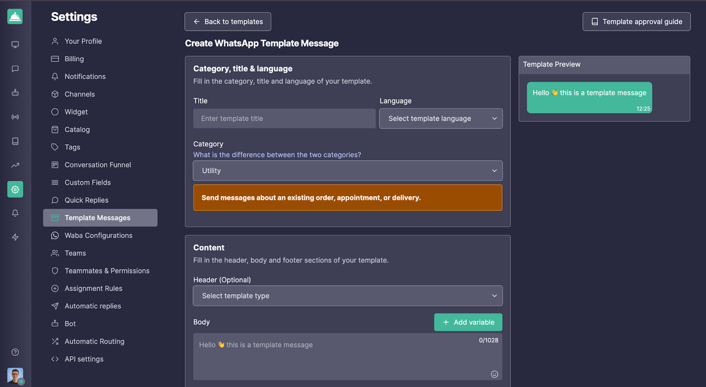
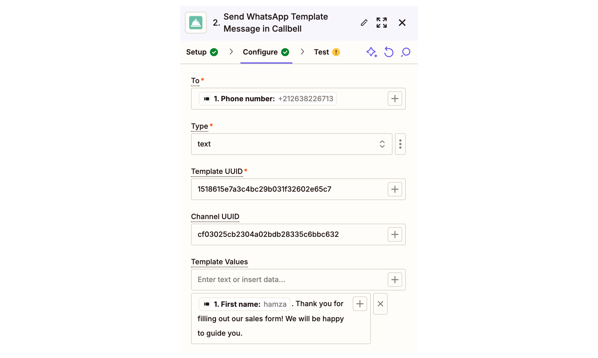

# Integração com Typeform - Automatize a Comunicação com Leads na Callbell

Simplifique a comunicação com leads integrando o Typeform ao Callbell através do Zapier. Este guia ajudará você a configurar um fluxo de trabalho automatizado para coletar dados de leads do Typeform, formatá-los e enviar uma mensagem personalizada no WhatsApp via Callbell usando variáveis personalizadas.

Link: https://zapier.com/apps/callbell/integrations/typeform

<iframe width="100%" height="500" src="https://www.youtube.com/embed/E0I_WsKZsnU?si=R1kKWWz1Vl95aezT" title="Integração com Typeform - Automatize a Comunicação com Leads na Callbell" frameborder="0" allow="accelerometer; autoplay; clipboard-write; encrypted-media; gyroscope; picture-in-picture; web-share" referrerpolicy="strict-origin-when-cross-origin" allowfullscreen></iframe>

## Introdução

Este artigo explica como automatizar a qualificação e a comunicação com leads utilizando Typeform, Callbell e Zapier. Ao final, você terá um fluxo de trabalho totalmente automatizado que enviará uma mensagem personalizada através do WhatsApp para os leads assim que eles enviarem suas informações pelo Typeform.

## Passo a passo

### 1. **Crie o Typeform desejado**

Configure seu Typeform para coletar informações essenciais, como:

- Nome
- Número de telefone (obrigatório)
- Endereço de E-mail (opcional)

### 2. **Prepare Modelos de Mensagem na Callbell**

- Crie o modelo de mensagem que deseja enviar para os novos leads na Callbell. Ao configurar o modelo:
- Use variáveis personalizadas (ex: {{variável 1}}, {{variável 2}}) para personalizar a mensagem.
- Essas variáveis serão preenchidas dinamicamente no Zapier usando os dados do lead do Typeform.

Saiba mais sobre como criar modelos de mensagem com variáveis na Callbell: [Callbell Help Center](https://callbellsupport.zendesk.com/hc/pt/articles/360007759237-O-que-s%C3%A3o-e-para-que-servem-os-modelos-de-mensagem)

### 3. **Criar um Zap: Typeform como Trigger**

- Acesse o Zapier e crie um novo Zap.
- Defina o gatilho como “New entry in Typeform”.
- Conecte sua conta do Typeform e selecione o formulário criado no Passo 1.
- Teste o gatilho para garantir que o Zapier está recuperando corretamente os dados do formulário.

### 4. **Formatar o Número de Telefone**

**Nota**: Se o campo de telefone no Typeform for do tipo "phone number", não é necessário realizar a formatação.

Caso contrário:

- Adicione a ação "Formatter" no Zapier para garantir que o número de telefone enviado via Typeform esteja corretamente formatado para o Callbell.
- Selecione a ação "Numbers" no Formatter.
- Escolha "Format Phone Number" como o tipo de transformação.
- Mapeie o campo de número de telefone do Typeform.
- Selecione o formato de saída E164.

### 5. **Enviar o Modelo de Mensagem com Variáveis Personalizadas via Callbell**

- Adicione a ação "Send Template Message" no Zapier.
- Conecte sua conta da Callbell.
- Mapeie o campo de número de telefone formatado da etapa anterior no campo "To".
- Copie e cole o UUID do modelo de mensagem criado no Passo 2.
- Copie e cole o UUID do canal da sua conta Callbell.
- Preencha as variáveis do modelo no campo "Template values".

## Notas Finais

Com essa configuração, cada novo lead do Typeform receberá automaticamente uma mensagem personalizada no WhatsApp via Callbell, com variáveis preenchidas dinamicamente. Esse fluxo garante uma comunicação rápida e personalizada com seus leads.

Para mais ajuda, acesse:

- [Central de Ajuda Callbell](https://callbellsupport.zendesk.com/hc/pt)
- [Documentação do Zapier](https://help.zapier.com/hc/en-us)
