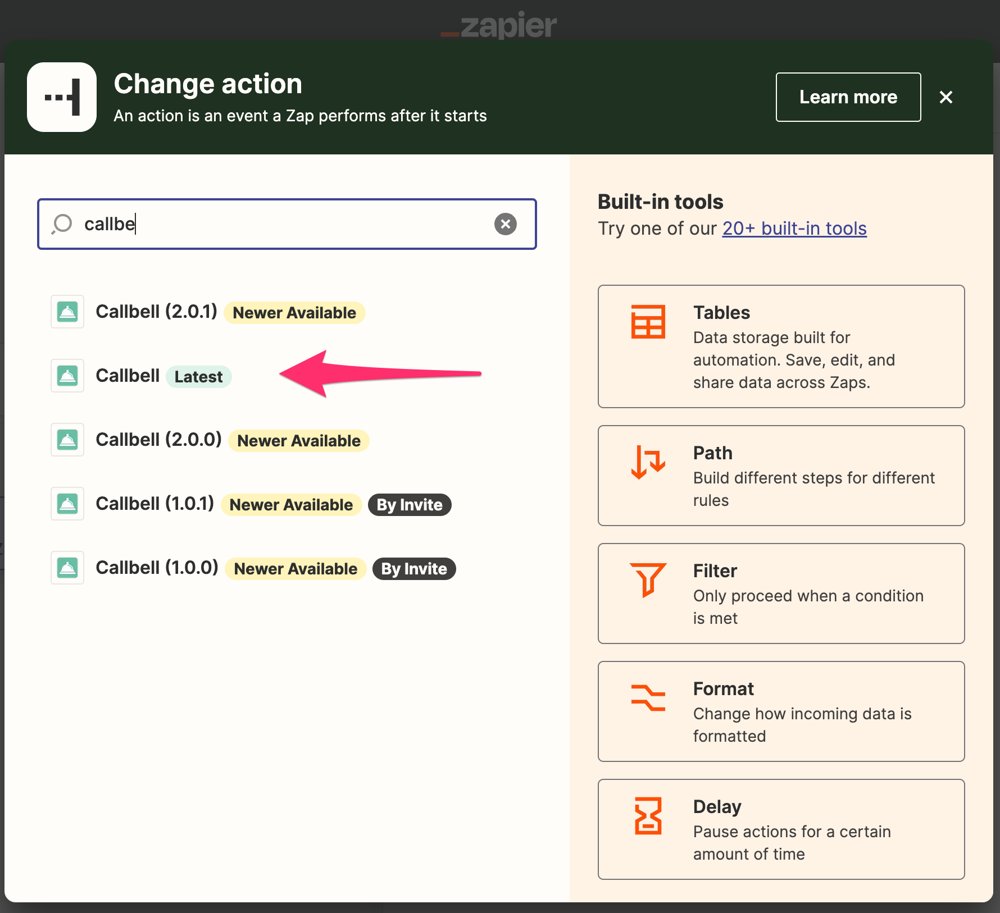

# Usando Action en Zapier

Aquí te mostraremos cómo usar Callbell en Zapier como una **Acción**

## Como una Acción

Asegúrate de seleccionar la aplicación Callbell(latest) correcta:



Nuestra integración de Callbell te permite usar Callbell como una acción. Esto significa que puedes enviar datos desde otras aplicaciones a Callbell.

### Acciones compatibles

- Crear Mensaje (limitado a mensajes de **texto** únicamente)
- Crear Contacto

#### Crear Mensaje

Esta acción creará un nuevo mensaje en Callbell.
Puedes usar esta acción para enviar datos desde otras aplicaciones a Callbell.

#### Crear Contacto

Esta acción creará un nuevo contacto en Callbell.
Puedes usar esta acción para enviar datos desde otras aplicaciones a Callbell.

## Ejemplo con Acción de Mensaje Creado

Imaginemos que quieres enviar un mensaje a un cliente cuando se realiza un nuevo pedido en tu tienda en línea. Puedes usar Zapier para enviar los datos desde tu tienda en línea a Callbell.

Tu tienda en línea es el **Trigger** y Callbell es la **Acción**.

Configura tu Zap (automatización):


### Paso 1: Configura tu Trigger

En este ejemplo, usaremos Shopify como el Trigger.

Selecciona Shopify como la aplicación Trigger:


Selecciona el evento Trigger:

Usaremos el evento "Nuevo pedido pagado" como el Trigger.

Luego haz clic en "Continuar". Se te pedirá que conectes tu cuenta de Shopify a Zapier.

Una vez que hayas conectado tu cuenta de Shopify, se te pedirá que selecciones la tienda que deseas usar.

Luego haz clic en "Continuar".

### Paso 2: Configura tu Acción

Selecciona Callbell como la aplicación Acción, luego selecciona la acción "Crear Mensaje".

Luego haz clic en "Continuar". Se te pedirá que conectes tu cuenta de Callbell a Zapier.

Una vez que hayas conectado tu cuenta de Callbell, tendrás que configurar el mensaje.

Selecciona el número de WhatsApp que deseas usar para enviar el mensaje.

Luego selecciona el contacto al que deseas enviar el mensaje.

Luego configura el mensaje.

Puedes usar los datos del Trigger para configurar el mensaje.

Por ejemplo, puedes usar los datos del Trigger para configurar el mensaje de esta manera:

```
Hola {{first_name}}, tu pedido {{order_number}} ha sido confirmado.
```

Luego haz clic en "Continuar".

### Paso 3: Prueba tu Zap

Puedes probar tu Zap haciendo clic en "Probar y revisar".

Si todo está configurado correctamente, verás un mensaje de éxito.

Luego haz clic en "Encender Zap".

¡Tu Zap está activo ahora!