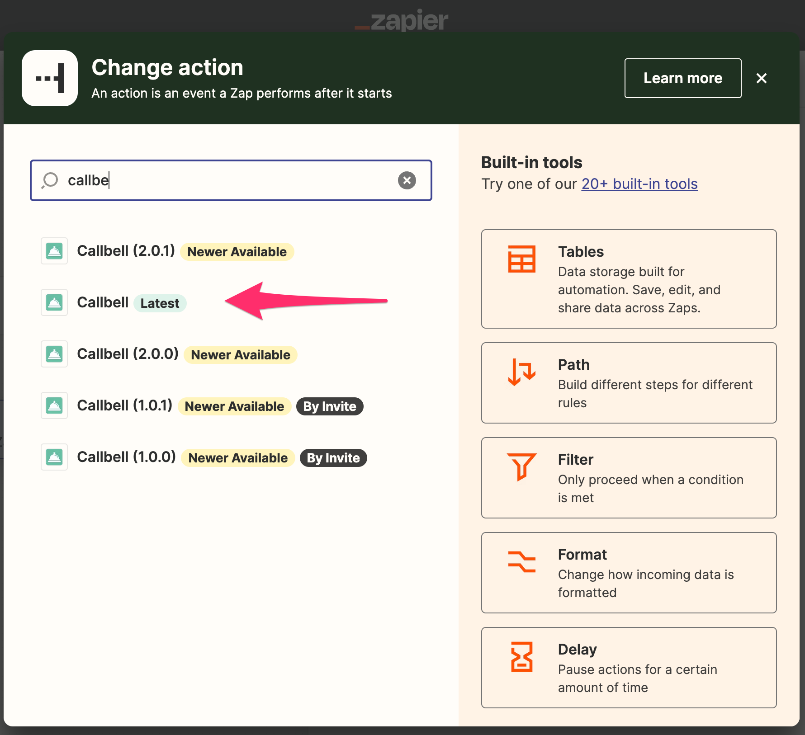
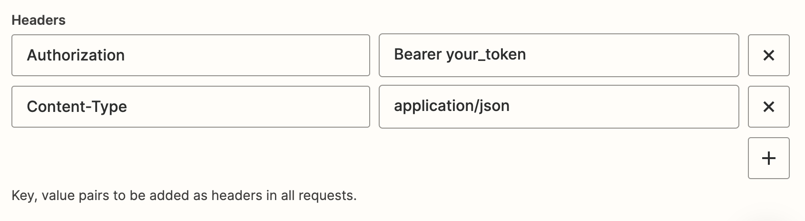

# Usando Webhooks Avançados

Aqui veremos como usar o Callbell por meio do Zapier, usando o webhook personalizado do Zapier como uma ação.
Esta é uma maneira mais avançada de usar o Callbell no Zapier, mas oferece mais flexibilidade porque você pode usar nossa API pública para realizar ações.

Consulte a [referência da API](https://docs.callbell.eu/api/reference/introduction'") para obter mais informações sobre os endpoints e as cargas úteis.

## Usando o Webhook Personalizado do Zapier

Certifique-se de selecionar o aplicativo Callbell correto (mais recente):

Em seguida, selecione "Webhooks by Zapier" como o aplicativo de ação:

A ação recomendada aqui é "Solicitação Personalizada":

Independentemente da ação que você escolher, será necessário configurar corretamente a URL do webhook.

### URL do Webhook

A URL do webhook é a URL que o Zapier usará para enviar dados para o Callbell.

:::info

Nesta [seção](https://docs.callbell.eu/api/reference/contacts_api/post_contacts) você pode encontrar a `url` para usar para o webhook.

:::

### Carga Útil do Webhook

A carga útil do webhook é os dados que o Zapier enviará para o Callbell.

A carga útil deve estar no formato JSON.

### Autenticação

Você precisará autenticar sua solicitação ao Callbell.

Você pode fazer isso adicionando os seguintes cabeçalhos à sua solicitação:

O `Content-Type` configurado para `application/json` é **obrigatório**.